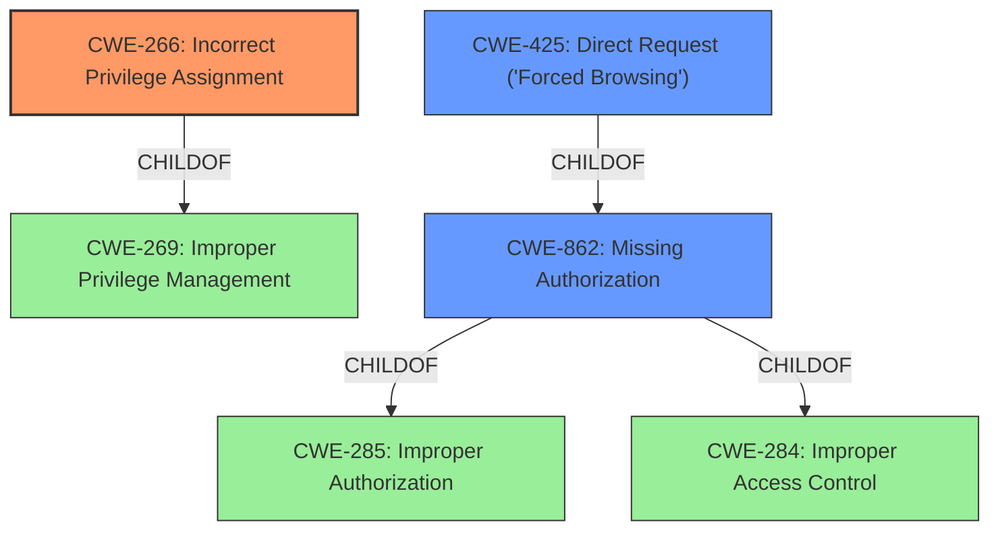

# Analysis for CVE-2021-24207

# Summary
| CWE ID | CWE Name | Confidence | CWE Abstraction Level | CWE Vulnerability Mapping Label | CWE-Vulnerability Mapping Notes |
|---|---|---|---|---|---|
| CWE-266 | Incorrect Privilege Assignment | 0.9 | Base | Allowed | Primary CWE |
| CWE-862 | Missing Authorization | 0.7 | Class | Allowed-with-Review | Secondary Candidate |
| CWE-425 | Direct Request ('Forced Browsing') | 0.6 | Base | Allowed | Secondary Candidate |

## Evidence and Confidence

*   **Confidence Score:** 0.8
*   **Evidence Strength:** HIGH

## Relationship Analysis
The primary CWE, CWE-266 Incorrect Privilege Assignment (Base), is related to CWE-269 (ChildOf) which is Improper Privilege Management (Class). The vulnerability involves assigning incorrect privileges to users, which directly aligns with CWE-266. The secondary CWE, CWE-862 Missing Authorization (Class), is a child of CWE-285 (Improper Authorization) and CWE-284 (Improper Access Control). This shows that the vulnerability could stem from a broader authorization issue, but the specific issue is related to privilege assignment. CWE-425 Direct Request ('Forced Browsing') (Base) is a child of CWE-862, suggesting a potential attack vector where unauthorized resources are directly accessed.

## Vulnerability Chain
The vulnerability chain starts with the **insecure default configuration** of the WP Page Builder plugin, leading to **incorrect privilege assignment (CWE-266)**, and subsequently, **missing authorization checks (CWE-862)**. This allows **subscriber-level users to edit and make changes to any and all posts pages**, potentially through **direct requests (CWE-425)**.

## Summary of Analysis
The initial assessment identified the primary issue as an **incorrect privilege assignment**, where subscriber-level users were granted unintended access to edit and modify all posts and pages. This is supported by the "CVE Reference Links Content Summary" which states: "By default, the plugin allowed users with the 'subscriber' role (the lowest privilege user role in WordPress) to access the page builder editor and modify or delete existing content." This directly relates to **CWE-266: Incorrect Privilege Assignment**, which describes a product incorrectly assigning a privilege to a particular actor, creating an unintended sphere of control for that actor.

The retriever results also highlighted **CWE-862: Missing Authorization** and **CWE-425: Direct Request ('Forced Browsing')** as potential candidates. While the core issue is privilege assignment, the lack of authorization checks for accessing the page builder functionality contributes to the vulnerability. The ability to directly access the editor URL (as described in the CVE Reference Links) aligns with CWE-425.

The final selection emphasizes CWE-266 as the primary root cause due to the **insecure default configuration** that grants excessive privileges. The supporting CWEs (CWE-862 and CWE-425) represent contributing factors and potential exploitation vectors. The selected CWEs are at the optimal level of specificity, with CWE-266 being a Base-level CWE and directly addressing the **incorrect privilege assignment**.

**CWEs Considered but Not Used:**

*   **CWE-352: Cross-Site Request Forgery (CSRF)**: While CSRF could be a potential attack vector, the primary vulnerability lies in the incorrect privilege assignment, making CSRF a secondary concern.
*   **CWE-863: Incorrect Authorization**: While related, CWE-863 is a class-level CWE, and CWE-266 is a more specific Base-level CWE that better describes the root cause.
*   **CWE-79: Improper Neutralization of Input During Web Page Generation ('Cross-site Scripting')**: This CWE is not relevant because the vulnerability is about access control, not about improper handling of user input for web page generation.
*   **CWE-94: Improper Control of Generation of Code ('Code Injection')**: This CWE is not relevant because the vulnerability is about access control, not about the generation of code.
*   **CWE-306: Missing Authentication for Critical Function**: While related to access control, the primary issue is the incorrect *assignment* of privileges rather than a complete lack of authentication.