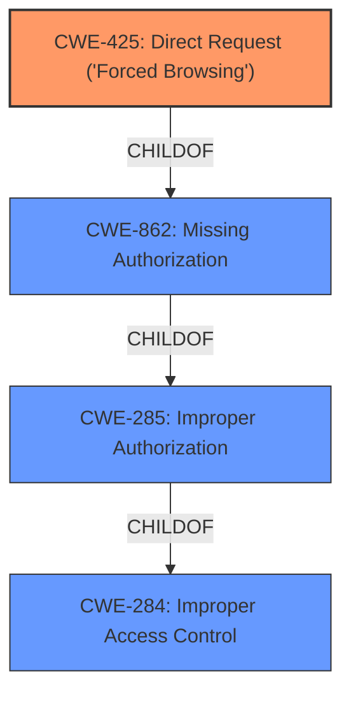

# Raw Analyzer Response for CVE-2021-24215

# Summary
| CWE ID  | CWE Name                                                                       | Confidence | CWE Abstraction Level | CWE Vulnerability Mapping Label | CWE-Vulnerability Mapping Notes |
| :-------- | :----------------------------------------------------------------------------- | :--------- | :---------------------- | :------------------------------ | :------------------------------ |
| CWE-425   | Direct Request ('Forced Browsing')                                             | 0.9        | Base                    | Primary CWE                     | Allowed                       |
| CWE-862   | Missing Authorization                                                          | 0.7        | Class                   | Secondary Candidate             | Allowed-with-Review           |
| CWE-285   | Improper Authorization                                                         | 0.6        | Class                   | Secondary Candidate             | Discouraged                    |
| CWE-284   | Improper Access Control                                                        | 0.5        | Pillar                  | Secondary Candidate             | Discouraged                    |

## Evidence and Confidence

*   **Confidence Score:** 0.9
*   **Evidence Strength:** HIGH

## Relationship Analysis
The primary CWE is CWE-425, which is a child of CWE-862 and CWE-285 and CWE-284. This indicates a hierarchical relationship where the more specific "Direct Request" vulnerability falls under the broader categories of missing and improper authorization. Choosing CWE-425 provides a more precise classification.

## Vulnerability Chain
The vulnerability chain starts with **Improper Access Control**, leading to the ability to make **Direct Requests** to sensitive admin pages, ultimately resulting in a complete compromise of the target resource.

## Summary of Analysis
The initial assessment identified **Improper Access Control** as the root cause, which aligns with the vulnerability description. However, further analysis of the vulnerability details and the available CWEs revealed that CWE-425, "Direct Request ('Forced Browsing')," is a more specific and accurate classification. This is because the vulnerability involves uncontrolled access to specific URLs due to the absence of proper authorization checks.

The evidence from the vulnerability description and CVE reference links supports this decision: "Uncontrolled access to the website customization functionality and global CMS settings, like /wp-admin/customization.php and /wp-admin/options.php". This demonstrates the ability to directly request sensitive resources without proper authorization.

The relationship graph highlights the hierarchical structure, with CWE-425 being a child of the broader authorization-related CWEs. This confirms that CWE-425 is the most specific and relevant CWE for this vulnerability.

The choice of CWE-425 is at the optimal level of specificity because it directly addresses the root cause of the vulnerability, which is the ability to bypass authorization by directly requesting restricted resources.

Relevant CWE Information:

# Enhanced Context (25 CWEs)

## CWE-1220: Insufficient Granularity of Access Control
**Abstraction Level**: Base
**Similarity Score**: 0.77
**Source**: dense

**Description**:
The product implements access controls via a policy or other feature with the intention to disable or restrict accesses (reads and/or writes) to assets in a system from untrusted agents. However, implemented access controls lack required granularity, which renders the control policy too broad because it allows accesses from unauthorized agents to the security-sensitive assets.

**Why it was not selected:**
This CWE addresses a lack of granularity in access control, but the vulnerability is more about completely missing checks for direct requests. Therefore, it's not as accurate as CWE-425.

## CWE-472: External Control of Assumed-Immutable Web Parameter
**Abstraction Level**: Base
**Similarity Score**: 0.77
**Source**: dense

**Description**:
The web application does not sufficiently verify inputs that are assumed to be immutable but are actually externally controllable, such as hidden form fields.

**Why it was not selected:**
This CWE is about tampering with assumed-immutable parameters, which is not the primary issue in this vulnerability. The main problem is the lack of authorization checks on direct requests.

## CWE-639: Authorization Bypass Through User-Controlled Key
**Abstraction Level**: Base
**Similarity Score**: 0.76
**Source**: dense

**Description**:
The system's authorization functionality does not prevent one user from gaining access to another user's data or record by modifying the key value identifying the data.

**Why it was not selected:**
This CWE is about bypassing authorization by manipulating keys, which is not directly related to the described vulnerability. The vulnerability is focused on directly accessing resources without proper authorization.

## CWE-274: Improper Handling of Insufficient Privileges
**Abstraction Level**: Base
**Similarity Score**: 0.76
**Source**: dense

**Description**:
The product does not handle or incorrectly handles when it has insufficient privileges to perform an operation, leading to resultant weaknesses.

**Why it was not selected:**
This CWE is about improper handling of insufficient privileges, which is too general for the specific vulnerability. The vulnerability is about direct access to resources without any authorization check.

## CWE-807: Reliance on Untrusted Inputs in a Security Decision
**Abstraction Level**: Base
**Similarity Score**: 0.75
**Source**: dense

**Description**:
The product uses a protection mechanism that relies on the existence or values of an input, but the input can be modified by an untrusted actor in a way that bypasses the protection mechanism.

**Why it was not selected:**
This CWE is about relying on untrusted inputs for security decisions, which is not the main issue. The vulnerability is about the absence of authorization checks, not the reliance on flawed inputs.

## CWE-424: Improper Protection of Alternate Path
**Abstraction Level**: Class
**Similarity Score**: 0.75
**Source**: dense

**Description**:
The product does not sufficiently protect all possible paths that a user can take to access restricted functionality or resources.

**Why it was not selected:**
While somewhat relevant, CWE-425 "Direct Request" is a child of CWE-424, and thus is more specific.

## CWE-552: Files or Directories Accessible to External Parties
**Abstraction Level**: Base
**Similarity Score**: 0.75
**Source**: dense

**Description**:
The product makes files or directories accessible to unauthorized actors, even though they should not be.

**Why it was not selected:**
This CWE is about general unauthorized access to files or directories, while the described vulnerability is about direct requests to specific URLs, making CWE-425 more accurate.

## CWE-280: Improper Handling of Insufficient Permissions or Privileges
**Abstraction Level**: Base
**Similarity Score**: 0.75
**Source**: dense

**Description**:
The product does not handle or incorrectly handles when it has insufficient privileges to access resources or functionality as specified by their permissions. This may cause it to follow unexpected code paths that may leave the product in an invalid state.

**Why it was not selected:**
Similar to CWE-274, this CWE is too general. The vulnerability is about the complete absence of authorization checks on direct requests.

## CWE-915: Improperly Controlled Modification of Dynamically-Determined Object Attributes
**Abstraction Level**: Base
**Similarity Score**: 0.74
**Source**: dense

**Description**:
The product receives input from an upstream component that specifies multiple attributes, properties, or fields that are to be initialized or updated in an object, but it does not properly control which attributes can be modified.

**Why it was not selected:**
This CWE focuses on improperly controlling modification of object attributes, which is not the core issue. The vulnerability is about lacking authorization checks on direct requests.

I am confident that CWE-425, "Direct Request ('Forced Browsing')," accurately reflects the root cause of the vulnerability, with secondary considerations for CWE-862, CWE-285, and CWE-284.