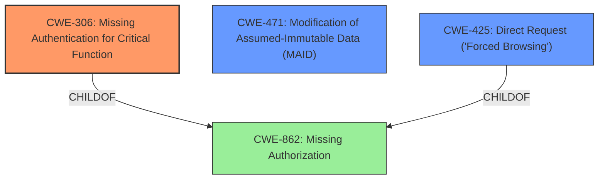

# Analysis Report for CVE-2021-24219

# Vulnerability Analysis Report: CVE-2021-24219

## Description


## Analysis (with Relationship Data)

# Summary
| CWE ID | CWE Name | Confidence | CWE Abstraction Level | CWE Vulnerability Mapping Label | CWE-Vulnerability Mapping Notes |
|---|---|---|---|---|---|
| CWE-306 | Missing Authentication for Critical Function | 1.0 | Base | Allowed | Primary CWE |
| CWE-471 | Modification of Assumed-Immutable Data (MAID) | 0.7 | Base | Allowed | Secondary Candidate |
| CWE-425 | Direct Request ('Forced Browsing') | 0.6 | Base | Allowed | Secondary Candidate |

## Evidence and Confidence

*   **Confidence Score:** 0.8
*   **Evidence Strength:** HIGH

## Relationship Analysis
The primary CWE is CWE-306 (Missing Authentication for Critical Function), which is a base-level weakness indicating a lack of authentication for a critical function. This is supported by the vulnerability description stating that the REST API endpoint, intended to require an API key, could be accessed without one.

CWE-471 (Modification of Assumed-Immutable Data (MAID)) is considered as a secondary CWE because the vulnerability allows attackers to add arbitrary data to a predefined option in the wp_options table, which could be considered assumed-immutable data.

CWE-425 (Direct Request ('Forced Browsing')) is also considered as a secondary CWE, as the vulnerability allows direct access to a REST API endpoint without proper authorization, effectively bypassing the intended access controls.



## Vulnerability Chain
The chain of events for this vulnerability is as follows:
1.  **Missing Authentication:** The REST API endpoint lacks proper authentication (CWE-306).
2.  **Direct Request:** Attackers can directly access the endpoint without an API key (CWE-425).
3.  **Modification of Data:** Attackers can add arbitrary data to the wp\_options table (CWE-471).

## Summary of Analysis
Initially, the vulnerability description points to **improper access control**.
The analysis and final selection of CWEs are based on the provided evidence. The core issue is the **lack of authentication** on a REST API endpoint, allowing unauthorized access.

*   **CWE-306 (Missing Authentication for Critical Function):** This is the primary weakness because the API endpoint, which should require authentication via an API key, does not enforce this requirement. The "CVE Reference Links Content Summary" clearly states: "This endpoint was intended to require an API key, but could be accessed without one by providing an empty `api_key` parameter." This directly aligns with the description of CWE-306.
*   **CWE-471 (Modification of Assumed-Immutable Data (MAID)):** This is a secondary weakness. Attackers can "add arbitrary data to a predefined option in the `wp_options` table". This suggests that the data within the `wp_options` table, once set, should be immutable or at least protected from unauthorized modification. The vulnerability violates this assumption, fitting the description of CWE-471.
*   **CWE-425 (Direct Request ('Forced Browsing'))**: This is a secondary weakness. The vulnerability allows direct access to a REST API endpoint without proper authorization, effectively bypassing the intended access controls. The "CVE Reference Links Content Summary" supports that the root cause is **improper access control** on the REST API endpoint.

The selected CWEs are at the optimal level of specificity, with CWE-306 being a base-level weakness that directly addresses the root cause of the vulnerability.

Relevant CWE Information:

# Enhanced Context (25 CWEs)
The following CWEs were identified as potentially relevant to this vulnerability:

## CWE-434: Unrestricted Upload of File with Dangerous Type
**Abstraction Level**: Base
**Similarity Score**: 0.78
**Source**: dense

**Description**:
The product allows the upload or transfer of dangerous file types that are automatically processed within its environment.

**Mapping Guidance**:
- Usage: Allowed
- Rationale: This CWE entry is at the Base level of abstraction, which is a preferred level of abstraction for mapping to the root causes of vulnerabilities.

## CWE-639: Authorization Bypass Through User-Controlled Key
**Abstraction Level**: Base
**Similarity Score**: 0.77
**Source**: dense

**Description**:
The system's authorization functionality does not prevent one user from gaining access to another user's data or record by modifying the key value identifying the data.

**Mapping Guidance**:
- Usage: Allowed
- Rationale: This CWE entry is at the Base level of abstraction, which is a preferred level of abstraction for mapping to the root causes of vulnerabilities.

## CWE-184: Incomplete List of Disallowed Inputs
**Abstraction Level**: Base
**Similarity Score**: 0.77
**Source**: dense

**Description**:
The product implements a protection mechanism that relies on a list of inputs (or properties of inputs) that are not allowed by policy or otherwise require other action to neutralize before additional processing takes place, but the list is incomplete.

**Mapping Guidance**:
- Usage: Allowed
- Rationale: This CWE entry is at the Base level of abstraction, which is a preferred level of abstraction for mapping to the root causes of vulnerabilities.

## CWE-23: Relative Path Traversal
**Abstraction Level**: Base
**Similarity Score**: 0.77
**Source**: dense

**Description**:
The product uses external input to construct a pathname that should be within a restricted directory, but it does not properly neutralize sequences such as ".." that can resolve to a location that is outside of that directory.

**Mapping Guidance**:
- Usage: Allowed
- Rationale: This CWE entry is at the Base level of abstraction, which is a preferred level of abstraction for mapping to the root causes of vulnerabilities.

## CWE-425: Direct Request ('Forced Browsing')
**Abstraction Level**: Base
**Similarity Score**: 0.77
**Source**: dense

**Description**:
The web application does not adequately enforce appropriate authorization on all restricted URLs, scripts, or files.

**Mapping Guidance**:
- Usage: Allowed
- Rationale: This CWE entry is at the Base level of abstraction, which is a preferred level of abstraction for mapping to the root causes of vulnerabilities.

## CWE-472: External Control of Assumed-Immutable Web Parameter
**Abstraction Level**: Base
**Similarity Score**: 0.77
**Source**: dense

**Description**:
The web application does not sufficiently verify inputs that are assumed to be immutable but are actually externally controllable, such as hidden form fields.

**Mapping Guidance**:
- Usage: Allowed
- Rationale: This CWE entry is at the Base level of abstraction, which is a preferred level of abstraction for mapping to the root causes of vulnerabilities.

## CWE-552: Files or Directories Accessible to External Parties
**Abstraction Level**: Base
**Similarity Score**: 0.77
**Source**: dense

**Description**:
The product makes files or directories accessible to unauthorized actors, even though they should not be.

**Mapping Guidance**:
- Usage: Allowed
- Rationale: This CWE entry is at the Base level of abstraction, which is a preferred level of abstraction for mapping to the root causes of vulnerabilities.

## CWE-74: Improper Neutralization of Special Elements in Output Used by a Downstream Component ('Injection')
**Abstraction Level**: Class
**Similarity Score**: 0.76
**Source**: dense

**Description**:
The product constructs all or part of a command, data structure, or record using externally-influenced input from an upstream component, but it does not neutralize or incorrectly neutralizes special elements that could modify how it is parsed or interpreted when it is sent to a downstream component.

**Mapping Guidance**:
- Usage: Discouraged
- Rationale: CWE-74 is high-level and often misused when lower-level weaknesses are more appropriate.

## CWE-1289: Improper Validation of Unsafe Equivalence in Input
**Abstraction Level**: Base
**Similarity Score**: 0.76
**Source**: dense

**Description**:
The product receives an input value that is used as a resource identifier or other type of reference, but it does not validate or incorrectly validates that the input is equivalent to a potentially-unsafe value.

**Mapping Guidance**:
- Usage: Allowed
- Rationale: This CWE entry is at the Base level of abstraction, which is a preferred level


## CWE Relationship Analysis

Current CWEs represent these abstraction levels: .


### Vulnerability Chain Analysis

**Chain starting from CWE-306:**
- 306 (Missing Authentication for Critical Function) - ROOT


**Chain starting from CWE-862:**
- 862 (Missing Authorization) - ROOT


### CWE Relationship Diagram

```mermaid
graph TD
    classDef primary fill:#f96,stroke:#333,stroke-width:2px
    classDef secondary fill:#69f,stroke:#333
    classDef tertiary fill:#9e9,stroke:#333
```


*Report generated on 2025-04-02 07:41:11*
