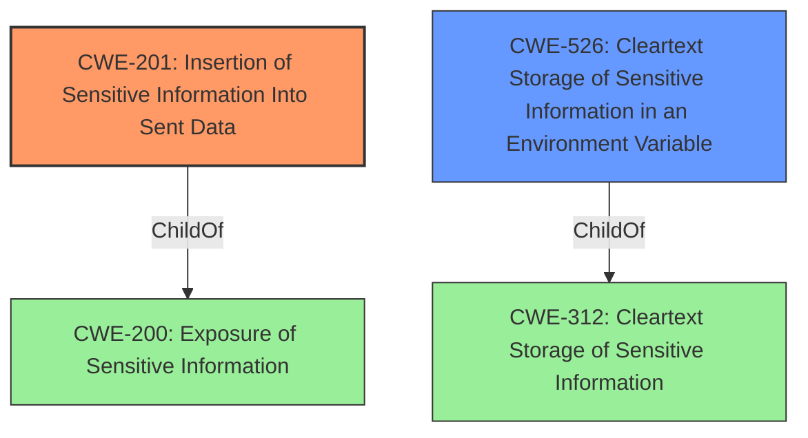

# Enhanced Analysis for CVE-2021-24226

# Summary
| CWE ID | CWE Name | Confidence | CWE Abstraction Level | CWE Vulnerability Mapping Label | CWE-Vulnerability Mapping Notes |
|---|---|---|---|---|---|
| CWE-201 | Insertion of Sensitive Information Into Sent Data | 1.0 | Base | Allowed | Primary CWE. The application is **dumping serialize($_SERVER)**, which contains sensitive information into a publicly accessible page. |
| CWE-526 | Cleartext Storage of Sensitive Information in an Environment Variable | 0.7 | Variant | Allowed | Secondary CWE. The **dumped serialize($_SERVER)** contains environment variables, which could potentially store sensitive information in cleartext. |

## Evidence and Confidence

*   **Confidence Score:** 0.9
*   **Evidence Strength:** HIGH

## Relationship Analysis
- CWE-201 (Insertion of Sensitive Information Into Sent Data) is the primary weakness because the vulnerability description explicitly states that the plugin is **dumping serialize($_SERVER)**, which contains sensitive information, onto a public page. CWE-201 has a parent-child relationship with CWE-200 (Exposure of Sensitive Information).
- CWE-526 (Cleartext Storage of Sensitive Information in an Environment Variable) is a secondary weakness because the leaked `$_SERVER` variable *may* contain sensitive information stored in environment variables in cleartext. CWE-526 is a variant of CWE-312 (Cleartext Storage of Sensitive Information).
- The relationship between CWE-201 and CWE-526 is that the information leaked (CWE-201) *might* include sensitive information stored in cleartext in environment variables (CWE-526).



## Vulnerability Chain
The vulnerability chain starts with the **dumping serialize($_SERVER)** which leads to the Exposure of Sensitive Information. If the Environment Variables contain sensitive information, then the chain also includes the Cleartext Storage of that Sensitive Information in those environment variables.

## Summary of Analysis
The initial analysis focused on identifying the root cause of the vulnerability, which is the **dumping serialize($_SERVER)**. The key phrase "*dumping serialize($_SERVER)*" clearly indicates that sensitive information is being inserted into the sent data.

The retriever results identified CWE-201 as the top candidate, which aligns with the vulnerability description. The description states that "the file resource/frontend/product/product-shortcode.php responsible for the [accessally_order_form] shortcode is **dumping serialize($_SERVER)**, which contains all environment variables."

CWE-526 was added as a secondary weakness because the `$_SERVER` variable may contain sensitive information stored in environment variables in cleartext.

The final selection of CWEs is based on the evidence from the vulnerability description and the relationships between the CWEs. CWE-201 is the primary weakness because it directly addresses the root cause of the vulnerability, while CWE-526 is a secondary weakness that identifies a potential issue with the storage of sensitive information.

The selected CWEs are at the optimal level of specificity. CWE-201 is a Base CWE that accurately describes the root cause of the vulnerability. CWE-526 is a Variant CWE that identifies a specific type of sensitive information exposure.


## CWE Relationship Analysis

Current CWEs represent these abstraction levels: .


### Vulnerability Chain Analysis

**Chain starting from CWE-526:**
- 526 (Cleartext Storage of Sensitive Information in an Environment Variable) - ROOT


**Chain starting from CWE-312:**
- 312 (Cleartext Storage of Sensitive Information) - ROOT


### CWE Relationship Diagram

```mermaid
graph TD
    classDef primary fill:#f96,stroke:#333,stroke-width:2px
    classDef secondary fill:#69f,stroke:#333
    classDef tertiary fill:#9e9,stroke:#333
```