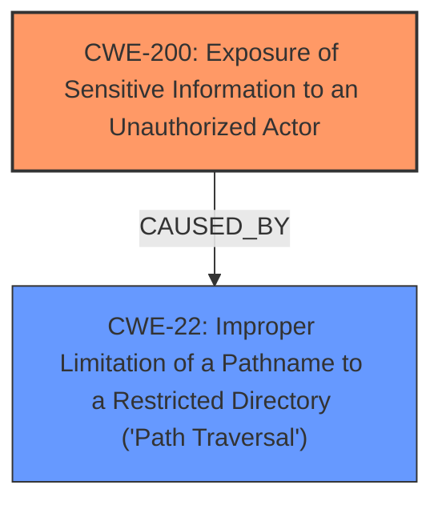

# Raw Analyzer Response for CVE-2021-24227

# Summary
| CWE ID  | CWE Name                                                        | Confidence | CWE Abstraction Level | CWE Vulnerability Mapping Label | CWE-Vulnerability Mapping Notes |
| :-------- | :-------------------------------------------------------------- | :---------- | :-------------------- | :------------------------------ | :------------------------------ |
| CWE-200   | Exposure of Sensitive Information to an Unauthorized Actor      | 0.9         | Class                | Primary                         | Discouraged                   |
| CWE-22    | Improper Limitation of a Pathname to a Restricted Directory ('Path Traversal') | 0.8         | Base                | Secondary                         | Allowed                   |

## Evidence and Confidence

*   **Confidence Score:** 0.85
*   **Evidence Strength:** HIGH

## Relationship Analysis
The primary relationship influencing the decision is the parent-child relationship between CWE-200 and potential child CWEs. While the root cause is Path Traversal (CWE-22), the primary impact is the exposure of sensitive information (CWE-200).

## Vulnerability Chain
The vulnerability chain starts with **Improper Limitation of a Pathname to a Restricted Directory ('Path Traversal')** (CWE-22), which leads to **Exposure of Sensitive Information to an Unauthorized Actor** (CWE-200).

## Summary of Analysis
Initially, the analysis focused on identifying the root cause, which is the **Local File Disclosure** vulnerability stemming from **lack of proper input validation and sanitization** in the Patreon WordPress plugin. The plugin uses the `$_REQUEST['patron_only_image']` parameter to construct the path to an image without proper validation, leading to a path traversal vulnerability. This allows an attacker to access files outside the intended upload directory, leading to the disclosure of sensitive files such as `wp-config.php`.

The primary CWE considered was CWE-22, **Improper Limitation of a Pathname to a Restricted Directory ('Path Traversal')**, as it directly addresses the root cause of the vulnerability. However, the ultimate impact is the disclosure of sensitive information. Therefore, CWE-200, **Exposure of Sensitive Information to an Unauthorized Actor**, was also considered as the primary weakness based on MITRE mapping guidance. The "CVE Reference Links Content Summary" highlights that attackers can potentially access sensitive information, such as database credentials, secret keys, and other configuration data stored in files like `wp-config.php`, which can lead to a full site takeover.

Although CWE-200 is discouraged as it is often misused, in this case it accurately reflects the high-level impact of the vulnerability: **Sensitive Data Exposure**. The retriever results also list CWE-200 with a similarity score of 0.327. The vulnerability allows "anyone visiting the site" to "leak important internal files like wp-config.php, which contains database credentials and cryptographic keys." This aligns with CWE-200's description: "The product exposes sensitive information to an actor that is not explicitly authorized to have access to that information."

CWE-22 is included to specify the technical weakness that allowed the exposure of sensitive information.

The final decision is based on the evidence that the primary impact is the exposure of sensitive data due to the path traversal vulnerability. CWE-200 captures this impact, while CWE-22 explains the technical flaw that enables it.

Relevant CWE Information:

# Enhanced Context (25 CWEs)
The following CWEs were identified as potentially relevant to this vulnerability:

## CWE-226: Sensitive Information in Resource Not Removed Before Reuse
**Abstraction Level**: Base
**Similarity Score**: 0.78
**Source**: dense

**Description**:
The product releases a resource such as memory or a file so that it can be made available for reuse, but it does not clear or "zeroize" the information contained in the resource before the product performs a critical state transition or makes the resource available for reuse by other entities.

**Mapping Guidance**:
- Usage: Allowed
- Rationale: This CWE entry is at the Base level of abstraction, which is a preferred level of abstraction for mapping to the root causes of vulnerabilities.

## CWE-639: Authorization Bypass Through User-Controlled Key
**Abstraction Level**: Base
**Similarity Score**: 0.77
**Source**: dense

**Description**:
The system's authorization functionality does not prevent one user from gaining access to another user's data or record by modifying the key value identifying the data.

**Mapping Guidance**:
- Usage: Allowed
- Rationale: This CWE entry is at the Base level of abstraction, which is a preferred level of abstraction for mapping to the root causes of vulnerabilities.

## CWE-807: Reliance on Untrusted Inputs in a Security Decision
**Abstraction Level**: Base
**Similarity Score**: 0.76
**Source**: dense

**Description**:
The product uses a protection mechanism that relies on the existence or values of an input, but the input can be modified by an untrusted actor in a way that bypasses the protection mechanism.

**Mapping Guidance**:
- Usage: Allowed
- Rationale: This CWE entry is at the Base level of abstraction, which is a preferred level of abstraction for mapping to the root causes of vulnerabilities.

## CWE-1391: Use of Weak Credentials
**Abstraction Level**: Class
**Similarity Score**: 0.76
**Source**: dense

**Description**:
The product uses weak credentials (such as a default key or hard-coded password) that can be calculated, derived, reused, or guessed by an attacker.

**Mapping Guidance**:
- Usage: Allowed-with-Review
- Rationale: This CWE entry is a Class and might have Base-level children that would be more appropriate

## CWE-538: Insertion of Sensitive Information into Externally-Accessible File or Directory
**Abstraction Level**: Base
**Similarity Score**: 0.76
**Source**: dense

**Description**:
The product places sensitive information into files or directories that are accessible to actors who are allowed to have access to the files, but not to the sensitive information.

**Mapping Guidance**:
- Usage: Allowed
- Rationale: This CWE entry is at the Base level of abstraction, which is a preferred level of abstraction for mapping to the root causes of vulnerabilities.

## CWE-1390: Weak Authentication
**Abstraction Level**: Class
**Similarity Score**: 0.76
**Source**: dense

**Description**:
The product uses an authentication mechanism to restrict access to specific users or identities, but the mechanism does not sufficiently prove that the claimed identity is correct.

**Mapping Guidance**:
- Usage: Allowed-with-Review
- Rationale: This CWE entry is a Class and might have Base-level children that would be more appropriate

## CWE-330: Use of Insufficiently Random Values
**Abstraction Level**: Class
**Similarity Score**: 0.76
**Source**: dense

**Description**:
The product uses insufficiently random numbers or values in a security context that depends on unpredictable numbers.

**Mapping Guidance**:
- Usage: Discouraged
- Rationale: This CWE entry is a level-1 Class (i.e., a child of a Pillar). It might have lower-level children that would be more appropriate

## CWE-319: Cleartext Transmission of Sensitive Information
**Abstraction Level**: Base
**Similarity Score**: 0.76
**Source**: dense

**Description**:
The product transmits sensitive or security-critical data in cleartext in a communication channel that can be sniffed by unauthorized actors.

**Mapping Guidance**:
- Usage: Allowed
- Rationale: This CWE entry is at the Base level of abstraction, which is a preferred level of abstraction for mapping to the root causes of vulnerabilities.

## CWE-472: External Control of Assumed-Immutable Web Parameter
**Abstraction Level**: Base
**Similarity Score**: 0.76
**Source**: dense

**Description**:
The web application does not sufficiently verify inputs that are assumed to be immutable but are actually externally controllable, such as hidden form fields.

**Mapping Guidance**:
- Usage: Allowed
- Rationale: This CWE entry is at the Base level of abstraction, which is a preferred level of abstraction for mapping to the root causes of vulnerabilities.

## CWE-212: Improper Removal of Sensitive Information Before Storage or Transfer
**Abstraction Level**: Base
**Similarity Score**: 0.75
**Source**: dense

**Description**:
The product stores, transfers, or shares a resource that contains sensitive information, but it does not properly remove that information before the product makes the resource available to unauthorized actors.

**Mapping Guidance**:
- Usage: Allowed
- Rationale: This CWE entry is at the Base level of abstraction, which is a preferred level of abstraction for mapping to the root causes of vulnerabilities.

## CWE-200: Exposure of Sensitive Information to an Unauthorized Actor
**Abstraction