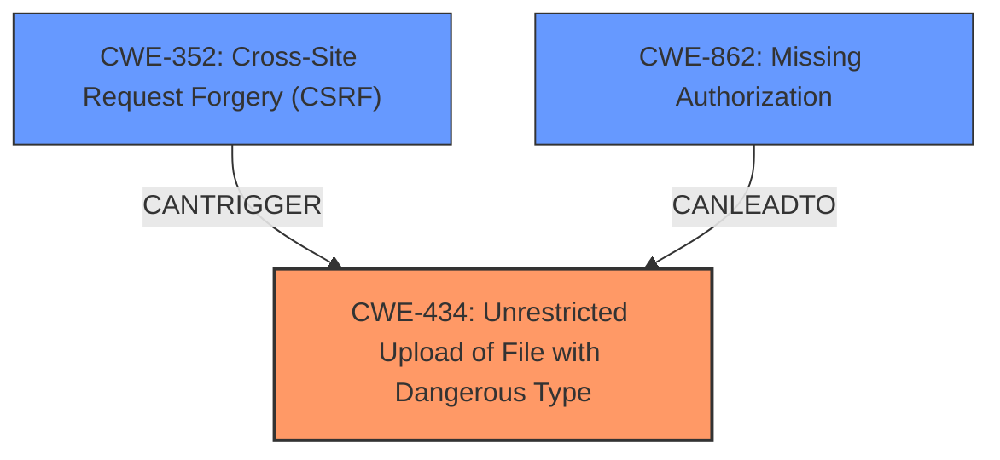

# Analysis Report for CVE-2021-24252

# Vulnerability Analysis Report: CVE-2021-24252

## Description


## Analysis (with Relationship Data)

# Summary
| CWE ID | CWE Name | Confidence | CWE Abstraction Level | CWE Vulnerability Mapping Label | CWE-Vulnerability Mapping Notes |
|---|---|---|---|---|---|
| CWE-434 | Unrestricted Upload of File with Dangerous Type | 1 | Base | Allowed | Primary CWE. The plugin does not verify the type of uploaded files, allowing the upload of executable files. |
| CWE-352 | Cross-Site Request Forgery (CSRF) | 0.7 | Compound | Allowed | Secondary CWE. The plugin lacks CSRF protection, allowing for exploitation via cross-site request forgery. |
| CWE-862 | Missing Authorization | 0.6 | Class | Allowed-with-Review | Secondary CWE. Authorization checks are missing which can lead to Local File Inclusion (LFI). |

## Evidence and Confidence

*   **Confidence Score:** 0.8
*   **Evidence Strength:** HIGH

## Relationship Analysis
The primary weakness is CWE-434, which allows an attacker to upload arbitrary files. This can be compounded by CWE-352, Cross-Site Request Forgery, if an attacker can trick an administrator into uploading a malicious file. Also, the lack of authorization, CWE-862, could lead to LFI.



## Vulnerability Chain
The vulnerability chain starts with the **lack of file upload restrictions**. This leads to arbitrary file uploads. The **lack of CSRF protection** allows an attacker to trick an administrator into uploading a file. The **missing authorization checks** allow a potential Local File Inclusion vulnerability. The end result of these vulnerabilities is Remote Code Execution (RCE).

## Summary of Analysis
The primary CWE is CWE-434, as the root cause of the RCE vulnerability is the **lack of file upload restrictions**, which allows an attacker to upload arbitrary files. This is supported by the "CVE Reference Links Content Summary," which states, "The plugin does not verify uploaded image file types, allowing admin accounts to upload arbitrary files." The **lack of CSRF protection** is a secondary vulnerability that can be exploited to trigger the arbitrary file upload, and the **missing authorization checks** could lead to LFI.

The "Retriever Results" also lists CWE-434 as the top combined result, further supporting the classification.

Other CWEs were considered but deemed less appropriate:

*   CWE-646: Reliance on File Name or Extension of Externally-Supplied File: This is a more specific case of CWE-434, and the vulnerability description doesn't explicitly mention reliance on file name or extension.
*   CWE-863: Incorrect Authorization and CWE-285: Improper Authorization: While authorization checks are missing, leading to LFI, the primary issue leading to RCE is the file upload vulnerability.
*   CWE-306: Missing Authentication for Critical Function: While authentication is required to access the admin panel, the vulnerability lies in the **lack of validation** once an admin user is authenticated.
*   CWE-183: Permissive List of Allowed Inputs and CWE-184: Incomplete List of Disallowed Inputs: There's no mention of an allowlist or denylist being used, so these CWEs are not applicable.
Relevant CWE Information:


## CWE Relationship Analysis

Current CWEs represent these abstraction levels: .


### Vulnerability Chain Analysis

**Chain starting from CWE-646:**
- 646 (Reliance on File Name or Extension of Externally-Supplied File) - ROOT


**Chain starting from CWE-306:**
- 306 (Missing Authentication for Critical Function) - ROOT


### CWE Relationship Diagram

```mermaid
graph TD
    classDef primary fill:#f96,stroke:#333,stroke-width:2px
    classDef secondary fill:#69f,stroke:#333
    classDef tertiary fill:#9e9,stroke:#333
```


*Report generated on 2025-04-02 05:47:59*
