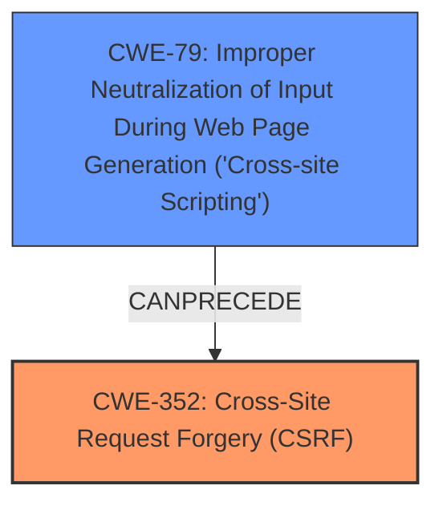

# Raw Analyzer Response for CVE-2021-24272

# Summary
| CWE ID | CWE Name | Confidence | CWE Abstraction Level | CWE Vulnerability Mapping Label | CWE-Vulnerability Mapping Notes |
|---|---|---|---|---|---|
| CWE-352 | Cross-Site Request Forgery (CSRF) | 1.0 | Compound | Primary | Allowed |
| CWE-79 | Improper Neutralization of Input During Web Page Generation ('Cross-site Scripting') | 1.0 | Base | Secondary | Allowed |

## Evidence and Confidence

*   **Confidence Score:** 1.0
*   **Evidence Strength:** HIGH

## Relationship Analysis
The analysis reveals a primary weakness of CWE-352 [Cross-Site Request Forgery (CSRF)] and a secondary weakness of CWE-79 [Improper Neutralization of Input During Web Page Generation ('Cross-site Scripting')]. CWE-352 requires multiple conditions to occur simultaneously and can lead to other weaknesses. CWE-79's description matches the Stored XSS aspect of the vulnerability. CWE-352 can be related to CWE-79 because an attacker can use CSRF to trick a user into submitting a request that contains an XSS payload.

## Vulnerability Chain
The vulnerability chain starts with the **lack of CSRF check** (CWE-352), which allows attackers to make logged-in users perform unwanted actions. This is compounded by the **lack of sanitization**, leading to a **Stored Cross-Site Scripting** vulnerability (CWE-79).

## Summary of Analysis
The primary weakness is the **lack of CSRF check** (CWE-352), as stated in both the vulnerability description and the CVE Reference Links Content Summary. The secondary weakness is the resulting **Stored Cross-Site Scripting** (CWE-79) due to the **lack of sanitization**.

*   "The fitness calculators WordPress plugin before 1.9.6...was **lacking CSRF check**, allowing attackers to make logged in users perform unwanted actions, such as change the calculator headers. Due to the **lack of sanitisation**, this could also lead to a **Stored Cross-Site Scripting** issue"
*   "**Root Cause of Vulnerability:** The vulnerability stems from a **lack of Cross-Site Request Forgery (CSRF) protection** in the "Fitness Calculators" WordPress plugin, combined with insufficient sanitization of user input."
*   "**Weaknesses/Vulnerabilities Present:** 1. **CSRF:** The plugin lacks proper CSRF checks, allowing attackers to make logged-in users perform unwanted actions. 2. **Stored Cross-Site Scripting (XSS):** Due to the **absence of sanitization** on user input, specifically when changing calculator headers, attackers can inject malicious scripts that are then stored and executed when the page is viewed."

CWE-352 is a Compound weakness, and CWE-79 is a Base weakness, which is the optimal level of specificity. Both CWEs are ALLOWED per MITRE's mapping guidance.

Relevant CWE Information:

# Enhanced Context (25 CWEs)
The following CWEs were identified as potentially relevant to this vulnerability:

## CWE-472: External Control of Assumed-Immutable Web Parameter
**Abstraction Level**: Base
**Similarity Score**: 0.77
**Source**: dense

**Description**:
The web application does not sufficiently verify inputs that are assumed to be immutable but are actually externally controllable, such as hidden form fields.
- Considered but not used. This CWE is not as directly applicable as CWE-352 or CWE-79.

## CWE-807: Reliance on Untrusted Inputs in a Security Decision
**Abstraction Level**: Base
**Similarity Score**: 0.76
**Source**: dense

**Description**:
The product uses a protection mechanism that relies on the existence or values of an input, but the input can be modified by an untrusted actor in a way that bypasses the protection mechanism.
- Considered but not used. This CWE is not as directly applicable as CWE-352 or CWE-79.

## CWE-1289: Improper Validation of Unsafe Equivalence in Input
**Abstraction Level**: Base
**Similarity Score**: 0.76
**Source**: dense

**Description**:
The product receives an input value that is used as a resource identifier or other type of reference, but it does not validate or incorrectly validates that the input is equivalent to a potentially-unsafe value.
- Considered but not used. This CWE is not as directly applicable as CWE-352 or CWE-79.

## CWE-74: Improper Neutralization of Special Elements in Output Used by a Downstream Component ('Injection')
**Abstraction Level**: Class
**Similarity Score**: 0.75
**Source**: dense

**Description**:
The product constructs all or part of a command, data structure, or record using externally-influenced input from an upstream component, but it does not neutralize or incorrectly neutralizes special elements that could modify how it is parsed or interpreted when it is sent to a downstream component.
- Considered but not used. CWE-79 is more specific to the XSS issue.

## CWE-639: Authorization Bypass Through User-Controlled Key
**Abstraction Level**: Base
**Similarity Score**: 0.75
**Source**: dense

**Description**:
The system's authorization functionality does not prevent one user from gaining access to another user's data or record by modifying the key value identifying the data.
- Considered but not used. This CWE is not as directly applicable as CWE-352 or CWE-79.

## CWE-184: Incomplete List of Disallowed Inputs
**Abstraction Level**: Base
**Similarity Score**: 0.75
**Source**: dense

**Description**:
The product implements a protection mechanism that relies on a list of inputs (or properties of inputs) that are not allowed by policy or otherwise require other action to neutralize before additional processing takes place, but the list is incomplete.
- Considered but not used. This CWE is not as directly applicable as CWE-352 or CWE-79.

## CWE-183: Permissive List of Allowed Inputs
**Abstraction Level**: Base
**Similarity Score**: 0.74
**Source**: dense

**Description**:
The product implements a protection mechanism that relies on a list of inputs (or properties of inputs) that are explicitly allowed by policy because the inputs are assumed to be safe, but the list is too permissive - that is, it allows an input that is unsafe, leading to resultant weaknesses.
- Considered but not used. This CWE is not as directly applicable as CWE-352 or CWE-79.

## CWE-1220: Insufficient Granularity of Access Control
**Abstraction Level**: Base
**Similarity Score**: 0.74
**Source**: dense

**Description**:
The product implements access controls via a policy or other feature with the intention to disable or restrict accesses (reads and/or writes) to assets in a system from untrusted agents. However, implemented access controls lack required granularity, which renders the control policy too broad because it allows accesses from unauthorized agents to the security-sensitive assets.
- Considered but not used. This CWE is not as directly applicable as CWE-352 or CWE-79.

## CWE-274: Improper Handling of Insufficient Privileges
**Abstraction Level**: Base
**Similarity Score**: 0.74
**Source**: dense

**Description**:
The product does not handle or incorrectly handles when it has insufficient privileges to perform an operation, leading to resultant weaknesses.
- Considered but not used. This CWE is not as directly applicable as CWE-352 or CWE-79.

## CWE-138: Improper Neutralization of Special Elements
**Abstraction Level**: Class
**Similarity Score**: 0.73
**Source**: dense

**Description**:
The product receives input from an upstream component, but it does not neutralize or incorrectly neutralizes special elements that could be interpreted as control elements or syntactic markers when they are sent to a downstream component.
- Considered but not used. CWE-79 is more specific to the XSS issue.

## CWE-116: Improper Encoding or Escaping of Output
**Abstraction Level**: Class
**Similarity Score**: 8170.88
**Source**: sparse

**Description**:
The product prepares a structured message for communication with another component, but encoding or escaping of the data is either missing or done incorrectly. As a result, the intended structure of the message is not preserved.
- Considered but not used. CWE-79 is more specific to the XSS issue.

## CWE-79: Improper Neutralization of Input During Web Page Generation ('Cross-site Scripting')