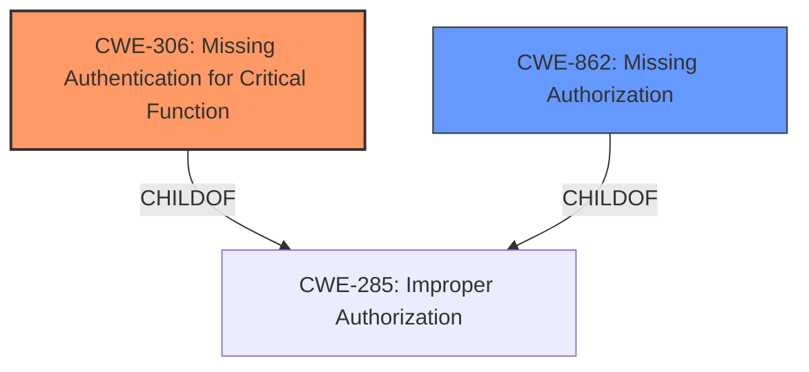

# Analysis for CVE-2021-24278

# Summary
| CWE ID | CWE Name | Confidence | CWE Abstraction Level | CWE Vulnerability Mapping Label | CWE-Vulnerability Mapping Notes |
|---|---|---|---|---|---|
| CWE-306 | Missing Authentication for Critical Function | 0.9 | Base | Primary | Allowed |
| CWE-862 | Missing Authorization | 0.7 | Class | Secondary | Allowed-with-Review |

## Evidence and Confidence

*   **Confidence Score:** 0.8
*   **Evidence Strength:** HIGH

## Relationship Analysis
The primary relationship considered was the parent-child relationship between CWE-285 (Improper Authorization), CWE-862 (Missing Authorization), and CWE-306 (Missing Authentication for Critical Function). CWE-306 and CWE-862 are children of CWE-285. Since the vulnerability specifically involves a missing authentication step for a critical function, CWE-306 was deemed the most specific and appropriate choice. CWE-862 was considered as a secondary weakness since the nonce generation can also be considered an authorization issue.

## Vulnerability Chain
The chain of events is as follows:
1.  The plugin exposes an AJAX action `wp_ajax_nopriv_wpcf7r_get_nonce` intended to generate nonces.
2.  This AJAX action lacks authentication (**CWE-306**), allowing unauthenticated users to access it.
3.  Unauthenticated users can then generate arbitrary nonces for any WordPress action/function.
4.  Other plugins relying solely on nonce checks for access control are vulnerable.
5.  An attacker can use the generated nonces to access sensitive functions, potentially leading to site takeover.

## Summary of Analysis
The initial analysis focused on identifying the root cause of the vulnerability. The key aspect is the **lack of authentication** for a critical function (nonce generation), which is why CWE-306 was selected as the primary CWE.

The following evidence supports this:
*   "unauthenticated users can use the wpcf7r_get_nonce AJAX action to retrieve a valid nonce for any WordPress action/function."
*   "The plugin exposed an AJAX action `wp_ajax_nopriv_wpcf7r_get_nonce` that was not intended for public use."
*   "This AJAX action was hooked to the `wpcf7r_get_nonce` function, which allowed for the generation of arbitrary nonces."

CWE-862 (Missing Authorization) was considered a secondary weakness since the nonce generation, while lacking authentication, effectively bypasses intended authorization checks. The vulnerability allows an attacker to generate valid nonces for actions they should not be authorized to perform.

The selected CWEs are at the optimal level of specificity. CWE-306 directly addresses the **missing authentication** aspect, while CWE-862 highlights the resulting **authorization bypass**. More general CWEs like CWE-284 (Improper Access Control) would not be as informative.

Other CWEs Considered:

*   CWE-352 (Cross-Site Request Forgery (CSRF)): While CSRF involves unauthorized actions, this vulnerability doesn't require tricking a user into making a request. It directly allows nonce generation without authentication. Therefore, CWE-352 is not applicable.
*   CWE-863 (Incorrect Authorization): While the nonce generation leads to authorization bypass, the root cause is the missing authentication, not an incorrect authorization check.
*   CWE-285 (Improper Authorization): This is a higher-level class and less specific than CWE-306 and CWE-862.
*   CWE-89 (Improper Neutralization of Special Elements used in an SQL Command ('SQL Injection')): This is not relevant as there is no SQL injection involved.
*   CWE-601 (URL Redirection to Untrusted Site ('Open Redirect')): This is not relevant as there is no URL redirection involved.
*   CWE-471 (Modification of Assumed-Immutable Data (MAID)): This is not relevant as the vulnerability doesn't directly involve the modification of assumed-immutable data.
*   CWE-1390 (Weak Authentication): While authentication is involved, the core issue is the complete absence of authentication, not a weak authentication mechanism. Therefore, CWE-306 is more accurate.