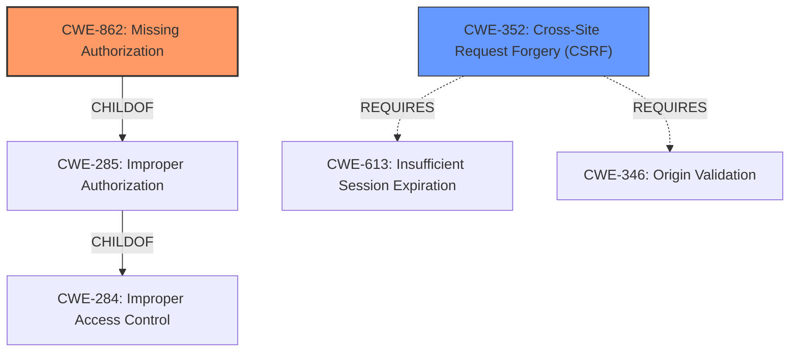

# Enhanced Analysis for CVE-2021-24281

# Summary
| CWE ID  | CWE Name                                                                                    | Confidence | CWE Abstraction Level | CWE Vulnerability Mapping Label | CWE-Vulnerability Mapping Notes |
| :-------- | :------------------------------------------------------------------------------------------ | :---------- | :---------------------- | :------------------------------ | :------------------------------ |
| CWE-862   | Missing Authorization                                                                     | 1          | Class                   | Primary CWE                    | Allowed-with-Review           |
| CWE-352   | Cross-Site Request Forgery (CSRF)                                                         | 0.75        | Compound                | Secondary CWE                   | Allowed                       |

## Evidence and Confidence

*   **Confidence Score:** 0.9
*   **Evidence Strength:** HIGH

## Relationship Analysis
The primary CWE is CWE-862 **Missing Authorization**, which falls under the broader category of CWE-285 **Improper Authorization**, and CWE-284 **Improper Access Control**. The vulnerability description clearly indicates that the `delete_action_post` function lacks authorization checks, making CWE-862 the most fitting choice. CWE-352 **Cross-Site Request Forgery (CSRF)** is considered as a secondary weakness due to the lack of nonce protection mentioned in the vulnerability description. CWE-352 requires multiple weaknesses to be present simultaneously, making it a compound weakness.



## Vulnerability Chain
The vulnerability chain starts with the **missing authorization** in the `delete_action_post` function (CWE-862), which allows any authenticated user to trigger the function and delete posts. The **lack of nonce protection** allows a CSRF attack (CWE-352).

## Summary of Analysis
The analysis is strongly based on the provided evidence, specifically the CVE Reference Links Content Summary.
The vulnerability description indicates a **missing authorization** check in the `delete_action_post` AJAX action, allowing any authenticated user to delete posts. The root cause is a **failure to enforce access control**, making CWE-862 the primary weakness.
The description also mentions **lack of nonce protection**, suggesting a potential for CSRF attacks (CWE-352) as a secondary weakness.
The selection of CWE-862 is at the optimal level of specificity, as it accurately captures the root cause of the vulnerability: **the absence of an authorization check**. Other CWEs like CWE-285 **Improper Authorization** are too generic.

Relevant CWE Information:

# Enhanced Context (25 CWEs)

## CWE-472: External Control of Assumed-Immutable Web Parameter
**Abstraction Level**: Base
**Similarity Score**: 0.78

**Description**:
The web application does not sufficiently verify inputs that are assumed to be immutable but are actually externally controllable, such as hidden form fields.

*Rationale for not selecting*: While this could be a contributing factor, the primary issue is the missing authorization check, not the modification of assumed-immutable data.

## CWE-639: Authorization Bypass Through User-Controlled Key
**Abstraction Level**: Base
**Similarity Score**: 0.77

**Description**:
The system's authorization functionality does not prevent one user from gaining access to another user's data or record by modifying the key value identifying the data.

*Rationale for not selecting*: The vulnerability does not involve modifying a key value to bypass authorization. The problem is the **lack of authorization**.

## CWE-425: Direct Request ('Forced Browsing')
**Abstraction Level**: Base
**Similarity Score**: 0.77

**Description**:
The web application does not adequately enforce appropriate authorization on all restricted URLs, scripts, or files.

*Rationale for not selecting*: This is similar to **missing authorization** but focuses on inadequate enforcement. The primary issue is the complete **absence of an authorization check**.

## CWE-807: Reliance on Untrusted Inputs in a Security Decision
**Abstraction Level**: Base
**Similarity Score**: 0.76

**Description**:
The product uses a protection mechanism that relies on the existence or values of an input, but the input can be modified by an untrusted actor in a way that bypasses the protection mechanism.

*Rationale for not selecting*: While untrusted input is involved, the core issue is the **lack of an authorization check**, not the reliance on untrusted inputs for a security decision.

## CWE-668: Exposure of Resource to Wrong Sphere
**Abstraction Level**: Class
**Similarity Score**: 0.76

**Description**:
The product exposes a resource to the wrong control sphere, providing unintended actors with inappropriate access to the resource.

*Rationale for not selecting*: This is a high-level class and not as specific as **missing authorization**.

## CWE-41: Improper Resolution of Path Equivalence
**Abstraction Level**: Base
**Similarity Score**: 0.76

**Description**:
The product is vulnerable to file system contents disclosure through path equivalence. Path equivalence involves the use of special characters in file and directory names. The associated manipulations are intended to generate multiple names for the same object.

*Rationale for not selecting*: This vulnerability does not involve path equivalence issues.

## CWE-552: Files or Directories Accessible to External Parties
**Abstraction Level**: Base
**Similarity Score**: 0.76

**Description**:
The product makes files or directories accessible to unauthorized actors, even though they should not be.

*Rationale for not selecting*: This vulnerability is about **missing authorization** to delete posts, not making files/directories accessible.

## CWE-1220: Insufficient Granularity of Access Control
**Abstraction Level**: Base
**Similarity Score**: 0.75

**Description**:
The product implements access controls via a policy or other feature with the intention to disable or restrict accesses (reads and/or writes) to assets in a system from untrusted agents. However, implemented access controls lack required granularity, which renders the control policy too broad because it allows accesses from unauthorized agents to the security-sensitive assets.

*Rationale for not selecting*: The issue is not the granularity of access control, but the **complete absence of it**.

## CWE-184: Incomplete List of Disallowed Inputs
**Abstraction Level**: Base
**Similarity Score**: 0.75

**Description**:
The product implements a protection mechanism that relies on a list of inputs (or properties of inputs) that are not allowed by policy or otherwise require other action to neutralize before additional processing takes place, but the list is incomplete.

*Rationale for not selecting*: This is not related to a list of disallowed inputs.

## CWE-799: Improper Control of Interaction Frequency
**Abstraction Level**: Class
**Similarity Score**: 0.75

**Description**:
The product does not properly limit the number or frequency of interactions that it has with an actor, such as the number of incoming requests.

*Rationale for not selecting*: This is not related to the frequency of interactions.

## CWE-863: Incorrect Authorization
**Abstraction Level**: Class
**Similarity Score**: 6490.72

**Description**:
The product performs an authorization check when an actor attempts to access a resource or perform an action, but it does not correctly perform the check.

*Rationale for not selecting*: The vulnerability description says that the authorization check is **missing**, not that it's performed incorrectly.

## CWE-285: Improper Authorization
**Abstraction Level**: Class
**Similarity Score**: 6374.33

**Description**:
The product does not perform or incorrectly performs an authorization check when an actor attempts to access a resource or perform an action.

*Rationale for not selecting*: While technically correct, CWE-285 is a high-level class. CWE-862 **Missing Authorization** is a more specific and accurate description of the vulnerability.

## CWE-639: Authorization Bypass Through User-Controlled Key
**Abstraction Level**: Base
**Similarity Score**: 6234.37

**Description**:
The system's authorization functionality does not prevent one user from gaining access to another user's data or record by modifying the key value identifying the data.

*Rationale for not selecting*: The vulnerability does not involve modifying a key to bypass authorization.

## CWE-425: Direct Request ('Forced Browsing')
**Abstraction Level**: Base
**Similarity Score**:


## CWE Relationship Analysis

Current CWEs represent these abstraction levels: .


### Vulnerability Chain Analysis

**Chain starting from CWE-862:**
- 862 (Missing Authorization) - ROOT


**Chain starting from CWE-284:**
- 284 (Improper Access Control) - ROOT


### CWE Relationship Diagram

```mermaid
graph TD
    classDef primary fill:#f96,stroke:#333,stroke-width:2px
    classDef secondary fill:#69f,stroke:#333
    classDef tertiary fill:#9e9,stroke:#333
```