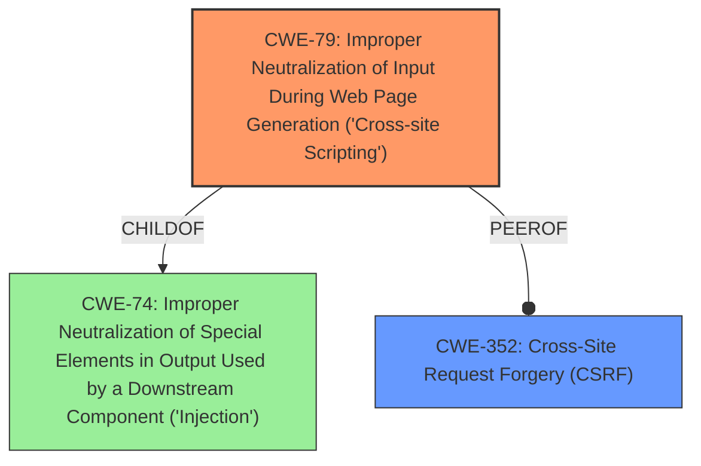

# Raw Analyzer Response for CVE-2021-24301

# Summary
| CWE ID | CWE Name | Confidence | CWE Abstraction Level | CWE Vulnerability Mapping Label | CWE-Vulnerability Mapping Notes |
|---|---|---|---|---|---|
| CWE-79 | Improper Neutralization of Input During Web Page Generation ('Cross-site Scripting') | 1.0 | Base | Primary | Allowed |
| CWE-352 | Cross-Site Request Forgery (CSRF) | 0.7 | Compound | Secondary | Allowed |

## Evidence and Confidence

*   **Confidence Score:** 0.85
*   **Evidence Strength:** HIGH

## Relationship Analysis
The primary weakness is CWE-79 (Cross-site Scripting), which involves improper neutralization of input during web page generation. This is a base-level CWE and directly addresses the **weakness** described in the vulnerability description.

CWE-352 (Cross-Site Request Forgery) is a secondary consideration because the description mentions a CSRF nonce that was properly verified. While CSRF protection was present, the core issue is the XSS vulnerability.

The relationship between CWE-79 and CWE-352 is relevant because XSS can sometimes be used in conjunction with CSRF. However, in this specific case, the CSRF protection appears to be separate from the XSS **weakness**.

## Vulnerability Chain
The chain of events is as follows:
1.  Improper input validation/sanitization (CWE-79) in the "hotjar script" textarea.
2.  An authenticated administrator injects malicious script.
3.  The malicious script is stored.
4.  When a victim visits the website, the script is executed in their browser, leading to potential malicious actions.

The root cause is the insufficient sanitization of the input, leading to stored XSS.

## Summary of Analysis
The primary focus is on the **Cross-Site Scripting** **weakness** (CWE-79) due to **insufficient sanitization or escaping of user-supplied input**, as explicitly stated in the "CVE Reference Links Content Summary". The evidence provided strongly supports this classification.

The vulnerability description states: "The Hotjar Connecticator WordPress plugin through 1.1.1 is vulnerable to Stored Cross-Site Scripting (XSS) in the hotjar script textarea." The "CVE Reference Links Content Summary" further elaborates: "The plugin's 'hotjar script' textarea was vulnerable to Stored Cross-Site Scripting (XSS) due to **insufficient sanitization or escaping of user-supplied input**."

CWE-79 is the most specific and relevant CWE, as it directly addresses the **weakness** of improper neutralization of input during web page generation. The relationship analysis confirms that while CSRF (CWE-352) is related to web application security, it is not the primary issue in this case. The presence of a properly verified CSRF nonce suggests that CSRF is not the main concern.

CWE-80 (Improper Neutralization of Script-Related HTML Tags in a Web Page) was considered but deemed less appropriate than CWE-79. While CWE-80 is a variant of XSS, CWE-79 is a more general description of the **weakness** and better fits the provided information. The description does not specify that the issue is limited to script-related HTML tags.

CWE-116 (Improper Encoding or Escaping of Output) was also considered. Although related to output handling, the core issue is the **lack of neutralization** rather than a specific encoding or escaping problem.

CWE-434 (Unrestricted Upload of File with Dangerous Type) is irrelevant because the vulnerability involves a textarea, not file uploads.
Relevant CWE Information:

# Enhanced Context (25 CWEs)
The following CWEs were identified as potentially relevant to this vulnerability:

## CWE-80: Improper Neutralization of Script-Related HTML Tags in a Web Page (Basic XSS)
**Abstraction Level**: Variant
**Similarity Score**: 0.79
**Source**: dense

**Description**:
The product receives input from an upstream component, but it does not neutralize or incorrectly neutralizes special characters such as "<", ">", and "&" that could be interpreted as web-scripting elements when they are sent to a downstream component that processes web pages.

**Mapping Guidance**:
- Usage: Allowed
- Rationale: This CWE entry is at the Variant level of abstraction, which is a preferred level of abstraction for mapping to the root causes of vulnerabilities.

## CWE-74: Improper Neutralization of Special Elements in Output Used by a Downstream Component ('Injection')
**Abstraction Level**: Class
**Similarity Score**: 0.78
**Source**: dense

**Description**:
The product constructs all or part of a command, data structure, or record using externally-influenced input from an upstream component, but it does not neutralize or incorrectly neutralizes special elements that could modify how it is parsed or interpreted when it is sent to a downstream component.

**Mapping Guidance**:
- Usage: Discouraged
- Rationale: CWE-74 is high-level and often misused when lower-level weaknesses are more appropriate.

## CWE-184: Incomplete List of Disallowed Inputs
**Abstraction Level**: Base
**Similarity Score**: 0.78
**Source**: dense

**Description**:
The product implements a protection mechanism that relies on a list of inputs (or properties of inputs) that are not allowed by policy or otherwise require other action to neutralize before additional processing takes place, but the list is incomplete.

**Mapping Guidance**:
- Usage: Allowed
- Rationale: This CWE entry is at the Base level of abstraction, which is a preferred level of abstraction for mapping to the root causes of vulnerabilities.

## CWE-1289: Improper Validation of Unsafe Equivalence in Input
**Abstraction Level**: Base
**Similarity Score**: 0.77
**Source**: dense

**Description**:
The product receives an input value that is used as a resource identifier or other type of reference, but it does not validate or incorrectly validates that the input is equivalent to a potentially-unsafe value.

**Mapping Guidance**:
- Usage: Allowed
- Rationale: This CWE entry is at the Base level of abstraction, which is a preferred level of abstraction for mapping to the root causes of vulnerabilities.

## CWE-41: Improper Resolution of Path Equivalence
**Abstraction Level**: Base
**Similarity Score**: 0.76
**Source**: dense

**Description**:
The product is vulnerable to file system contents disclosure through path equivalence. Path equivalence involves the use of special characters in file and directory names. The associated manipulations are intended to generate multiple names for the same object.

**Mapping Guidance**:
- Usage: Allowed
- Rationale: This CWE entry is at the Base level of abstraction, which is a preferred level of abstraction for mapping to the root causes of vulnerabilities.

## CWE-138: Improper Neutralization of Special Elements
**Abstraction Level**: Class
**Similarity Score**: 0.76
**Source**: dense

**Description**:
The product receives input from an upstream component, but it does not neutralize or incorrectly neutralizes special elements that could be interpreted as control elements or syntactic markers when they are sent to a downstream component.

**Mapping Guidance**:
- Usage: Discouraged
- Rationale: This CWE entry is a level-1 Class (i.e., a child of a Pillar). It might have lower-level children that would be more appropriate

## CWE-73: External Control of File Name or Path
**Abstraction Level**: Base
**Similarity Score**: 0.76
**Source**: dense

**Description**:
The product allows user input to control or influence paths or file names that are used in filesystem operations.

**Mapping Guidance**:
- Usage: Allowed
- Rationale: This CWE entry is at the Base level of abstraction, which is a preferred level of abstraction for mapping to the root causes of vulnerabilities.

## CWE-113: Improper Neutralization of CRLF Sequences in HTTP Headers ('HTTP Request/Response Splitting')
**Abstraction Level**: Variant
**Similarity Score**: 0.76
**Source**: dense

**Description**:
The product receives data from an HTTP agent/component (e.g., web server, proxy, browser, etc.), but it does not neutralize or incorrectly neutralizes CR and LF characters before the data is included in outgoing HTTP headers.

**Mapping Guidance**:
- Usage: Allowed
- Rationale: This CWE entry is at the Variant level of abstraction,