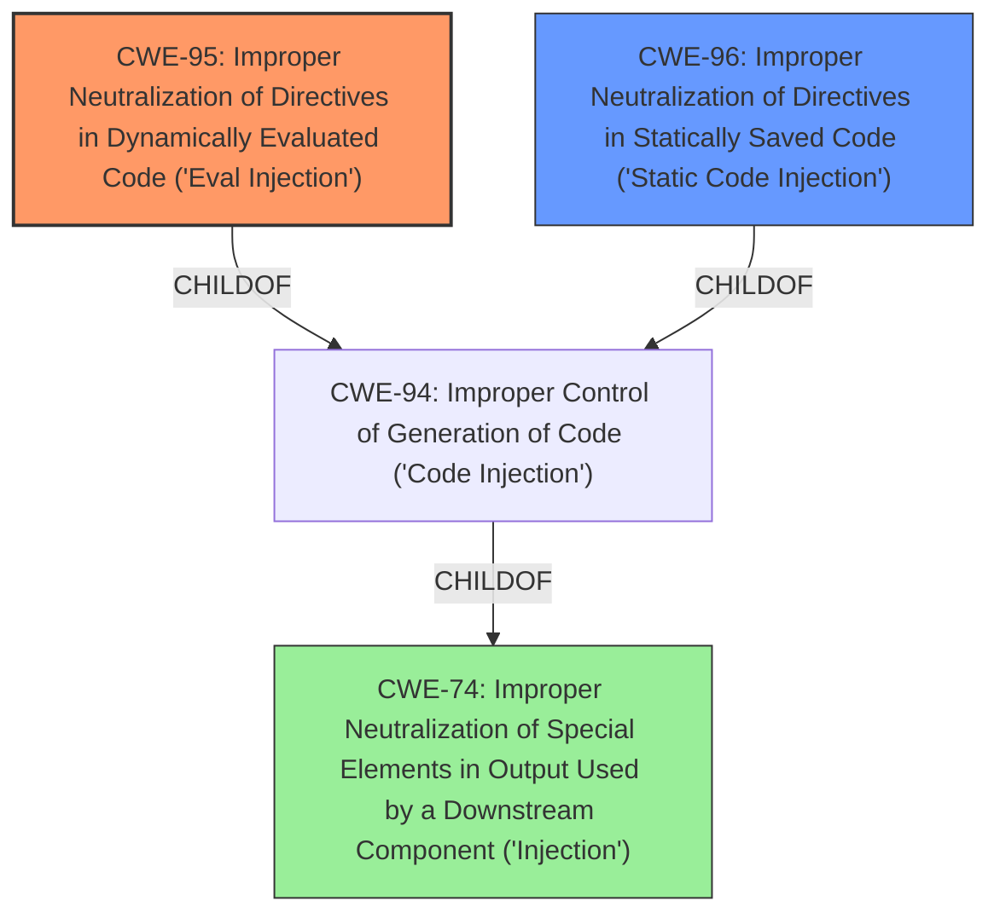

# Raw Analyzer Response for CVE-2021-24312

# Summary
| CWE ID | CWE Name | Confidence | CWE Abstraction Level | CWE Vulnerability Mapping Label | CWE-Vulnerability Mapping Notes |
|---|---|---|---|---|---|
| CWE-95 | Improper Neutralization of Directives in Dynamically Evaluated Code ('Eval Injection') | 0.9 | Variant | Allowed | Primary CWE: The vulnerability allows for the injection of shell commands due to insecure handling of special characters in dynamically evaluated code. |
| CWE-96 | Improper Neutralization of Directives in Statically Saved Code ('Static Code Injection') | 0.7 | Base | Allowed | Secondary CWE: The injected code is saved into a configuration file, which is then executed, leading to static code injection. |
| CWE-74 | Improper Neutralization of Special Elements in Output Used by a Downstream Component ('Injection') | 0.5 | Class | Discouraged | Secondary CWE: High-level and often misused when lower-level weaknesses are more appropriate. |

## Evidence and Confidence

*   **Confidence Score:** 0.8
*   **Evidence Strength:** HIGH

## Relationship Analysis
The primary CWE is CWE-95, a variant of CWE-94, which deals with code injection in dynamically evaluated code. CWE-96, a base CWE, is related as the code is injected into a statically saved file. CWE-74 is a more general class of injection vulnerabilities.

## Vulnerability Chain
The vulnerability chain starts with the **improper neutralization** of input, leading to **code injection**, and ultimately **remote code execution**.

## Summary of Analysis
The analysis is based on the provided vulnerability description and the CVE reference links content summary. The key phrase indicating the vulnerability is that the parameters allow input of $ and \n, leading to RCE.

The primary CWE selected is CWE-95 because the vulnerability involves **improper neutralization** of special elements in dynamically evaluated code, specifically the $ and \n characters. The "CVE Reference Links Content Summary" states that the root cause is the parameters `$cache_path`, `$wp_cache_debug_ip`, `$wp_super_cache_front_page_text`, `$cache_scheduled_time`, and `$cached_direct_pages` allow the input of `$` and `\n`, leading to Remote Code Execution (RCE). The attack vector involves sending crafted POST requests with specific parameters, exploiting the vulnerable settings. The injected commands are then executed via direct access to `https://target/wp-content/wp-cache-config.php`. This directly matches the description of CWE-95, which states: "The product receives input from an upstream component, but it does not neutralize or incorrectly neutralizes code syntax before using the input in a dynamic evaluation call (e.g. "eval")."

CWE-96 is considered a secondary weakness because the injected code is saved into an executable resource (the `wp-cache-config.php` file). The description of CWE-96 is "The product receives input from an upstream component, but it does not neutralize or incorrectly neutralizes code syntax before inserting the input into an executable resource, such as a library, configuration file, or template."

CWE-74 was considered but ultimately deemed too general. While the vulnerability does involve **improper neutralization** of special elements, CWE-95 and CWE-96 are more specific and accurately represent the nature of the weakness. CWE-74 is a class-level CWE, whereas CWE-95 is a variant and CWE-96 is a base, which are preferred.

The selected CWEs are at the optimal level of specificity because they directly address the root cause of the vulnerability (improper neutralization of input leading to code injection) and the mechanism of exploitation (dynamic evaluation and static saving of code).