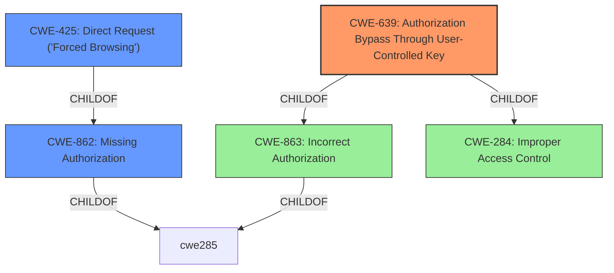

# Analysis for CVE-2021-24318

# Summary
| CWE ID  | CWE Name                                                                                                | Confidence | CWE Abstraction Level | CWE Vulnerability Mapping Label | CWE-Vulnerability Mapping Notes |
| :-------- | :-------------------------------------------------------------------------------------------------------- | :---------- | :---------------------- | :------------------------------ | :------------------------------ |
| CWE-639 | Authorization Bypass Through User-Controlled Key                                                        | 0.95      | Base                    | Primary CWE                     | Allowed                         |
| CWE-425 | Direct Request ('Forced Browsing')                                                                       | 0.8       | Base                    | Secondary CWE                   | Allowed                         |
| CWE-862 | Missing Authorization                                                                                       | 0.75       | Class                   | Secondary CWE                   | Allowed-with-Review           |

## Evidence and Confidence

*   **Confidence Score:** 0.9
*   **Evidence Strength:** HIGH

## Relationship Analysis
The primary CWE selected is CWE-639, which falls under the broader categories of CWE-863 (Incorrect Authorization) and CWE-284 (Improper Access Control). CWE-425 (Direct Request) is related as it describes a scenario where authorization checks are bypassed by directly accessing resources. CWE-862 is a class-level CWE and a parent of CWE-425. The selection of CWE-639 is due to the user-controlled key aspect, making it a more specific fit than its parents.

## Vulnerability Chain
The vulnerability chain starts with the **failure to ensure that the Post/Page and Booking to delete belong to the user making the request**. This leads to an IDOR vulnerability, allowing any authenticated user to delete arbitrary content. The chain can be represented as:
Missing Authorization -> User-Controlled Key -> Arbitrary Delete

## Summary of Analysis
The initial analysis focused on identifying the root cause of the vulnerability, which is the **lack of proper authorization checks**. The evidence from the "Vulnerability Description Key Phrases" section states, "**did not ensure that the Post/Page and Booking to delete belong to the user making the request**," highlighting the absence of validation. The "CVE Reference Links Content Summary" confirms this, stating, "The Listeo theme failed to verify if the user making the request owned the Post/Page or Booking they were trying to delete."

CWE-639 (Authorization Bypass Through User-Controlled Key) was selected as the primary CWE due to its specific focus on authorization bypass via user-controlled keys, which aligns directly with the IDOR aspect of the vulnerability. The vulnerability involves authenticated users manipulating IDs to access and delete resources they should not have access to. The "CVE Reference Links Content Summary" describes how `listing_id` and `booking_id` parameters can be manipulated.

CWE-425 (Direct Request ('Forced Browsing')) was considered because the vulnerability involves directly accessing resources without proper authorization. However, CWE-639 is more specific because it highlights the manipulation of the key, while CWE-425 is the consequence of that manipulation.

CWE-862 (Missing Authorization) was also considered as a more general description of the problem, but CWE-639 provides a more precise explanation of how the authorization bypass occurs.

The selection of CWE-639 is at the optimal level of specificity because it accurately represents the root cause of the vulnerability (authorization bypass through user-controlled key) while also being a base-level CWE. The evidence clearly supports this classification, and the relationship analysis further validates this decision.