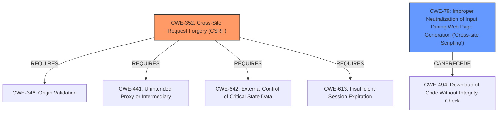

# Enhanced Analysis for CVE-2021-24324

# Summary
| CWE ID | CWE Name | Confidence | CWE Abstraction Level | CWE Vulnerability Mapping Label | CWE-Vulnerability Mapping Notes |
|---|---|---|---|---|---|
| CWE-352 | Cross-Site Request Forgery (CSRF) | 1.0 | Compound | Primary | Allowed |
| CWE-79 | Improper Neutralization of Input During Web Page Generation ('Cross-site Scripting') | 1.0 | Base | Secondary | Allowed |

## Evidence and Confidence

*   **Confidence Score:** 1.0
*   **Evidence Strength:** HIGH

## Relationship Analysis
The primary weakness is the **lack of CSRF checks (CWE-352)**. The secondary weakness is the **lack of sanitization, leading to Stored Cross-Site Scripting (CWE-79)**. CWE-352 requires other CWEs to be present (CWE-346, CWE-441, CWE-642, and CWE-613). CWE-79 can be caused by missing output encoding or escaping.



## Vulnerability Chain
The vulnerability chain starts with the **lack of CSRF checks (CWE-352)**, allowing attackers to change plugin settings. This leads to the **lack of sanitization and escaping, resulting in Stored Cross-Site Scripting (CWE-79)**.

## Summary of Analysis
The vulnerability description clearly states the plugin is "**lacking CSRF checks** in all its settings, allowing attackers to make a logged in user change the plugins settings. Due to the lack of sanitisation and escaping in some fields, it could also lead to Stored Cross-Site Scripting issues".

The CVE Reference Links Content Summary confirms the **root cause** as the "**absence of CSRF checks**" and the presence of "**Stored Cross-Site Scripting (XSS)** due to the **lack of sanitization and escaping** in some fields".

The primary CWE is CWE-352 because the **root cause** is "**lacking CSRF checks**." The secondary CWE is CWE-79 because the **lack of sanitization and escaping** in some fields leads to "**Stored Cross-Site Scripting**".

Other CWEs Considered:
*   CWE-862: Missing Authorization - This was considered but is less specific than CWE-352, which directly addresses the CSRF issue.
*   CWE-116: Improper Encoding or Escaping of Output - This could be considered a contributing factor to XSS, but CWE-79 is a more direct representation of the vulnerability.
*   CWE-434: Unrestricted Upload of File with Dangerous Type - This does not directly relate to the described vulnerability.
*   CWE-601: URL Redirection to Untrusted Site ('Open Redirect') - This does not directly relate to the described vulnerability.
*   CWE-471: Modification of Assumed-Immutable Data (MAID) - While settings are modified, the absence of CSRF protection is the root cause.

Relevant CWE Information:
# Enhanced Context (25 CWEs)
The following CWEs were identified as potentially relevant to this vulnerability:

## CWE-352: Cross-Site Request Forgery (CSRF)
**Abstraction:** Compound
**Status:** Stable

### Description
The web application does not, or can not, sufficiently verify whether a well-formed, valid, consistent request was intentionally provided by the user who submitted the request.

### Extended Description
When a web server is designed to receive a request from a client without any mechanism for verifying that it was intentionally sent, then it might be possible for an attacker to trick a client into making an unintentional request to the web server which will be treated as an authentic request. This can be done via a URL, image load, XMLHttpRequest, etc. and can result in exposure of data or unintended code execution.

### Alternative Terms
Session Riding
Cross Site Reference Forgery
XSRF

### Relationships
ChildOf -> CWE-345
ChildOf -> CWE-345
Requires -> CWE-346
Requires -> CWE-441
Requires -> CWE-642
Requires -> CWE-613

### Mapping Guidance
**Usage:** Allowed
**Rationale:** This is a well-known Composite of multiple weaknesses that must all occur simultaneously, although it is attack-oriented in nature.
**Comments:** While attack-oriented composites are supported in CWE, they have not been a focus of research. There is a chance that future research or CWE scope clarifications will change or deprecate them. Perform root-cause analysis to determine if other weaknesses allow CSRF attacks to occur, and map to those weaknesses. For example, predictable CSRF tokens might allow bypass of CSRF protection mechanisms; if this occurs, they might be better characterized as randomness/predictability weaknesses.
**Reasons:**
- Other

## CWE-79: Improper Neutralization of Input During Web Page Generation ('Cross-site Scripting')
**Abstraction:** Base
**Status:** Stable

### Description
The product does not neutralize or incorrectly neutralizes user-controllable input before it is placed in output that is used as a web page that is served to other users.

### Extended Description
Cross-site scripting (XSS) vulnerabilities occur when:

 1. Untrusted data enters a web application, typically from a web request.
 2. The web application dynamically generates a web page that contains this untrusted data.
 3. During page generation, the application does not prevent the data from containing content that is executable by a web browser, such as JavaScript, HTML tags, HTML attributes, mouse events, Flash, ActiveX, etc.
 4. A victim visits the generated web page through a web browser, which contains malicious script that was injected using the untrusted data.
 5. Since the script comes from a web page that was sent by the web server, the victim's web browser executes the malicious script in the context of the web server's domain.
 6. This effectively violates the intention of the web browser's same-origin policy, which states that scripts in one domain should not be able to access resources or run code in a different domain.

There are three main kinds of XSS:

 -  **Type 1: Reflected XSS (or Non-Persistent)**  - The server reads data directly from the HTTP request and reflects it back in the HTTP response. Reflected XSS exploits occur when an attacker causes a victim to supply dangerous content to a vulnerable web application, which is then reflected back to the victim and executed by the web browser. The most common mechanism for delivering malicious content is to include it as a parameter in a URL that is posted publicly or e-mailed directly to the victim. URLs constructed in this manner constitute the core of many phishing schemes, whereby an attacker convinces a victim to visit a URL that refers to a vulnerable site. After the site reflects the attacker's content back to the victim, the content is executed by the victim's browser.

 -  **Type 2: Stored XSS (or Persistent)**  - The application stores dangerous data in a database, message forum, visitor log, or other trusted data store. At a later time, the dangerous data is subsequently read back into the application and included in dynamic content. From an attacker's perspective, the optimal place to inject malicious content is in an area that is displayed to either many users or particularly interesting users. Interesting users typically have elevated privileges in the application or interact with sensitive data that is valuable to the attacker. If one of these users executes malicious content, the attacker may be able to perform privileged operations on behalf of the user or gain access to sensitive data belonging to the user. For example, the attacker might inject XSS into a log message, which might not be handled properly when an administrator views the logs.

 -  **Type 0: DOM-Based XSS**  - In DOM-based XSS, the client performs the injection of XSS into the page; in the other types, the server performs the injection. DOM-based XSS generally involves server-controlled, trusted script that is sent to the client, such as Javascript that performs sanity checks on a form before the user submits it. If the server-supplied script processes user-supplied data and then injects it back into


## CWE Relationship Analysis

Current CWEs represent these abstraction levels: .


### Vulnerability Chain Analysis

**Chain starting from CWE-494:**
- 494 (Download of Code Without Integrity Check) - ROOT


**Chain starting from CWE-79:**
- 79 (Improper Neutralization of Input During Web Page Generation ('Cross-site Scripting')) - ROOT


### CWE Relationship Diagram

```mermaid
graph TD
    classDef primary fill:#f96,stroke:#333,stroke-width:2px
    classDef secondary fill:#69f,stroke:#333
    classDef tertiary fill:#9e9,stroke:#333
```