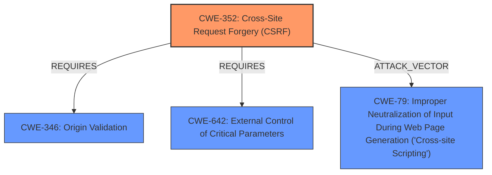

# Enhanced Analysis for CVE-2021-24328

# Summary
| CWE ID | CWE Name | Confidence | CWE Abstraction Level | CWE Vulnerability Mapping Label | CWE-Vulnerability Mapping Notes |
|---|---|---|---|---|---|
| CWE-352 | Cross-Site Request Forgery (CSRF) | 1.0 | Compound | Allowed | Primary CWE |
| CWE-79 | Improper Neutralization of Input During Web Page Generation ('Cross-site Scripting') | 1.0 | Base | Allowed | Secondary CWE |

## Evidence and Confidence

*   **Confidence Score:** 1.0
*   **Evidence Strength:** HIGH

## Relationship Analysis
The primary weakness is the **lack of CSRF protection**, which allows an attacker to trick a logged-in administrator into performing unintended actions. The secondary weakness is **improper sanitization** of settings, which allows for **Cross-Site Scripting (XSS)**. CWE-352 requires other weaknesses to be present, such as CWE-346 (Origin Validation), CWE-642 (External Control of Critical Parameters), and CWE-79 (Improper Neutralization of Input During Web Page Generation). In this case, the missing sanitization directly leads to the XSS vulnerability.



## Vulnerability Chain
The vulnerability chain starts with the **lack of CSRF protection (CWE-352)**, which allows attackers to make logged-in administrators change the plugin's settings to arbitrary values. This, combined with the **lack of sanitization (CWE-79)**, enables attackers to inject XSS payloads into the settings. When these settings are displayed, the XSS payload is executed.

## Summary of Analysis
The analysis is based on the provided evidence, which clearly indicates the **lack of CSRF check** and **improper sanitization**. The "Vulnerability Description Key Phrases" highlights the **rootcause** as the **lack of CSRF check** and the **weakness** as **cross-site scripting**. The CVE Reference Links Content Summary further confirms the **root cause** as the **lack of CSRF protection** and the presence of **stored XSS** due to **lack of sanitization and validation**.

The primary CWE is CWE-352 because the **lack of CSRF protection** is the initial flaw that allows the attack to occur. Without it, an attacker wouldn't be able to trick an administrator into changing settings. CWE-79 is a secondary weakness, as the **lack of sanitization** is what allows the injected settings to execute arbitrary JavaScript.

The selected CWEs are at the optimal level of specificity. CWE-352 is a Compound CWE which fits since this vulnerability is a composite of multiple weaknesses occurring together. CWE-79 is at the Base level, which is preferred.

Relevant CWE Information:

# Enhanced Context (25 CWEs)

## CWE-472: External Control of Assumed-Immutable Web Parameter
**Abstraction Level**: Base
**Similarity Score**: 0.79
**Source**: dense
**Description**: The web application does not sufficiently verify inputs that are assumed to be immutable but are actually externally controllable, such as hidden form fields.
**Mapping Guidance**: Usage: Allowed

This CWE was considered because the settings being changed could be seen as assumed-immutable parameters. However, the **lack of CSRF protection** is a more direct cause than merely failing to verify the inputs.

## CWE-807: Reliance on Untrusted Inputs in a Security Decision
**Abstraction Level**: Base
**Similarity Score**: 0.78
**Source**: dense
**Description**: The product uses a protection mechanism that relies on the existence or values of an input, but the input can be modified by an untrusted actor in a way that bypasses the protection mechanism.
**Mapping Guidance**: Usage: Allowed

This CWE was not selected because the core issue isn't about relying on an input for security decisions, but the **lack of CSRF protection** allowing settings to be changed.

## CWE-639: Authorization Bypass Through User-Controlled Key
**Abstraction Level**: Base
**Similarity Score**: 0.77
**Source**: dense
**Description**: The system's authorization functionality does not prevent one user from gaining access to another user's data or record by modifying the key value identifying the data.
**Mapping Guidance**: Usage: Allowed

This CWE does not apply, as the issue is not about modifying a key to access another user's data.

## CWE-425: Direct Request ('Forced Browsing')
**Abstraction Level**: Base
**Similarity Score**: 0.76
**Source**: dense
**Description**: The web application does not adequately enforce appropriate authorization on all restricted URLs, scripts, or files.
**Mapping Guidance**: Usage: Allowed

This is not a direct request issue, but one of **missing CSRF protection**.

## CWE-1390: Weak Authentication
**Abstraction Level**: Class
**Similarity Score**: 0.75
**Source**: dense
**Description**: The product uses an authentication mechanism to restrict access to specific users or identities, but the mechanism does not sufficiently prove that the claimed identity is correct.
**Mapping Guidance**: Usage: Allowed-with-Review

This is not an authentication issue, but one of **missing CSRF protection**.

## CWE-303: Incorrect Implementation of Authentication Algorithm
**Abstraction Level**: Base
**Similarity Score**: 0.75
**Source**: dense
**Description**: The requirements for the product dictate the use of an established authentication algorithm, but the implementation of the algorithm is incorrect.
**Mapping Guidance**: Usage: Allowed

This is not an authentication algorithm implementation issue.

## CWE-302: Authentication Bypass by Assumed-Immutable Data
**Abstraction Level**: Base
**Similarity Score**: 0.75
**Source**: dense
**Description**: The authentication scheme or implementation uses key data elements that are assumed to be immutable, but can be controlled or modified by the attacker.
**Mapping Guidance**: Usage: Allowed

This does not apply, as the issue is not related to authentication bypass.

## CWE-184: Incomplete List of Disallowed Inputs
**Abstraction Level**: Base
**Similarity Score**: 0.75
**Source**: dense
**Description**: The product implements a protection mechanism that relies on a list of inputs (or properties of inputs) that are not allowed by policy or otherwise require other action to neutralize before additional processing takes place, but the list is incomplete.
**Mapping Guidance**: Usage: Allowed

While there's a **lack of sanitization**, the primary issue isn't an incomplete list of disallowed inputs, but the **absence of CSRF protection**.

## CWE-1289: Improper Validation of Unsafe Equivalence in Input
**Abstraction Level**: Base
**Similarity Score**: 0.75
**Source**: dense
**Description**: The product receives an input value that is used as a resource identifier or other type of reference, but it does not validate or incorrectly validates that the input is equivalent to a potentially-unsafe value.
**Mapping Guidance**: Usage: Allowed

The vulnerability isn't about validating equivalence but about **missing CSRF protection**.

## CWE-552: Files or Directories Accessible to External Parties
**Abstraction Level**: Base
**Similarity Score**: 0.75
**Source**: dense
**Description**: The product makes files or directories accessible to unauthorized actors, even though they should not be.
**Mapping Guidance**: Usage: Allowed

This does not apply as the issue is not about file access.

## CWE-116: Improper Encoding or Escaping of Output
**Abstraction Level**: Class
**Similarity Score**: 6588.90
**Source**: sparse
**Description**: The product prepares a structured message for communication with another component, but encoding or escaping of the data is either missing or done incorrectly. As a result, the intended structure of the message is not preserved.
**Mapping Guidance**: Usage: Allowed-with-Review

This is related to the **lack of sanitization**, but CWE-79 is a more specific fit for XSS.

## CWE-863: Incorrect Authorization
**Abstraction Level**: Class
**Similarity Score**: 6296.97
**Source**: sparse
**Description**: The product performs an authorization check when an actor attempts to access a resource or perform an action, but it does not correctly perform the check.
**Mapping Guidance**: Usage: Allowed-with-Review

The issue is not incorrect authorization but **missing CSRF protection**.

## CWE


## CWE Relationship Analysis

Current CWEs represent these abstraction levels: .


### Vulnerability Chain Analysis

**Chain starting from CWE-79:**
- 79 (Improper Neutralization of Input During Web Page Generation ('Cross-site Scripting')) - ROOT


**Chain starting from CWE-303:**
- 303 (Incorrect Implementation of Authentication Algorithm) - ROOT


### CWE Relationship Diagram

```mermaid
graph TD
    classDef primary fill:#f96,stroke:#333,stroke-width:2px
    classDef secondary fill:#69f,stroke:#333
    classDef tertiary fill:#9e9,stroke:#333
```