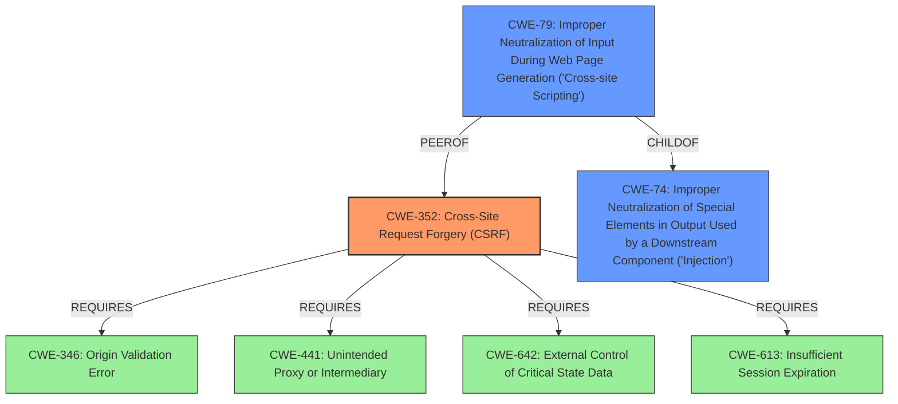

# Enhanced Analysis for CVE-2021-24333

# Summary

| CWE ID | CWE Name | Confidence | CWE Abstraction Level | CWE Vulnerability Mapping Label | CWE-Vulnerability Mapping Notes |
|---|---|---|---|---|---|
| CWE-352 | Cross-Site Request Forgery (CSRF) | 1.0 | Compound | Allowed | Primary CWE |
| CWE-79 | Improper Neutralization of Input During Web Page Generation ('Cross-site Scripting') | 1.0 | Base | Allowed | Secondary Candidate |

## Evidence and Confidence

*   **Confidence Score:** 1.0
*   **Evidence Strength:** HIGH

## Relationship Analysis
The primary weakness is CWE-352, Cross-Site Request Forgery (CSRF), a compound weakness. The secondary weakness, CWE-79, Improper Neutralization of Input During Web Page Generation ('Cross-site Scripting'), a base weakness, can be a consequence of missing input validation. While CWE-79 is related to the impact of the vulnerability (XSS), the root cause stems from the **lack of CSRF protection**. CWE-352's relationships indicate that it requires other weaknesses such as CWE-346 (Origin Validation Error), CWE-441 (Unintended Proxy or Intermediary), CWE-642 (External Control of Critical State Data), and CWE-613 (Insufficient Session Expiration). CWE-79 is a child of CWE-74 (Improper Neutralization of Special Elements in Output Used by a Downstream Component ('Injection')) and is a peer of CWE-352.



## Vulnerability Chain
The vulnerability chain starts with the **lack of CSRF protection** (CWE-352), which allows an attacker to trick a logged-in administrator into submitting a crafted request. This request saves an attacker's XSS payload into the plugin settings. The XSS payload is then executed when the settings are displayed, leading to arbitrary script execution in the administrator's browser (CWE-79).

## Summary of Analysis
The analysis is based on the provided evidence, specifically the vulnerability description and CVE reference content summary.

The vulnerability description states, "The Content Copy Protection & Prevent Image Save WordPress plugin through 1.3 does not check for CSRF when saving its settings, not perform any validation and sanitisation on them, allowing attackers to make a logged in administrator set arbitrary XSS payloads in them."

The CVE reference content summary confirms, "The plugin does not check for CSRF when saving its settings and does not perform any validation or sanitization on the input." It also identifies "CSRF (Cross-Site Request Forgery)" and "Stored Cross-Site Scripting (XSS)" as weaknesses.

The relationship graph emphasizes that the root cause is the **lack of CSRF protection** (CWE-352), which then leads to the possibility of injecting XSS payloads (CWE-79).

The selection of CWE-352 is based on the explicit mention of the **lack of CSRF protection** as the root cause. CWE-79 is selected as a secondary weakness because the **lack of sanitization** allows for XSS. Both CWEs are at appropriate levels of specificity, with CWE-352 being a Compound and CWE-79 being a Base.

Other CWEs considered but not used:

*   CWE-80: Improper Neutralization of Script-Related HTML Tags in a Web Page (Basic XSS) - While related to XSS, it doesn't capture the root cause.
*   CWE-472: External Control of Assumed-Immutable Web Parameter - Not applicable as the vulnerability is not directly related to immutable web parameters.
*   CWE-74: Improper Neutralization of Special Elements in Output Used by a Downstream Component ('Injection') - Too generic; CWE-79 is more specific.
*   CWE-116: Improper Encoding or Escaping of Output - Related to output encoding, but CWE-79 more directly addresses the XSS issue.
*   CWE-184: Incomplete List of Disallowed Inputs - Not applicable as the vulnerability is not related to an incomplete list of disallowed inputs.
*   CWE-425: Direct Request ('Forced Browsing') - Not applicable as the vulnerability is not related to direct requests.
*   CWE-1289: Improper Validation of Unsafe Equivalence in Input - Not applicable as the vulnerability is not related to unsafe equivalence.
*   CWE-639: Authorization Bypass Through User-Controlled Key - Not applicable as the vulnerability is not related to authorization bypass.
*   CWE-113: Improper Neutralization of CRLF Sequences in HTTP Headers ('HTTP Request/Response Splitting') - Not applicable as the vulnerability is not related to HTTP request/response splitting.
*   CWE-434: Unrestricted Upload of File with Dangerous Type - Not applicable as the vulnerability is not related to file uploads.
*   CWE-863: Incorrect Authorization - Not specific enough; the root cause is the **lack of CSRF protection**.
*   CWE-183: Permissive List of Allowed Inputs - Not applicable as the vulnerability is not related to a permissive list of allowed inputs.
*   CWE-178: Improper Handling of Case Sensitivity - Not applicable as the vulnerability is not related to case sensitivity.
*   CWE-430: Deployment of Wrong Handler - Not applicable as the vulnerability is not related to handler deployment.
*   CWE-494: Download of Code Without Integrity Check - Not applicable as the vulnerability is not related to code downloads.
*   CWE-471: Modification of Assumed-Immutable Data (MAID) - Not applicable as the vulnerability is not related to the modification of assumed-immutable data.
*   CWE-94: Improper Control of Generation of Code ('Code Injection') - Not applicable as the vulnerability is not related to code injection.
*   CWE-613: Insufficient Session Expiration - Not applicable as the vulnerability is not related to session expiration.
*   CWE-98: Improper Control of Filename for Include/Require Statement in PHP Program ('PHP Remote File Inclusion') - Not applicable as the vulnerability is not related to file inclusion.
*   CWE-351: Insufficient Type Distinction - Not applicable as the vulnerability is not related to type distinction.
*   CWE-96: Improper Neutralization of Directives in Statically Saved Code ('Static Code Injection') - Not applicable as the vulnerability is not related to static code injection.
*   CWE-285: Improper Authorization - Too generic; the root cause is specifically **lack of CSRF protection**.


## CWE Relationship Analysis

Current CWEs represent these abstraction levels: .


### Vulnerability Chain Analysis

**Chain starting from CWE-96:**
- 96 (Improper Neutralization of Directives in Statically Saved Code ('Static Code Injection')) - ROOT


**Chain starting from CWE-116:**
- 116 (Improper Encoding or Escaping of Output) - ROOT


### CWE Relationship Diagram

```mermaid
graph TD
    classDef primary fill:#f96,stroke:#333,stroke-width:2px
    classDef secondary fill:#69f,stroke:#333
    classDef tertiary fill:#9e9,stroke:#333
```