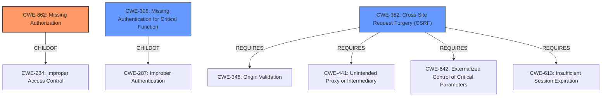

# Raw Analyzer Response for CVE-2021-24352

# Summary
| CWE ID | CWE Name | Confidence | CWE Abstraction Level | CWE Vulnerability Mapping Label | CWE-Vulnerability Mapping Notes |
|---|---|---|---|---|---|
| CWE-862 | Missing Authorization | 1.0 | Class | Allowed-with-Review | Primary CWE. The product does not perform an authorization check when an actor attempts to access a resource or perform an action. |
| CWE-306 | Missing Authentication for Critical Function | 0.7 | Base | Allowed | Secondary Candidate. The product does not perform any authentication for functionality that requires a provable user identity or consumes a significant amount of resources. |
| CWE-352 | Cross-Site Request Forgery (CSRF) | 0.6 | Compound | Allowed | Secondary Candidate. The web application does not, or can not, sufficiently verify whether a well-formed, valid, consistent request was intentionally provided by the user who submitted the request. |

## Evidence and Confidence

*   **Confidence Score:** 0.9
*   **Evidence Strength:** HIGH

## Relationship Analysis
The primary CWE is CWE-862 (Missing Authorization), which is a class-level CWE. It has child relationships to more specific authorization issues. CWE-306 (Missing Authentication for Critical Function) is a base-level CWE and a child of CWE-287, so it is more specific. CWE-352 (Cross-Site Request Forgery (CSRF)) is a compound CWE and requires other CWEs such as CWE-346, CWE-441, CWE-642, and CWE-613.

## Vulnerability Chain
The vulnerability chain starts with the **missing authorization** check in the `export_data` function, which leads to unauthenticated users being able to export sensitive redirect data. This can potentially be used to further exploit the system.

## Summary of Analysis
The initial assessment identified **missing authorization** as the primary weakness, which aligns with the **root cause** of the vulnerability. The `export_data` function lacked capability and nonce checks, allowing unauthenticated users to export a site's redirects.

The analysis is based on the provided evidence, specifically the "CVE Reference Links Content Summary," which states that the `export_data` function lacked both capability checks and nonce verification, making it accessible to unauthenticated users.

The graph relationships influenced the decision to include CWE-306 and CWE-352 as secondary candidates. While the primary issue is the **missing authorization** check (CWE-862), the lack of authentication (CWE-306) and the possibility of Cross-Site Request Forgery (CWE-352) contribute to the overall vulnerability.

The selected CWEs are at the optimal level of specificity. CWE-862 is a class-level CWE, but it accurately represents the general **missing authorization** issue. While CWE-306 is more specific, the primary problem is the **missing authorization** check rather than the complete absence of authentication. CWE-352 is a compound weakness that could be present, but more information would be needed.

Relevant CWE Information:

CWE-472, CWE-807, CWE-639, CWE-1390, CWE-303, CWE-212, CWE-345, CWE-319, CWE-74, CWE-425, CWE-116, CWE-863, CWE-352, CWE-79, CWE-639, CWE-201, CWE-613, CWE-226, CWE-79, CWE-178, CWE-202, CWE-209, CWE-352, CWE-471, CWE-20.

CWE-862 (Missing Authorization) is the primary CWE because the **root cause** of the vulnerability is the absence of an authorization check in the `export_data` function.

CWE-306 (Missing Authentication for Critical Function) is a secondary candidate because the function lacked authentication, making it accessible to unauthenticated users.

CWE-352 (Cross-Site Request Forgery (CSRF)) is a secondary candidate because the function lacked nonce verification, making it potentially vulnerable to CSRF attacks.

CWE-863 (Incorrect Authorization) was considered but not used because the issue is not that the authorization was incorrect, but that it was **missing** altogether.

CWE-116 (Improper Encoding or Escaping of Output) was considered but not used because the issue is not related to encoding or escaping of output.

CWE-601 (URL Redirection to Untrusted Site ('Open Redirect')) was considered but not used because the issue is not related to URL redirection.

CWE-471 (Modification of Assumed-Immutable Data (MAID)) was considered but not used because the issue is not related to the modification of assumed-immutable data.

CWE-1390 (Weak Authentication) was considered but not used because the issue is not that the authentication was weak, but that it was **missing**.

CWE-201 (Insertion of Sensitive Information Into Sent Data) was considered but not used because the issue is not related to the insertion of sensitive information into sent data.