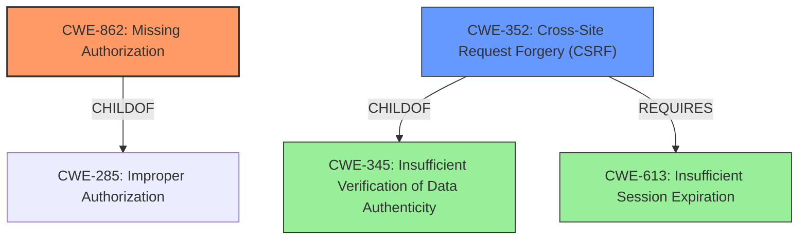

# Analysis Report for CVE-2021-24353

# Vulnerability Analysis Report: CVE-2021-24353

## Description


## Analysis (with Relationship Data)

# Summary
| CWE ID | CWE Name | Confidence | CWE Abstraction Level | CWE Vulnerability Mapping Label | CWE-Vulnerability Mapping Notes |
|---|---|---|---|---|---|
| CWE-862 | Missing Authorization | 1.0 | Class | Primary | Allowed-with-Review |
| CWE-352 | Cross-Site Request Forgery (CSRF) | 0.7 | Compound | Secondary | Allowed |

## Evidence and Confidence

*   **Confidence Score:** 0.9
*   **Evidence Strength:** HIGH

## Relationship Analysis
The primary CWE is CWE-862 **Missing Authorization**, because the **import_data** function of the Simple 301 Redirects plugin lacks the proper permission checks to ensure only authorized users can import redirects. CWE-862 is a Class-level CWE, and per mapping guidance, should be reviewed to determine if more specific Base-level children exist. Although CWE-639 **Authorization Bypass Through User-Controlled Key** is a possible candidate, it is not as suitable as CWE-862 because the vulnerability is not necessarily related to a user-controlled key.

CWE-352 **Cross-Site Request Forgery (CSRF)** is a possible secondary CWE, because the description mentions that there are no nonce checks, a common requirement for CSRF protection. The **Relationships** section for CWE-352 shows that it `Requires -> CWE-642` (Permissive Cross-domain Policy with Untrusted Domains), `Requires -> CWE-613` (Insufficient Session Expiration).



## Vulnerability Chain
The vulnerability chain involves a **missing authorization** check, which allows **unauthenticated users** to **import a set of site redirects**, leading to potential **total site redirection** to an external malicious site and a **denial-of-service**.

## Summary of Analysis
The initial assessment identified CWE-862 **Missing Authorization** as the primary weakness because the **import_data** function lacked capability checks.
The analysis considered the retriever results and the provided information in the **Vulnerability Description** and **CVE Reference Links Content Summary**, which highlighted the absence of both capability and nonce checks.

The evidence to support CWE-862 is from the **CVE Reference Links Content Summary**: "The `import_data` function lacked both capability and nonce checks, meaning that no authorization or security verification was performed before executing the function. This allowed anyone to call the function and supply arbitrary data."

The evidence to support CWE-352 is from the **Vulnerability Description Key Phrases** and **CVE Reference Links Content Summary** sections: "no capability or nonce checks".

The selection of CWE-862 is based on its accurate representation of the **missing authorization** vulnerability, aligning with the evidence provided. CWE-352 is a secondary consideration. These CWEs are at the optimal level of specificity, providing a clear and actionable classification of the vulnerability.

Relevant CWE Information:

# Enhanced Context (25 CWEs)
The following CWEs were identified as potentially relevant to this vulnerability:

## CWE-639: Authorization Bypass Through User-Controlled Key
**Abstraction Level**: Base
**Similarity Score**: 0.78
**Source**: dense

**Description**:
The system's authorization functionality does not prevent one user from gaining access to another user's data or record by modifying the key value identifying the data.

**Mapping Guidance**:
- Usage: Allowed
- Rationale: This CWE entry is at the Base level of abstraction, which is a preferred level of abstraction for mapping to the root causes of vulnerabilities.

*Reason for not selecting*: While authorization is bypassed, the bypass is not through a user-controlled key.

## CWE-472: External Control of Assumed-Immutable Web Parameter
**Abstraction Level**: Base
**Similarity Score**: 0.77
**Source**: dense

**Description**:
The web application does not sufficiently verify inputs that are assumed to be immutable but are actually externally controllable, such as hidden form fields.

**Mapping Guidance**:
- Usage: Allowed
- Rationale: This CWE entry is at the Base level of abstraction, which is a preferred level of abstraction for mapping to the root causes of vulnerabilities.

*Reason for not selecting*: The vulnerability isn't directly related to the modification of assumed immutable parameters.

## CWE-41: Improper Resolution of Path Equivalence
**Abstraction Level**: Base
**Similarity Score**: 0.76
**Source**: dense

**Description**:
The product is vulnerable to file system contents disclosure through path equivalence. Path equivalence involves the use of special characters in file and directory names. The associated manipulations are intended to generate multiple names for the same object.

**Mapping Guidance**:
- Usage: Allowed
- Rationale: This CWE entry is at the Base level of abstraction, which is a preferred level of abstraction for mapping to the root causes of vulnerabilities.

*Reason for not selecting*: The vulnerability isn't about file system traversal.

## CWE-23: Relative Path Traversal
**Abstraction Level**: Base
**Similarity Score**: 0.76
**Source**: dense

**Description**:
The product uses external input to construct a pathname that should be within a restricted directory, but it does not properly neutralize sequences such as ".." that can resolve to a location that is outside of that directory.

**Mapping Guidance**:
- Usage: Allowed
- Rationale: This CWE entry is at the Base level of abstraction, which is a preferred level of abstraction for mapping to the root causes of vulnerabilities.

*Reason for not selecting*: The vulnerability isn't about file system traversal.

## CWE-552: Files or Directories Accessible to External Parties
**Abstraction Level**: Base
**Similarity Score**: 0.76
**Source**: dense

**Description**:
The product makes files or directories accessible to unauthorized actors, even though they should not be.

**Mapping Guidance**:
- Usage: Allowed
- Rationale: This CWE entry is at the Base level of abstraction, which is a preferred level of abstraction for mapping to the root causes of vulnerabilities.

*Reason for not selecting*: The vulnerability isn't about making files or directories accessible to external parties.

## CWE-74: Improper Neutralization of Special Elements in Output Used by a Downstream Component ('Injection')
**Abstraction Level**: Class
**Similarity Score**: 0.76
**Source**: dense

**Description**:
The product constructs all or part of a command, data structure, or record using externally-influenced input from an upstream component, but it does not neutralize or incorrectly neutralizes special elements that could modify how it is parsed or interpreted when it is sent to a downstream component.

**Mapping Guidance**:
- Usage: Discouraged
- Rationale: CWE-74 is high-level and often misused when lower-level weaknesses are more appropriate.

*Reason for not selecting*: The vulnerability is not directly about injection.

## CWE-434: Unrestricted Upload of File with Dangerous Type
**Abstraction Level**: Base
**Similarity Score**: 0.76
**Source**: dense

**Description**:
The product allows the upload or transfer of dangerous file types that are automatically processed within its environment.

**Mapping Guidance**:
- Usage: Allowed
- Rationale: This CWE entry is at the Base level of abstraction, which is a preferred level of abstraction for mapping to the root causes of vulnerabilities.

*Reason for not selecting*: While a file is uploaded, the main issue is the lack of authorization, not the file type.

## CWE-807: Reliance on Untrusted Inputs in a Security Decision
**Abstraction Level**: Base
**Similarity Score**: 0.76
**Source**: dense

**Description**:
The product uses a protection mechanism that relies on the existence or values of an input, but the input can be modified by an untrusted actor in a way that bypasses the protection mechanism.

**Mapping Guidance**:
- Usage: Allowed
- Rationale: This CWE entry is at the Base level of abstraction, which is a preferred level of abstraction for mapping to the root causes of vulnerabilities.

*Reason for not selecting*: There isn't an apparent security decision relying on untrusted input that is being bypassed. The authorization is simply missing.

## CWE-425: Direct Request ('Forced Browsing')
**Abstraction Level**: Base
**Similarity Score**: 0.75


## CWE Relationship Analysis

Current CWEs represent these abstraction levels: .


### Vulnerability Chain Analysis

**Chain starting from CWE-862:**
- 862 (Missing Authorization) - ROOT


**Chain starting from CWE-41:**
- 41 (Improper Resolution of Path Equivalence) - ROOT


### CWE Relationship Diagram

```mermaid
graph TD
    classDef primary fill:#f96,stroke:#333,stroke-width:2px
    classDef secondary fill:#69f,stroke:#333
    classDef tertiary fill:#9e9,stroke:#333
```


*Report generated on 2025-04-02 17:34:47*
