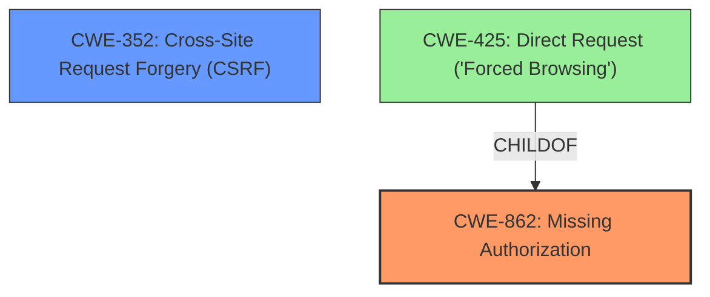

# Analysis for CVE-2021-24354

# Summary
| CWE ID | CWE Name | Confidence | CWE Abstraction Level | CWE Vulnerability Mapping Label | CWE-Vulnerability Mapping Notes |
|---|---|---|---|---|---|
| CWE-862 | Missing Authorization | 1.0 | Class | Primary | Allowed-with-Review |
| CWE-352 | Cross-Site Request Forgery (CSRF) | 0.7 | Compound | Secondary | Allowed |

## Evidence and Confidence

*   **Confidence Score:** 0.85
*   **Evidence Strength:** HIGH

## Relationship Analysis
The primary weakness is the **lack of capability checks**, which directly corresponds to **CWE-862: Missing Authorization**. The secondary weakness is the **insufficient nonce check**, which is related to **CWE-352: Cross-Site Request Forgery (CSRF)**. **CWE-862** is a Class-level CWE, and it has a child CWE, **CWE-425: Direct Request ('Forced Browsing')**, which is a Base-level CWE. However, **CWE-862** is chosen because the description explicitly mentions the **lack of authorization checks**. **CWE-352** is a Compound-level CWE that describes a situation where the application cannot verify that the request was intentionally provided by the user. This is also relevant because **insufficient nonce check** makes the application vulnerable to CSRF attacks.

## Vulnerability Chain
The vulnerability chain starts with the **lack of capability checks** and **insufficient nonce check** on the AJAX action, leading to the ability for authenticated users to **install arbitrary plugins**.

*   Root Cause 1: **Lack of capability checks** -> **CWE-862: Missing Authorization**
*   Root Cause 2: **Insufficient nonce check** -> **CWE-352: Cross-Site Request Forgery (CSRF)**
*   Impact: Ability to **install arbitrary plugins**.

## Summary of Analysis
The initial analysis identified two key weaknesses: **lack of capability checks** and **insufficient nonce check**. The analysis strongly suggests that **CWE-862: Missing Authorization** is the primary CWE because the description explicitly states a **lack of capability checks**. The second contributing factor is the **insufficient nonce check**, making **CWE-352: Cross-Site Request Forgery (CSRF)** a relevant secondary CWE. Both are at acceptable abstraction levels.

Relevant CWE Information:

# Enhanced Context (25 CWEs)
The following CWEs were identified as potentially relevant to this vulnerability:

## CWE-425: Direct Request ('Forced Browsing')
**Abstraction Level**: Base
**Similarity Score**: 0.74
**Source**: dense

**Description**:
The web application does not adequately enforce appropriate authorization on all restricted URLs, scripts, or files.

**Mapping Guidance**:
- Usage: Allowed
- Rationale: This CWE entry is at the Base level of abstraction, which is a preferred level of abstraction for mapping to the root causes of vulnerabilities.

## CWE-352: Cross-Site Request Forgery (CSRF)
**Abstraction Level**: Compound
**Similarity Score**: 0.73
**Source**: dense

**Description**:
The web application does not, or can not, sufficiently verify whether a well-formed, valid, consistent request was intentionally provided by the user who submitted the request.

**Mapping Guidance**:
- Usage: Allowed
- Rationale: This is a well-known Composite of multiple weaknesses that must all occur simultaneously, although it is attack-oriented in nature.

## CWE-472: External Control of Assumed-Immutable Web Parameter
**Abstraction Level**: Base
**Similarity Score**: 0.72
**Source**: dense

**Description**:
The web application does not sufficiently verify inputs that are assumed to be immutable but are actually externally controllable, such as hidden form fields.

**Mapping Guidance**:
- Usage: Allowed
- Rationale: This CWE entry is at the Base level of abstraction, which is a preferred level of abstraction for mapping to the root causes of vulnerabilities.

## CWE-178: Improper Handling of Case Sensitivity
**Abstraction Level**: Base
**Similarity Score**: 0.70
**Source**: dense

**Description**:
The product does not properly account for differences in case sensitivity when accessing or determining the properties of a resource, leading to inconsistent results.

**Mapping Guidance**:
- Usage: Allowed
- Rationale: This CWE entry is at the Base level of abstraction, which is a preferred level of abstraction for mapping to the root causes of vulnerabilities.

## CWE-639: Authorization Bypass Through User-Controlled Key
**Abstraction Level**: Base
**Similarity Score**: 0.70
**Source**: dense

**Description**:
The system's authorization functionality does not prevent one user from gaining access to another user's data or record by modifying the key value identifying the data.

**Mapping Guidance**:
- Usage: Allowed
- Rationale: This CWE entry is at the Base level of abstraction, which is a preferred level of abstraction for mapping to the root causes of vulnerabilities.

## CWE-1390: Weak Authentication
**Abstraction Level**: Class
**Similarity Score**: 0.69
**Source**: dense

**Description**:
The product uses an authentication mechanism to restrict access to specific users or identities, but the mechanism does not sufficiently prove that the claimed identity is correct.

**Mapping Guidance**:
- Usage: Allowed-with-Review
- Rationale: This CWE entry is a Class and might have Base-level children that would be more appropriate

## CWE-807: Reliance on Untrusted Inputs in a Security Decision
**Abstraction Level**: Base
**Similarity Score**: 0.69
**Source**: dense

**Description**:
The product uses a protection mechanism that relies on the existence or values of an input, but the input can be modified by an untrusted actor in a way that bypasses the protection mechanism.

**Mapping Guidance**:
- Usage: Allowed
- Rationale: This CWE entry is at the Base level of abstraction, which is a preferred level of abstraction for mapping to the root causes of vulnerabilities.

## CWE-941: Incorrectly Specified Destination in a Communication Channel
**Abstraction Level**: Base
**Similarity Score**: 0.69
**Source**: dense

**Description**:
The product creates a communication channel to initiate an outgoing request to an actor, but it does not correctly specify the intended destination for that actor.

**Mapping Guidance**:
- Usage: Allowed
- Rationale: This CWE entry is at the Base level of abstraction, which is a preferred level of abstraction for mapping to the root causes of vulnerabilities.

## CWE-184: Incomplete List of Disallowed Inputs
**Abstraction Level**: Base
**Similarity Score**: 0.69
**Source**: dense

**Description**:
The product implements a protection mechanism that relies on a list of inputs (or properties of inputs) that are not allowed by policy or otherwise require other action to neutralize before additional processing takes place, but the list is incomplete.

**Mapping Guidance**:
- Usage: Allowed
- Rationale: This CWE entry is at the Base level of abstraction, which is a preferred level of abstraction for mapping to the root causes of vulnerabilities.

## CWE-303: Incorrect Implementation of Authentication Algorithm
**Abstraction Level**: Base
**Similarity Score**: 0.69
**Source**: dense

**Description**:
The requirements for the product dictate the use of an established authentication algorithm, but the implementation of the algorithm is incorrect.

**Mapping Guidance**:
- Usage: Allowed
- Rationale: This CWE entry is at the Base level of abstraction, which is a preferred level of abstraction for mapping to the root causes of vulnerabilities.

## CWE-352: Cross-Site Request Forgery (CSRF)
**Abstraction Level**: Compound
**Similarity Score**: 2908.59
**Source**: sparse

**Description**:
The web application does not, or can not, sufficiently verify whether a well-formed, valid, consistent request was intentionally provided by the user who submitted the request.

**Mapping Guidance**:
- Usage: Allowed
- Rationale: This is a well-known Composite of multiple weaknesses that must all occur simultaneously, although it is attack-oriented in nature.

## CWE-116: Improper Encoding or Escaping of Output
**Abstraction Level**: Class
**Similarity Score**: 2831.86
**Source**: sparse

**Description**:
The product prepares a structured message for communication with another component, but encoding or escaping of the data is either missing or done incorrectly. As a result, the

# Enhanced Query for CVE-2021-24354

# Vulnerability Description

    A **lack of capability checks** and **insufficient nonce check** on the AJAX action in the Simple 301 Redirects by BetterLinks WordPress plugin before 2.0.4, made it possible for authenticated users to install arbitrary plugins on vulnerable sites.

    # Keyphrase-Specific CWE Analysis
    This vulnerability contains multiple keyphrases that may map to different CWEs. 
    Please analyze each keyphrase separately and determine the most appropriate CWE(s) for each.

    ## ROOTCAUSE: 'lack of capability checks'

Relevant CWEs for this ROOTCAUSE:

### 1. CWE-352: Cross-Site Request Forgery (CSRF) (Score: 405.59)

The web application does not, or can not, sufficiently verify whether a well-formed, valid, consistent request was intentionally provided by the user who submitted the request....

### 2. CWE-862: Missing Authorization (Score: 360.80)

The product does not perform an authorization check when an actor attempts to access a resource or perform an action....

### 3. CWE-863: Incorrect Authorization (Score: 332.54)

The product performs an authorization check when an actor attempts to access a resource or perform an action, but it does not correctly perform the check....

### 4. CWE-285: Improper Authorization (Score: 303.08)

The product does not perform or incorrectly performs an authorization check when an actor attempts to access a resource or perform an action....

### 5. CWE-116: Improper Encoding or Escaping of Output (Score: 277.35)

The product prepares a structured message for communication with another component, but encoding or escaping of the data is either missing or done incorrectly. As a result, the intended structure of the message is not preserved....

## ROOTCAUSE: 'insufficient nonce check'

Relevant CWEs for this ROOTCAUSE:

### 1. CWE-352: Cross-Site Request Forgery (CSRF) (Score: 405.59)

The web application does not, or can not, sufficiently verify whether a well-formed, valid, consistent request was intentionally provided by the user who submitted the request....

### 2. CWE-862: Missing Authorization (Score: 360.80)

The product does not perform an authorization check when an actor attempts to access a resource or perform an action....

### 3. CWE-863: Incorrect Authorization (Score: 332.54)

The product performs an authorization check when an actor attempts to access a resource or perform an action, but it does not correctly perform the check....

### 4. CWE-285: Improper Authorization (Score: 303.08)

The product does not perform or incorrectly performs an authorization check when an actor attempts to access a resource or perform an action....

### 5. CWE-116: Improper Encoding or Escaping of Output (Score: 277.35)

The product prepares a structured message for communication with another component, but encoding or escaping of the data is either missing or done incorrectly. As a result, the intended structure of the message is not preserved....

## IMPACT: 'install arbitrary plugins'

Relevant CWEs for this IMPACT:

### 1. CWE-352: Cross-Site Request Forgery (CSRF) (Score: 405.59)

The web application does not, or can not, sufficiently verify whether a well-formed, valid, consistent request was intentionally provided by the user who submitted the request....

### 2. CWE-862: Missing Authorization (Score: 360.80)

The product does not perform an authorization check when an actor attempts to access a resource or perform an action....

### 3. CWE-863: Incorrect Authorization (Score: 332.54)

The product performs an authorization check when an actor attempts to access a resource or perform an action, but it does not correctly perform the check....

### 4. CWE-285: Improper Authorization (Score: 303.08)

The product does not perform or incorrectly performs an authorization check when an actor attempts to access a resource or perform an action....

### 5. CWE-116: Improper Encoding or Escaping of Output (Score: 277.35)

The product prepares a structured message for communication with another component, but encoding or escaping of the data is either missing or done incorrectly. As a result, the intended structure of the message is not preserved....

## ATTACKER: 'authenticated users'

Relevant CWEs for this ATTACKER:

### 1. CWE-352: Cross-Site Request Forgery (CSRF) (Score: 405.59)

The web application does not, or can not, sufficiently verify whether a well-formed, valid, consistent request was intentionally provided by the user who submitted the request....

### 2. CWE-862: Missing Authorization (Score: 360.80)

The product does not perform an authorization check when an actor attempts to access a resource or perform an action....

### 3. CWE-863: Incorrect Authorization (Score: 332.54)

The product performs an authorization check when an actor attempts to access a resource or perform an action, but it does not correctly perform the check....

### 4. CWE-285: Improper Authorization (Score: 303.08)

The product does not perform or incorrectly performs an authorization check when an actor attempts to access a resource or perform an action....

### 5. CWE-116: Improper Encoding or Escaping of Output (Score: 277.35)

The product prepares a structured message for communication with another component, but encoding or escaping of the data is either missing or done incorrectly. As a result, the intended structure of the message is not preserved....

## PRODUCT: 'Simple 301 Redirects by BetterLinks WordPress plugin'

Relevant CWEs for this PRODUCT:

### 1. CWE-352: Cross-Site Request Forgery (CSRF) (Score: 405.59)

The web application does not, or can not, sufficiently verify whether a well-formed, valid, consistent request was intentionally provided by the user who submitted the request....

### 2. CWE-862: Missing Authorization (Score: 360.80)

The product does not perform an authorization check when an actor attempts to access a resource or perform an action....

### 3. CWE-863: Incorrect Authorization (Score: 332.54)

The product performs an authorization check when an actor attempts to access a resource or perform an action, but it does not correctly perform the check....

### 4. CWE-285: Improper Authorization (Score: 303.08)

The product does not perform or incorrectly performs an authorization check when an actor attempts to access a resource or perform an action....

### 5. CWE-116: Improper Encoding or Escaping of Output (Score: 277.35)

The product prepares a structured message for communication with another component, but encoding or escaping of the data is either missing or done incorrectly. As a result, the intended structure of the message is not preserved....

## VERSION: 'before 2.0.4'

Relevant CWEs for this VERSION:

### 1. CWE-352: Cross-Site Request Forgery (CSRF) (Score: 405.59)

The web application does not, or can not, sufficiently verify whether a well-formed, valid, consistent request was intentionally provided by the user who submitted the request....

### 2. CWE-862: Missing Authorization (Score: 360.80)

The product does not perform an authorization check when an actor attempts to access a resource or perform an action....

### 3. CWE-863: Incorrect Authorization (Score: 332.54)

The product performs an authorization check when an actor attempts to access a resource or perform an action, but it does not correctly perform the check....

### 4. CWE-285: Improper Authorization (Score: 303.08)

The product does not perform or incorrectly performs an authorization check when an actor attempts to access a resource or perform an action....

### 5. CWE-116: Improper Encoding or Escaping of Output (Score: 277.35)

The product prepares a structured message for communication with another component, but encoding or escaping of the data is either missing or done incorrectly. As a result, the intended structure of the message is not preserved....

## COMPONENT: 'AJAX action'

Relevant CWEs for this COMPONENT:

### 1. CWE-352: Cross-Site Request Forgery (CSRF) (Score: 405.59)

The web application does not, or can not, sufficiently verify whether a well-formed, valid, consistent request was intentionally provided by the user who submitted the request....

### 2. CWE-862: Missing Authorization (Score: 360.80)

The product does not perform an authorization check when an actor attempts to access a resource or perform an action....

### 3. CWE-863: Incorrect Authorization (Score: 332.54)

The product performs an authorization check when an actor attempts to access a resource or perform an action, but it does not correctly perform the check....

### 4. CWE-285: Improper Authorization (Score: 303.08)

The product does not perform or incorrectly performs an authorization check when an actor attempts to access a resource or perform an action....

### 5. CWE-116: Improper Encoding or Escaping of Output (Score: 277.35)

The product prepares a structured message for communication with another component, but encoding or escaping of the data is either missing or done incorrectly. As a result, the intended structure of the message is not preserved....

    # Analysis Instructions
    1. For each keyphrase, identify the most appropriate CWE(s) that represent the weakness.
    2. Consider how the different keyphrases might relate to each other in the vulnerability chain.
    3. Provide a final determination of primary CWE(s) and any secondary CWEs.
    4. Format your response using the standard analysis template.

    Please analyze how these different weaknesses interact and provide a comprehensive CWE classification.
    