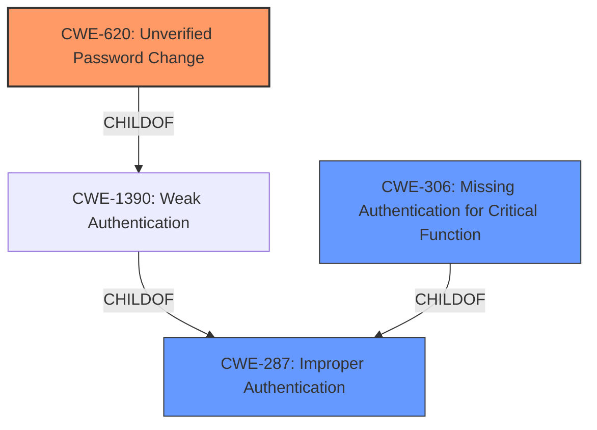

# Analysis Report for CVE-2021-24359

# Vulnerability Analysis Report: CVE-2021-24359

## Description


## Analysis (with Relationship Data)

# Summary
| CWE ID | CWE Name | Confidence | CWE Abstraction Level | CWE Vulnerability Mapping Label | CWE-Vulnerability Mapping Notes |
|---|---|---|---|---|---|
| CWE-620 | Unverified Password Change | 0.9 | Base | Primary | Allowed |
| CWE-306 | Missing Authentication for Critical Function | 0.7 | Base | Secondary | Allowed |
| CWE-287 | Improper Authentication | 0.5 | Class | Secondary | Discouraged |

## Evidence and Confidence

*   **Confidence Score:** 0.8
*   **Evidence Strength:** HIGH

## Relationship Analysis
The primary CWE is CWE-620, which is a Base level CWE and a ChildOf CWE-1390 (Weak Authentication). CWE-1390 is a Class level CWE and a ChildOf CWE-287 (Improper Authentication). These relationships helped to narrow down from a general authentication issue to a specific problem of unverified password changes. CWE-306, another potential candidate, also stems from CWE-287, representing a different facet of authentication failure.



## Vulnerability Chain
The vulnerability chain starts with the **improper check** on password reset requests, leading to the ability to send arbitrary password reset emails. This can then be chained with an open redirect to achieve account takeover.
  - Root Cause: **did not properly check that a user requesting a password reset was the legitimate user** (CWE-620)
  - Consequence: arbitrary reset password email to a registered user
  - Further Exploitation: open redirect (CVE-2021-24358) to include a crafted password reset link
  - Final Impact: Account takeover

## Summary of Analysis
The initial analysis identified several potential CWEs, including CWE-620, CWE-1390, and CWE-306. However, after carefully reviewing the vulnerability description and the provided context, CWE-620 (Unverified Password Change) emerges as the most appropriate primary CWE. This is because the **root cause** explicitly states that the plugin **did not properly check that a user requesting a password reset was the legitimate user**. This directly aligns with the description of CWE-620: "When setting a new password for a user, the product does not require knowledge of the original password, or using another form of authentication."

The evidence supporting this decision is strong, as it comes directly from the "Vulnerability Description Key Phrases" and "CVE Reference Links Content Summary":
- **Vulnerability Description Key Phrases:** **"did not properly check that a user requesting a password reset was the legitimate user"**
- **CVE Reference Links Content Summary:** "The plugin's password reset functionality does not properly verify that the user requesting the reset is indeed the legitimate owner of the account."

CWE-306 (Missing Authentication for Critical Function) and CWE-287 (Improper Authentication) were considered, but they are more general and don't specifically address the password reset **weakness**. While the plugin **fails to properly authenticate** the user requesting the password reset, the core issue is the **lack of verification** during the password change process itself, making CWE-620 a more precise fit. CWE-287 is discouraged, and CWE-1390 is a class that could be a better fit with a Base level child CWE.

The relationships between the CWEs further support this decision. CWE-620 is a child of CWE-1390 (Weak Authentication), which in turn is a child of CWE-287 (Improper Authentication). This hierarchical structure indicates that CWE-620 is a more specific type of authentication **weakness**, making it the most appropriate choice for this vulnerability.

The final selection of CWE-620 is at the optimal level of specificity, as it directly reflects the **root cause** of the vulnerability and provides a clear understanding of the underlying issue.

Relevant CWE Information:
- CWE-620: Unverified Password Change: "When setting a new password for a user, the product does not require knowledge of the original password, or using another form of authentication."
- CWE-306: Missing Authentication for Critical Function: "The product does not perform any authentication for functionality that requires a provable user identity or consumes a significant amount of resources."
- CWE-287: Improper Authentication: "When an actor claims to have a given identity, the product does not prove or insufficiently proves that the claim is correct."


## CWE Relationship Analysis

Current CWEs represent these abstraction levels: .


### Vulnerability Chain Analysis

**Chain starting from CWE-620:**
- 620 (Unverified Password Change) - ROOT


**Chain starting from CWE-287:**
- 287 (Improper Authentication) - ROOT


### CWE Relationship Diagram

```mermaid
graph TD
    classDef primary fill:#f96,stroke:#333,stroke-width:2px
    classDef secondary fill:#69f,stroke:#333
    classDef tertiary fill:#9e9,stroke:#333
```


*Report generated on 2025-04-01 16:11:32*
