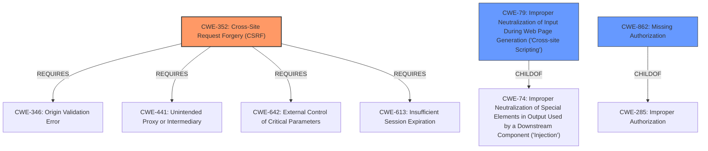

# Enhanced Analysis for CVE-2021-24405

# Summary
| CWE ID | CWE Name | Confidence | CWE Abstraction Level | CWE Vulnerability Mapping Label | CWE-Vulnerability Mapping Notes |
|---|---|---|---|---|---|
| CWE-352 | Cross-Site Request Forgery (CSRF) | 1.0 | Compound | Primary | Allowed |
| CWE-79 | Improper Neutralization of Input During Web Page Generation ('Cross-site Scripting') | 1.0 | Base | Secondary | Allowed |
| CWE-862 | Missing Authorization | 0.7 | Class | Secondary | Allowed-with-Review |

## Evidence and Confidence

*   **Confidence Score:** 0.9
*   **Evidence Strength:** HIGH

## Relationship Analysis
The primary relationship is between CWE-352 [CWE-352: Cross-Site Request Forgery (CSRF)] and its requirements. The vulnerability description explicitly mentions a **lack of CSRF protection** when saving settings, which aligns directly with CWE-352. The XSS vulnerability, CWE-79 [CWE-79: Improper Neutralization of Input During Web Page Generation ('Cross-site Scripting')], is a separate, exploitable weakness due to **missing sanitization**, co-occurring with the CSRF issue, thus a secondary concern. CWE-862 [CWE-862: Missing Authorization] is related to the fact that any authenticated user can make changes. The abstraction levels influenced the selection, preferring the more specific Compound and Base levels over the Class level.



## Vulnerability Chain
The vulnerability chain starts with the **lack of CSRF protection** (CWE-352) and **missing authorization** (CWE-862), allowing authenticated users or attackers via CSRF to modify the plugin settings. This leads to **improper sanitization** (CWE-79) of the cookie banner settings, resulting in a stored XSS vulnerability.

## Summary of Analysis
The initial assessment correctly identified the **lack of CSRF protection** as a significant vulnerability. The supporting evidence explicitly states that the plugin lacks CSRF checks when saving settings: "The Easy Cookies Policy WordPress plugin through 1.6.2 is lacking any capability and CSRF check when saving its settings, allowing any authenticated users (such as subscriber) to change them." The analysis also pointed out the stored XSS vulnerability due to **improper sanitization**, "Furthermore, the cookie banner setting is not sanitised or validated before being output in all pages of the frontend and the backend settings one, leading to a Stored Cross-Site Scripting issue." The selection of CWE-352, CWE-79, and CWE-862 is based on this evidence. The compound nature of CWE-352 accounts for the complex interplay of missing validation and user interaction, while CWE-79 captures the specific XSS flaw. The retriever results, especially the high scores for CWE-352 and CWE-79, further support this decision. CWE-862 captures that any authenticated user can make changes, which is a missing authorization. The selected CWEs are at the optimal level of specificity, addressing both the overarching CSRF issue and the resultant XSS vulnerability.

Relevant CWE Information:


## CWE Relationship Analysis

Current CWEs represent these abstraction levels: .


### Vulnerability Chain Analysis

**Chain starting from CWE-79:**
- 79 (Improper Neutralization of Input During Web Page Generation ('Cross-site Scripting')) - ROOT


**Chain starting from CWE-862:**
- 862 (Missing Authorization) - ROOT


### CWE Relationship Diagram

```mermaid
graph TD
    classDef primary fill:#f96,stroke:#333,stroke-width:2px
    classDef secondary fill:#69f,stroke:#333
    classDef tertiary fill:#9e9,stroke:#333
```