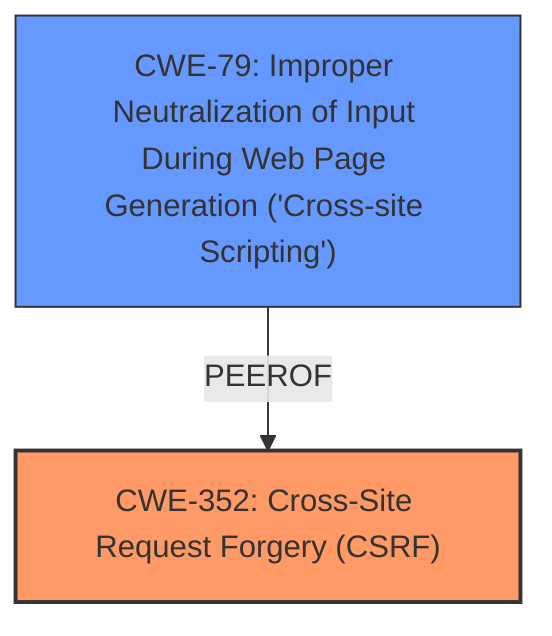

# Analysis Report for CVE-2021-24431

# Vulnerability Analysis Report: CVE-2021-24431

## Description


## Analysis (with Relationship Data)

# Summary
| CWE ID | CWE Name | Confidence | CWE Abstraction Level | CWE Vulnerability Mapping Label | CWE-Vulnerability Mapping Notes |
|---|---|---|---|---|---|
| CWE-352 | Cross-Site Request Forgery (CSRF) | 1.0 | Compound | Allowed | Primary CWE |
| CWE-79 | Improper Neutralization of Input During Web Page Generation ('Cross-site Scripting') | 1.0 | Base | Allowed | Secondary CWE |

## Evidence and Confidence

*   **Confidence Score:** 1.0
*   **Evidence Strength:** HIGH

## Relationship Analysis
The primary relationship is that the vulnerability involves both **CWE-352 [Cross-Site Request Forgery (CSRF)]** and **CWE-79 [Improper Neutralization of Input During Web Page Generation ('Cross-site Scripting')]**. **CWE-352 [Cross-Site Request Forgery (CSRF)]** allows an attacker to modify the settings of the plugin. These settings are then used to generate a flag bar on the front end. Because the input is not sanitized, an attacker can inject a **cross-site scripting** payload via **CWE-79 [Improper Neutralization of Input During Web Page Generation ('Cross-site Scripting')]**.



## Vulnerability Chain
The vulnerability chain starts with a **missing CSRF** protection (**CWE-352 [Cross-Site Request Forgery (CSRF)]**), which allows an attacker to modify the plugin's settings. The plugin then fails to sanitize or escape these settings, leading to **CWE-79 [Improper Neutralization of Input During Web Page Generation ('Cross-site Scripting')]** when the settings are displayed on the frontend, thus injecting an XSS payload.

## Summary of Analysis
The initial assessment identified **CWE-352 [Cross-Site Request Forgery (CSRF)]** and **CWE-79 [Improper Neutralization of Input During Web Page Generation ('Cross-site Scripting')]** as the primary weaknesses.

The vulnerability description clearly states that there is a **missing CSRF** protection: "The Language Bar Flags WordPress plugin through 1.0.8 does not have any CSRF in place when saving its settings". This directly corresponds to **CWE-352 [Cross-Site Request Forgery (CSRF)]**.

The description also mentions that the plugin "did not sanitise or escape them when generating the flag bar in the frontend." This lack of sanitization leads to **CWE-79 [Improper Neutralization of Input During Web Page Generation ('Cross-site Scripting')]**.

The graph relationships confirm that these two CWEs can exist in the same vulnerability, with **CWE-79 [Improper Neutralization of Input During Web Page Generation ('Cross-site Scripting')]** and **CWE-352 [Cross-Site Request Forgery (CSRF)]** considered peers.

Both CWEs are at the optimal level of specificity. **CWE-352 [Cross-Site Request Forgery (CSRF)]** is a compound weakness and directly describes the **missing CSRF** protection. **CWE-79 [Improper Neutralization of Input During Web Page Generation ('Cross-site Scripting')]** is a base weakness and directly describes the **lack of sanitization** of the settings.

Relevant CWE Information:
- **CWE-352 [Cross-Site Request Forgery (CSRF)]**: The web application does not, or can not, sufficiently verify whether a well-formed, valid, consistent request was intentionally provided by the user who submitted the request.
- **CWE-79 [Improper Neutralization of Input During Web Page Generation ('Cross-site Scripting')]**: The product does not neutralize or incorrectly neutralizes user-controllable input before it is placed in output that is used as a web page that is served to other users.


## CWE Relationship Analysis

Current CWEs represent these abstraction levels: .


### Vulnerability Chain Analysis

**Chain starting from CWE-352:**
- 352 (Cross-Site Request Forgery (CSRF)) - ROOT


**Chain starting from CWE-79:**
- 79 (Improper Neutralization of Input During Web Page Generation ('Cross-site Scripting')) - ROOT


### CWE Relationship Diagram

```mermaid
graph TD
    classDef primary fill:#f96,stroke:#333,stroke-width:2px
    classDef secondary fill:#69f,stroke:#333
    classDef tertiary fill:#9e9,stroke:#333
```


*Report generated on 2025-04-02 03:58:01*
