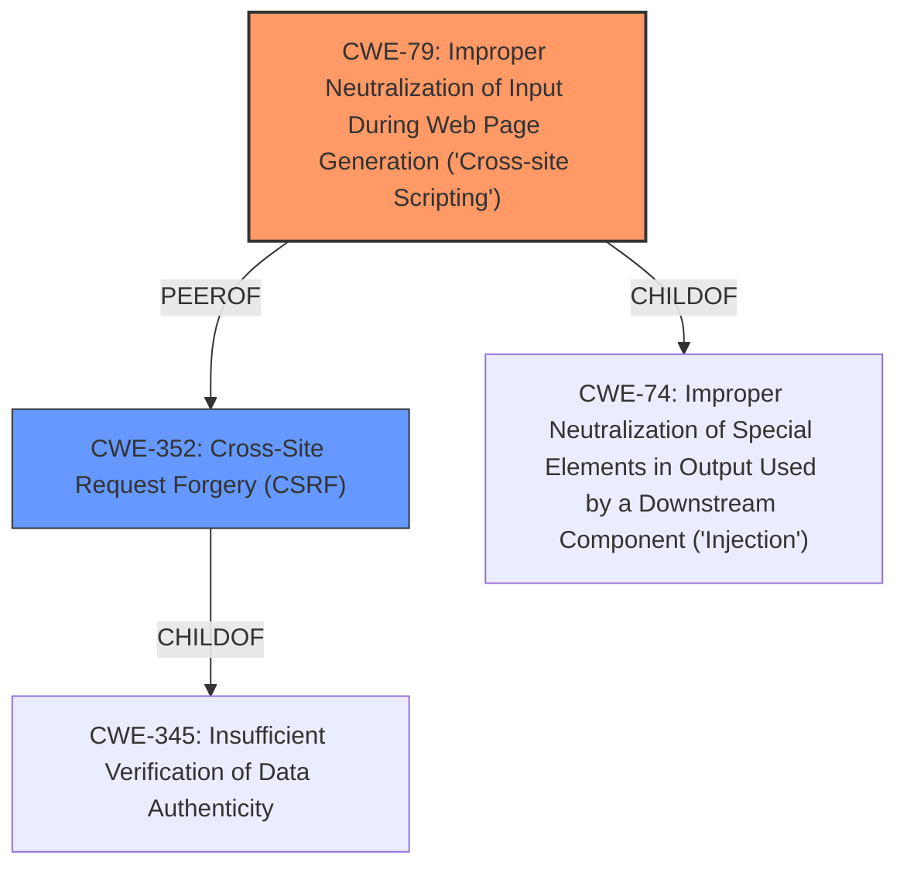

# Enhanced Analysis for CVE-2021-24434

# Summary
| CWE ID | CWE Name | Confidence | CWE Abstraction Level | CWE Vulnerability Mapping Label | CWE-Vulnerability Mapping Notes |
|---|---|---|---|---|---|
| **CWE-79** | **Improper Neutralization of Input During Web Page Generation ('Cross-site Scripting')** | 1.0 | Base | Primary | Allowed |
| CWE-352 | Cross-Site Request Forgery (CSRF) | 1.0 | Compound | Secondary | Allowed |

## Evidence and Confidence

*   **Confidence Score:** 1.0
*   **Evidence Strength:** HIGH

## Relationship Analysis
The primary weakness is CWE-79, which directly addresses the Stored Cross-Site Scripting (XSS) due to **improper input sanitization** in the "Glass Pages" setting. CWE-352 is a related, secondary weakness because the absence of CSRF checks allows the XSS vulnerability to be exploited more easily. CWE-79 is a Base level CWE, which is the preferred level of abstraction, while CWE-352 is a Compound CWE which is also allowed.


## Vulnerability Chain
The vulnerability chain starts with **improper input sanitization** leading to XSS. The absence of CSRF protection allows an attacker to more easily exploit the XSS vulnerability.

Root Cause: **Improper Input Sanitization** (in Glass Pages setting)
|
V
Weakness: Stored Cross-Site Scripting (CWE-79)
|
V
Enabler: Missing CSRF Protection (CWE-352)
|
V
Impact: Arbitrary JavaScript code injection, user redirection, cookie theft, website defacement

## Summary of Analysis
The analysis concludes that the primary vulnerability is CWE-79, resulting from **improper input sanitization**. The plugin does not sanitize or escape its "Glass Pages" setting before outputting it in a page. This aligns directly with the CWE-79 description: "The product does not neutralize or incorrectly neutralizes user-controllable input before it is placed in output that is used as a web page that is served to other users." The presence of a CSRF vulnerability (CWE-352) exacerbates the problem, as it allows attackers to more easily inject malicious scripts via a crafted request.

The "Vulnerability Description Key Phrases" section explicitly states "**rootcause: improper input sanitization**" and "**weakness: cross-site scripting**". The "CVE Reference Links Content Summary" further confirms this, stating, "The plugin fails to sanitize and escape the 'Glass Pages' setting before outputting it in a page. This lack of sanitization allows for the injection of malicious scripts. Additionally, the plugin lacks CSRF protection, which allows for the exploitation of the XSS vulnerability via a CSRF attack."

CWE-79 is chosen because it accurately describes the root cause and impact of the vulnerability. CWE-352 is included as a secondary vulnerability because the **lack of CSRF** allows for easier exploitation of the XSS issue. The selected CWEs are at the optimal level of specificity, with CWE-79 being a Base level CWE and CWE-352 being a Compound level CWE.

Relevant CWE Information:

# Enhanced Context (25 CWEs)
The following CWEs were identified as potentially relevant to this vulnerability:

## CWE-80: Improper Neutralization of Script-Related HTML Tags in a Web Page (Basic XSS)
**Abstraction Level**: Variant
**Similarity Score**: 0.78
**Source**: dense

**Description**:
The product receives input from an upstream component, but it does not neutralize or incorrectly neutralizes special characters such as "<", ">", and "&" that could be interpreted as web-scripting elements when they are sent to a downstream component that processes web pages.

**Mapping Guidance**:
- Usage: Allowed
- Rationale: This CWE entry is at the Variant level of abstraction, which is a preferred level of abstraction for mapping to the root causes of vulnerabilities.

## CWE-352: Cross-Site Request Forgery (CSRF)
**Abstraction Level**: Compound
**Similarity Score**: 7961.80
**Source**: sparse

**Description**:
The web application does not, or can not, sufficiently verify whether a well-formed, valid, consistent request was intentionally provided by the user who submitted the request.

**Mapping Guidance**:
- Usage: Allowed
- Rationale: This is a well-known Composite of multiple weaknesses that must all occur simultaneously, although it is attack-oriented in nature.

## CWE-79: Improper Neutralization of Input During Web Page Generation ('Cross-site Scripting')
**Abstraction Level**: Base
**Similarity Score**: 8401.82
**Source**: sparse

**Description**:
The product does not neutralize or incorrectly neutralizes user-controllable input before it is placed in output that is used as a web page that is served to other users.

**Mapping Guidance**:
- Usage: Allowed
- Rationale: This CWE entry is at the Base level of abstraction, which is a preferred level of abstraction for mapping to the root causes of vulnerabilities.

## CWE-116: Improper Encoding or Escaping of Output
**Abstraction Level**: Class
**Similarity Score**: 8445.91
**Source**: sparse

**Description**:
The product prepares a structured message for communication with another component, but encoding or escaping of the data is either missing or done incorrectly. As a result, the intended structure of the message is not preserved.

**Mapping Guidance**:
- Usage: Allowed-with-Review
- Rationale: This CWE entry is a Class and might have Base-level children that would be more appropriate

**Rationale for not selecting CWE-116:**
CWE-116 is a Class level CWE. The description states "The product prepares a structured message for communication with another component, but encoding or escaping of the data is either missing or done incorrectly. As a result, the intended structure of the message is not preserved." The encoding issue is happening in the web page generation, so CWE-79 is a better fit.


## CWE Relationship Analysis

Current CWEs represent these abstraction levels: .


### Vulnerability Chain Analysis

**Chain starting from CWE-79:**
- 79 (Improper Neutralization of Input During Web Page Generation ('Cross-site Scripting')) - ROOT


**Chain starting from CWE-80:**
- 80 (Improper Neutralization of Script-Related HTML Tags in a Web Page (Basic XSS)) - ROOT


### CWE Relationship Diagram

```mermaid
graph TD
    classDef primary fill:#f96,stroke:#333,stroke-width:2px
    classDef secondary fill:#69f,stroke:#333
    classDef tertiary fill:#9e9,stroke:#333
```