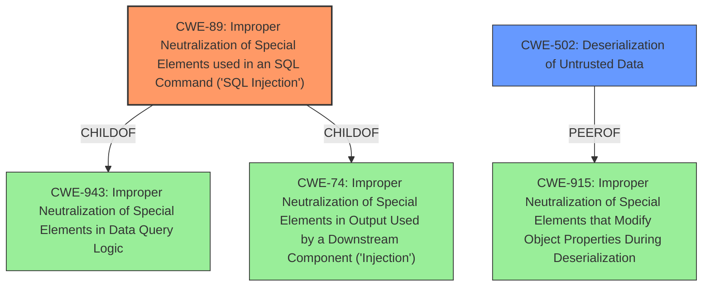

# Analysis Report for CVE-2021-24465

# Vulnerability Analysis Report: CVE-2021-24465

## Description


## Analysis (with Relationship Data)

# Summary
| CWE ID | CWE Name | Confidence | CWE Abstraction Level | CWE Vulnerability Mapping Label | CWE-Vulnerability Mapping Notes |
|---|---|---|---|---|---|
| CWE-89 | Improper Neutralization of Special Elements used in an SQL Command ('SQL Injection') | 1.0 | Base | Allowed | Primary CWE |
| CWE-502 | Deserialization of Untrusted Data | 0.7 | Base | Allowed | Secondary Candidate |

## Evidence and Confidence

*   **Confidence Score:** 0.9
*   **Evidence Strength:** HIGH

## Relationship Analysis
The primary relationship is that **CWE-89** [CWE-89: Improper Neutralization of Special Elements used in an SQL Command ('SQL Injection')] is a base CWE. It can be a child of **CWE-943** [CWE-943: Improper Neutralization of Special Elements in Data Query Logic] or **CWE-74** [CWE-74: Improper Neutralization of Special Elements in Output Used by a Downstream Component ('Injection')]. **CWE-502** [CWE-502: Deserialization of Untrusted Data] is a base CWE and a peer of **CWE-915** [CWE-915: Improper Neutralization of Special Elements that Modify Object Properties During Deserialization]. There are no direct chain relationships, but SQL Injection can allow for manipulation that leads to object deserialization.



## Vulnerability Chain
The vulnerability chain starts with **improper sanitization** of the `ids` attribute leading to **CWE-89** [CWE-89: Improper Neutralization of Special Elements used in an SQL Command ('SQL Injection')], which then leads to **data disclosure** and **manipulation of returned values**, ultimately resulting in **CWE-502** [CWE-502: Deserialization of Untrusted Data].

## Summary of Analysis
The initial analysis strongly suggests **CWE-89** [CWE-89: Improper Neutralization of Special Elements used in an SQL Command ('SQL Injection')] as the primary weakness, supported by the "Vulnerability Description Key Phrases" highlighting "SQL injection" and the "CVE Reference Links Content Summary" stating "The `Meow Gallery` plugin fails to properly sanitize, validate, or escape the `ids` attribute within its gallery shortcode before using it in an SQL query." The description also mentions that the injection allows the returned values to be manipulated in a way that could lead to data disclosure and arbitrary objects to be deserialized, which points to a secondary weakness of **CWE-502** [CWE-502: Deserialization of Untrusted Data].

The retriever results also lists **CWE-89** [CWE-89: Improper Neutralization of Special Elements used in an SQL Command ('SQL Injection')] as the top result, further strengthening the case for its selection. The graph relationships show that it is a base CWE that can be a child of **CWE-943** [CWE-943: Improper Neutralization of Special Elements in Data Query Logic] or **CWE-74** [CWE-74: Improper Neutralization of Special Elements in Output Used by a Downstream Component ('Injection')].

**CWE-89** [CWE-89: Improper Neutralization of Special Elements used in an SQL Command ('SQL Injection')] is selected as the primary CWE because it directly addresses the root cause of the vulnerability, which is the **improper neutralization** of special elements used in an SQL command. **CWE-502** [CWE-502: Deserialization of Untrusted Data] is included as a secondary CWE because the **SQL injection** can be leveraged to manipulate returned values, leading to the deserialization of arbitrary objects. Both CWEs are at the base level of abstraction, making them the most specific and appropriate choices based on the available evidence.

---
**CWE-89: Improper Neutralization of Special Elements used in an SQL Command ('SQL Injection')**
*   **Technical Explanation:** The plugin **fails to properly sanitize, validate, or escape** the `ids` attribute of its gallery shortcode before using it in an SQL query. This allows an attacker to inject arbitrary SQL code through the `ids` attribute, leading to **SQL injection**.
*   **Security Implications:** Attackers can steal sensitive data from the database, including user password hashes, and potentially execute arbitrary code on the server.
*   **Relationships:** **CWE-89** [CWE-89: Improper Neutralization of Special Elements used in an SQL Command ('SQL Injection')] is a base CWE, a child of **CWE-943** [CWE-943: Improper Neutralization of Special Elements in Data Query Logic] and **CWE-74** [CWE-74: Improper Neutralization of Special Elements in Output Used by a Downstream Component ('Injection')].
*   **Primary/Secondary:** Primary
*   **MITRE Mapping Guidance:** Usage: Allowed. This CWE entry is at the Base level of abstraction, which is a preferred level of abstraction for mapping to the root causes of vulnerabilities.

---
**CWE-502: Deserialization of Untrusted Data**
*   **Technical Explanation:** The **SQL injection** allows for the manipulation of returned values, leading to the deserialization of arbitrary PHP objects. This occurs because the application doesn't sufficiently ensure that the resulting data will be valid after deserialization.
*   **Security Implications:** Through object deserialization vulnerabilities, it may be possible to execute arbitrary code on the server.
*   **Relationships:** Child of **CWE-913** [CWE-913: Improper Control of Dynamically-Managed Code Resources], peer of **CWE-915** [CWE-915: Improper Neutralization of Special Elements that Modify Object Properties During Deserialization].
*   **Primary/Secondary:** Secondary
*   **MITRE Mapping Guidance:** Usage: Allowed. This CWE entry is at the Base level of abstraction, which is a preferred level of abstraction for mapping to the root causes of vulnerabilities.

---

Other CWEs Considered But Not Used:

*   **CWE-943** [CWE-943: Improper Neutralization of Special Elements in Data Query Logic]: While this is a parent of **CWE-89** [CWE-89: Improper Neutralization of Special Elements used in an SQL Command ('SQL Injection')], **CWE-89** [CWE-89: Improper Neutralization of Special Elements used in an SQL Command ('SQL Injection')] is more specific and directly addresses the **SQL injection** vulnerability.
*   **CWE-74** [CWE-74: Improper Neutralization of Special Elements in Output Used by a Downstream Component ('Injection')]: Same reasoning as **CWE-943** [CWE-943: Improper Neutralization of Special Elements in Data Query Logic]. **CWE-89** [CWE-89: Improper Neutralization of Special Elements used in an SQL Command ('SQL Injection')] is a more specific child.
*   **CWE-79** [CWE-79: Improper Neutralization of Input During Web Page Generation ('Cross-site Scripting')]: Not applicable as the vulnerability is not related to Cross-Site Scripting.
*   **CWE-352** [CWE-352: Cross-Site Request Forgery (CSRF)]: Although listed in the retriever results, there is no evidence of CSRF in the provided description.
*   **CWE-116** [CWE-116: Improper Encoding or Escaping of Output]: While related to sanitization, **CWE-89** [CWE-89: Improper Neutralization of Special Elements used in an SQL Command ('SQL Injection')] is a more direct and specific classification for **SQL injection**.
*   **CWE-862** [CWE-862: Missing Authorization] and **CWE-863** [CWE-863


## CWE Relationship Analysis

Current CWEs represent these abstraction levels: .


### Vulnerability Chain Analysis

**Chain starting from CWE-502:**
- 502 (Deserialization of Untrusted Data) - ROOT


**Chain starting from CWE-79:**
- 79 (Improper Neutralization of Input During Web Page Generation ('Cross-site Scripting')) - ROOT


### CWE Relationship Diagram

```mermaid
graph TD
    classDef primary fill:#f96,stroke:#333,stroke-width:2px
    classDef secondary fill:#69f,stroke:#333
    classDef tertiary fill:#9e9,stroke:#333
```


*Report generated on 2025-04-02 11:00:25*
