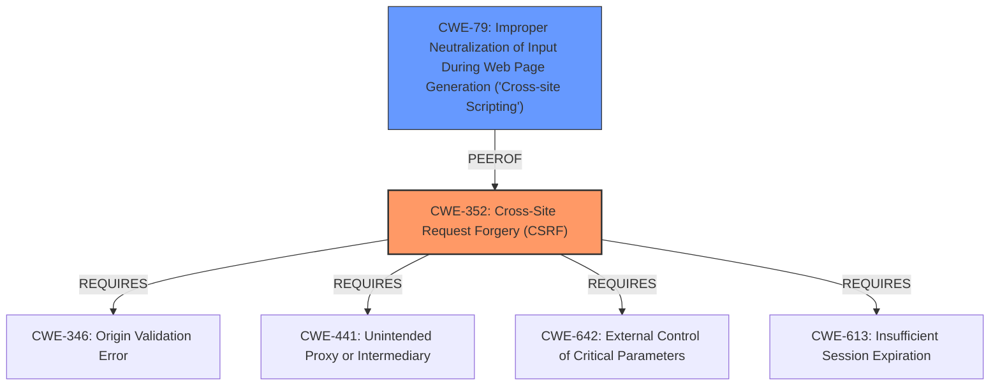

# Enhanced Analysis for CVE-2021-24467

# Summary
| CWE ID | CWE Name | Confidence | CWE Abstraction Level | CWE Vulnerability Mapping Label | CWE-Vulnerability Mapping Notes |
|---|---|---|---|---|---|
| CWE-352 | Cross-Site Request Forgery (CSRF) | 1.0 | Compound | Primary | Allowed |
| CWE-79 | Improper Neutralization of Input During Web Page Generation ('Cross-site Scripting') | 0.7 | Base | Secondary | Allowed |

## Evidence and Confidence

*   **Confidence Score:** 0.85
*   **Evidence Strength:** HIGH

## Relationship Analysis
The primary CWE is CWE-352, which is a Compound weakness. It REQUIRES other weaknesses to be present, such as **lack of CSRF nonce verification**. The secondary CWE is CWE-79 which can arise from the exploitation of the CSRF vulnerability if an attacker uses it to inject malicious scripts into the plugin settings. CWE-79 is a Base level CWE.



## Vulnerability Chain
The vulnerability chain starts with the **lack of CSRF nonce verification**, leading to a CSRF vulnerability (CWE-352). An attacker can exploit this to modify the plugin settings, potentially injecting malicious JavaScript. This injected script can then lead to XSS (CWE-79) when the settings are used to generate web pages.

## Summary of Analysis
The vulnerability description clearly states that the Leaflet Map WordPress plugin before 3.0.0 **does not verify the CSRF nonce when saving its settings**, which allows attackers to make a logged in admin update the settings via a Cross-Site Request Forgery attack. This could lead to Cross-Site Scripting issues by either changing the URL of the JavaScript library being used, or using malicious attributions which will be executed in all page with an embed map from the plugin.

The primary weakness is CWE-352 because the **root cause** is the **lack of CSRF nonce verification**. The description specifies that the vulnerability allows attackers to make a logged in admin update the settings via a Cross-Site Request Forgery attack.

The secondary weakness is CWE-79. The vulnerability description says "This could lead to Cross-Site Scripting issues by either changing the URL of the JavaScript library being used, or using malicious attributions which will be executed in all page with an embed map from the plugin." The CSRF attack is used to inject malicious content that results in XSS.

CWE-116 was considered, but it's a class-level CWE, and the more specific CWE-79 is more appropriate. CWE-862 was considered, but the **lack of CSRF nonce verification** more directly relates to the CSRF attack itself than a general missing authorization. CWE-434 was considered, but it's not directly related to the described vulnerability. CWE-1385 was considered, but it relates to WebSockets, which are not mentioned in the vulnerability description. CWE-471 was considered, but the core issue is the CSRF vulnerability due to the **lack of CSRF nonce verification**, rather than the modification of assumed-immutable data. CWE-89 and CWE-918 are not relevant to this vulnerability.

Relevant CWE Information:
*   The **rootcause** is the **lack of CSRF nonce verification**.

*   The description specifies that the vulnerability allows attackers to make a logged in admin update the settings via a Cross-Site Request Forgery attack.

*   The description says "This could lead to Cross-Site Scripting issues by either changing the URL of the JavaScript library being used, or using malicious attributions which will be executed in all page with an embed map from the plugin."


## CWE Relationship Analysis

Current CWEs represent these abstraction levels: .


### Vulnerability Chain Analysis

**Chain starting from CWE-79:**
- 79 (Improper Neutralization of Input During Web Page Generation ('Cross-site Scripting')) - ROOT


**Chain starting from CWE-1385:**
- 1385 (Missing Origin Validation in WebSockets) - ROOT


### CWE Relationship Diagram

```mermaid
graph TD
    classDef primary fill:#f96,stroke:#333,stroke-width:2px
    classDef secondary fill:#69f,stroke:#333
    classDef tertiary fill:#9e9,stroke:#333
```