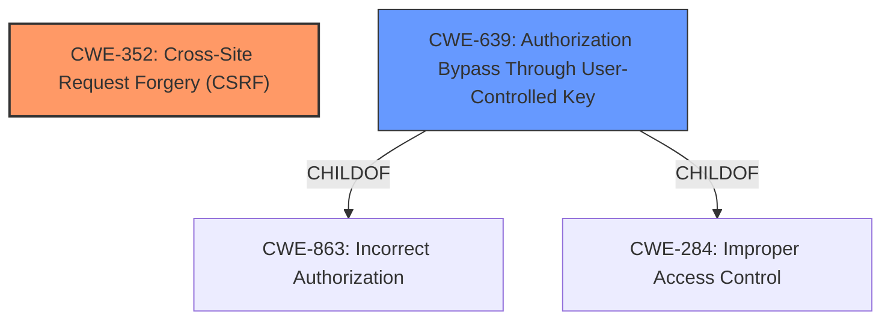

# Enhanced Analysis for CVE-2021-24500

# Summary
| CWE ID | CWE Name | Confidence | CWE Abstraction Level | CWE Vulnerability Mapping Label | CWE-Vulnerability Mapping Notes |
|---|---|---|---|---|---|
| CWE-352 | Cross-Site Request Forgery (CSRF) | 1.0 | Compound | Allowed | Primary CWE: The vulnerability description explicitly mentions **lack of CSRF protection** on AJAX actions as a root cause.  |
| CWE-639 | Authorization Bypass Through User-Controlled Key | 1.0 | Base | Allowed | Secondary CWE: The vulnerability description also mentions **insecure direct object references** (IDOR) which aligns with this CWE.  |

## Evidence and Confidence

*   **Confidence Score:** 1.0
*   **Evidence Strength:** HIGH

## Relationship Analysis
The primary weakness is CWE-352, Cross-Site Request Forgery. The secondary weakness is CWE-639, Authorization Bypass Through User-Controlled Key.
CWE-352 is a compound weakness that requires multiple conditions to be met, including **lack of CSRF protection**. CWE-639 is a base level weakness describing the **insecure direct object references**.



## Vulnerability Chain
The vulnerability involves two distinct weaknesses:
1.  **Lack of CSRF Protection (CWE-352):** AJAX actions lack CSRF protection, allowing attackers to forge requests on behalf of logged-in users.
2.  **Insecure Direct Object References (CWE-639):** The application doesn't properly validate object references, enabling attackers to access or modify arbitrary objects by manipulating their IDs.

The chain of events:
1.  A user is authenticated and logged into the application.
2.  An attacker crafts a malicious request targeting a vulnerable AJAX action.
3.  The attacker tricks the logged-in user into triggering the malicious request (e.g., via a link or embedded image).
4.  Due to the **lack of CSRF protection** (CWE-352), the server executes the request as if it were legitimate.
5.  Due to **insecure direct object references** (CWE-639), the attacker can modify or delete arbitrary objects by manipulating their IDs in the request.

## Summary of Analysis
The analysis is based on the vulnerability description and the provided CVE reference content summary, both clearly stating the presence of CSRF and IDOR vulnerabilities in the Workreap WordPress theme.

The key evidence is:
*   "Several AJAX actions available in the Workreap WordPress theme before 2.2.2 **lacked CSRF protections**, as well as allowing **insecure direct object references** that were not validated."
*   "**Root cause of vulnerability**: The theme **lacks CSRF protection** on several AJAX actions, and also allows **insecure direct object references** (IDOR) without proper validation."

CWE-352 and CWE-639 accurately represent the root causes of the vulnerabilities, which aligns well with the identified weaknesses and impacts. Both are at appropriate levels of abstraction.

Other CWEs Considered:

*   CWE-99: Improper Control of Resource Identifiers ('Resource Injection'): While related to IDOR, CWE-639 is a more specific match for the authorization bypass aspect.
*   CWE-862: Missing Authorization: This is too general. CWE-639 specifies the bypass is through user-controlled keys.
*   CWE-285: Improper Authorization: Also too general; CWE-639 is more specific.
*   CWE-425: Direct Request ('Forced Browsing'): While related to accessing resources directly, it doesn't capture the IDOR aspect as well as CWE-639.
*   CWE-471: Modification of Assumed-Immutable Data (MAID): Not directly applicable, as the issue is more about authorization than modifying assumed-immutable data.
*   CWE-863: Incorrect Authorization: Too general. CWE-639 is more specific about the method of authorization bypass.
*   CWE-89: Improper Neutralization of Special Elements used in an SQL Command ('SQL Injection'): Irrelevant as there's no mention of SQL injection in the description.
*   CWE-116: Improper Encoding or Escaping of Output: Not applicable as there's no indication of encoding/escaping issues.


## CWE Relationship Analysis

Current CWEs represent these abstraction levels: .


### Vulnerability Chain Analysis

**Chain starting from CWE-862:**
- 862 (Missing Authorization) - ROOT


**Chain starting from CWE-284:**
- 284 (Improper Access Control) - ROOT


### CWE Relationship Diagram

```mermaid
graph TD
    classDef primary fill:#f96,stroke:#333,stroke-width:2px
    classDef secondary fill:#69f,stroke:#333
    classDef tertiary fill:#9e9,stroke:#333
```