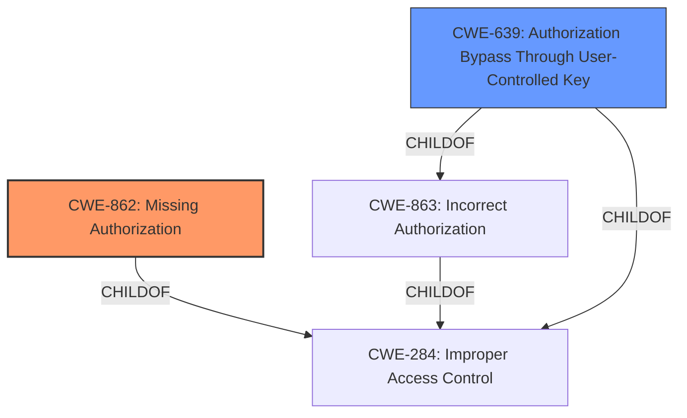

# Raw Analyzer Response for CVE-2021-24501

# Summary
| CWE ID | CWE Name | Confidence | CWE Abstraction Level | CWE Vulnerability Mapping Label | CWE-Vulnerability Mapping Notes |
|---|---|---|---|---|---|
| CWE-862 | Missing Authorization | 1.0 | Class | Primary | Allowed-with-Review |
| CWE-639 | Authorization Bypass Through User-Controlled Key | 0.7 | Base | Secondary | Allowed |

## Evidence and Confidence

*   **Confidence Score:** 0.9
*   **Evidence Strength:** HIGH

## Relationship Analysis
The primary CWE is CWE-862, which is a Class-level CWE describing the absence of an authorization check. CWE-862 is a child of CWE-284 (Improper Access Control), a higher-level Pillar CWE. CWE-639 is a Base-level CWE that describes a specific type of authorization bypass. It is a child of both CWE-863 (Incorrect Authorization) and CWE-284. The relationship between these CWEs indicates a hierarchical structure where CWE-284 is the most general, CWE-862 represents a common type of authorization failure, and CWE-639 is a more specific case.

## Vulnerability Chain
The vulnerability chain starts with the **missing authorization checks** in the AJAX actions. This leads to the impact where a logged-in user can modify or delete objects belonging to other users. The chain is:

Missing Authorization (CWE-862) -> Authorization Bypass -> Modification of Other Users' Data

## Summary of Analysis
The initial assessment focused on the **missing authorization checks** described in the vulnerability description and the CVE reference. The primary CWE selected is CWE-862 (Missing Authorization) because the vulnerability is caused by the absence of authorization checks. The CVE reference summary explicitly states: "**Missing Authorization Checks:** AJAX actions did not verify if a user was authorized to perform specific operations, leading to broken access control."

The retriever results indicated CWE-284 (Improper Access Control), CWE-862 (Missing Authorization), and CWE-639 (Authorization Bypass Through User-Controlled Key) as potential candidates. CWE-284 is too high-level, as it is a Pillar CWE and is discouraged for use. CWE-862 is a more specific Class CWE and is a better fit. CWE-639 is a Base CWE and describes a specific scenario where authorization is bypassed due to user-controlled keys.

CWE-639 is included as a secondary CWE because the vulnerability allows a logged-in user to modify or delete objects belonging to other users by exploiting the missing authorization checks in AJAX actions. The user is essentially using their session to access resources they should not have access to by crafting AJAX requests.

The final decision is based on the evidence from the vulnerability description and the CVE reference, as well as the CWE specifications and mapping guidance. CWE-862 is the most accurate representation of the root cause, while CWE-639 provides additional context about the nature of the authorization bypass. The selected CWEs are at the appropriate level of specificity, with CWE-862 being a Class and CWE-639 being a Base.

Relevant CWE Information:

# Enhanced Context (25 CWEs)

## CWE-639: Authorization Bypass Through User-Controlled Key
**Abstraction Level**: Base
**Similarity Score**: 0.75
**Source**: dense

**Description**:
The system's authorization functionality does not prevent one user from gaining access to another user's data or record by modifying the key value identifying the data.

**Mapping Guidance**:
- Usage: Allowed
- Rationale: This CWE entry is at the Base level of abstraction, which is a preferred level of abstraction for mapping to the root causes of vulnerabilities.

## CWE-862: Missing Authorization
**Abstraction Level**: Class
**Similarity Score**: 6081.54
**Source**: sparse

**Description**:
The product does not perform an authorization check when an actor attempts to access a resource or perform an action.

**Mapping Guidance**:
- Usage: Allowed-with-Review
- Rationale: This CWE entry is a Class and might have Base-level children that would be more appropriate
### Final Conclusion

The primary weakness is the **missing authorization checks**, and the secondary weakness is the bypass itself.

*   CWE-862 (Missing Authorization) is the primary CWE because it directly reflects the **missing authorization checks** in the AJAX actions.
*   CWE-639 (Authorization Bypass Through User-Controlled Key) is a secondary CWE because the vulnerability allows a logged-in user to modify or delete objects belonging to other users by exploiting the missing authorization checks in AJAX actions.