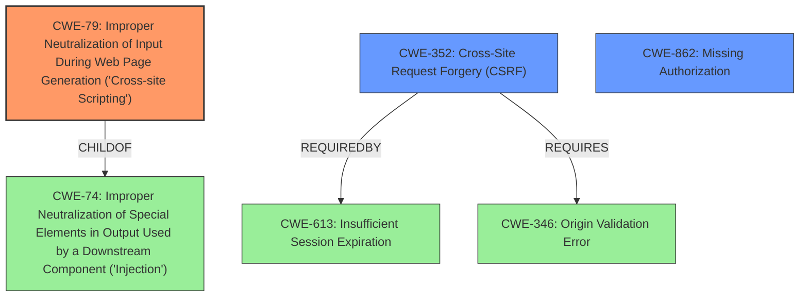

# Raw Analyzer Response for CVE-2021-24504

# Summary
| CWE ID  | CWE Name                                                                              | Confidence | CWE Abstraction Level | CWE Vulnerability Mapping Label | CWE-Vulnerability Mapping Notes |
| :-------- | :------------------------------------------------------------------------------------ | :--------- | :---------------------- | :------------------------------ | :------------------------------ |
| CWE-79    | Improper Neutralization of Input During Web Page Generation ('Cross-site Scripting') | 1          | Base                    | Primary CWE                     | Allowed                       |
| CWE-352   | Cross-Site Request Forgery (CSRF)                                                   | 1          | Compound                | Secondary Candidate             | Allowed                       |
| CWE-862   | Missing Authorization                                                               | 1          | Class                   | Secondary Candidate             | Allowed-with-Review           |

## Evidence and Confidence

*   **Confidence Score:** 1
*   **Evidence Strength:** HIGH

## Relationship Analysis
The primary weakness is CWE-79, which is a **Base** level CWE describing improper neutralization of input during web page generation, leading to XSS. This is related to CWE-74 (Improper Neutralization of Special Elements in Output Used by a Downstream Component ('Injection')) as it is a child. CWE-352 (Cross-Site Request Forgery) is a **Compound** CWE, which is triggered by the lack of CSRF checks. CWE-862 (Missing Authorization) is a **Class** level CWE and represents the absence of capability checks, indicating a broader authorization issue. CWE-352 is related to CWE-613 (Insufficient Session Expiration) and requires CWE-346 (Origin Validation Error).

## Vulnerability Chain
1.  **Root Cause:** **Improper sanitization and validation of User Field Titles** leads to the possibility of injecting XSS payloads.
2.  **Missing Protection Mechanisms:** The absence of CSRF and capability checks further exacerbates the risk.
3.  **Impact:** Injection of malicious JavaScript code, which can lead to session hijacking or redirection to malicious sites.

## Summary of Analysis
The analysis identifies three distinct weaknesses: **cross-site scripting** (CWE-79), **cross-site request forgery** (CWE-352), and **missing authorization** (CWE-862). The primary weakness is CWE-79, stemming from the lack of sanitization and validation of user-supplied input.

The "Vulnerability Description" clearly states that the plugin "**does not properly sanitise or validate** its User Field Titles, allowing XSS payload to be used in them." The "CVE Reference Links Content Summary" confirms the **root cause** as the plugin not properly sanitizing or validating User Field Titles, further emphasizing the lack of CSRF and capability checks.

CWE-79 is chosen as the primary CWE because the vulnerability description explicitly mentions "**cross-site scripting**". It matches the description of CWE-79 perfectly: "The product does not neutralize or incorrectly neutralizes user-controllable input before it is placed in output that is used as a web page that is served to other users."

CWE-352 is included as a secondary weakness because the description mentions that "**no CSRF** and capability checks were in place," indicating a lack of CSRF protection. This aligns with the description of CWE-352, which states that "The web application does not, or can not, sufficiently verify whether a well-formed, valid, consistent request was intentionally provided by the user who submitted the request."

CWE-862 is also included as a secondary weakness because the description mentions that "**no CSRF** and capability checks were in place," indicating a missing authorization check. This aligns with the description of CWE-862, which states that "The product does not perform an authorization check when an actor attempts to access a resource or perform an action."

Other CWEs Considered:

*   CWE-434: Unrestricted Upload of File with Dangerous Type - Not applicable, as the vulnerability does not involve file uploads.
*   CWE-116: Improper Encoding or Escaping of Output - While encoding is a mitigation for XSS, the core issue is the lack of sanitization, making CWE-79 a more precise fit.
*   CWE-472: External Control of Assumed-Immutable Web Parameter - While potentially relevant, the primary issue is the lack of input validation and sanitization, not the reliance on assumed-immutable parameters.
*   CWE-73: External Control of File Name or Path - Not applicable, as the vulnerability does not involve file path manipulation.

The selected CWEs are at the optimal level of specificity, with CWE-79 at the Base level and CWE-352 at the Compound level, accurately reflecting the nature of the vulnerabilities. CWE-862 is a Class, but the evidence does not support choosing a more specific child.