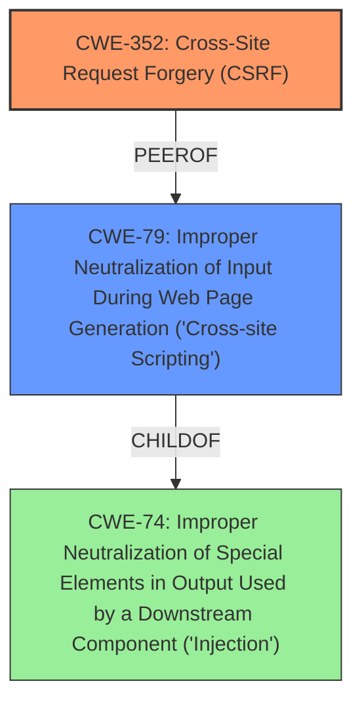

# Enhanced Analysis for CVE-2021-24543

# Summary
| CWE ID | CWE Name | Confidence | CWE Abstraction Level | CWE Vulnerability Mapping Label | CWE-Vulnerability Mapping Notes |
|---|---|---|---|---|---|
| CWE-352 | Cross-Site Request Forgery (CSRF) | 1.0 | Compound | Allowed | Primary CWE |
| CWE-79 | Improper Neutralization of Input During Web Page Generation ('Cross-site Scripting') | 1.0 | Base | Allowed | Secondary Candidate |

## Evidence and Confidence

*   **Confidence Score:** 1.0
*   **Evidence Strength:** HIGH

## Relationship Analysis
The primary weakness is the **lack of CSRF protection**. The secondary weakness is Stored Cross-Site Scripting (XSS) due to the **lack of sanitisation or escaping** of the Quote String and Reply String settings before outputting them in Comments. CWE-352 is a Compound weakness comprised of multiple other weaknesses. CWE-79 is a Base level weakness. CWE-79 is a child of CWE-74 (Improper Neutralization of Special Elements in Output Used by a Downstream Component ('Injection')).



## Vulnerability Chain
The vulnerability chain starts with the **lack of CSRF protection** (CWE-352), which allows an attacker to trick an administrator into submitting a crafted form, leading to stored XSS (CWE-79) because the Quote String and Reply String settings are not sanitized or escaped.

## Summary of Analysis
The vulnerability description clearly states a **lack of CSRF protection** and a stored Cross-Site Scripting (XSS) issue. The CVE Reference Links Content Summary confirms this, stating: "The plugin **does not have any CSRF check** when saving its settings, nor sanitise or escape its 'Quote String' and 'Reply String' settings before outputting them in Comments."

The primary CWE is CWE-352 (Cross-Site Request Forgery (CSRF)) because the application **does not sufficiently verify** whether a request was intentionally provided by the user. The vulnerability description states that there is **no CSRF check**, which means an attacker can trick a user into making an unintentional request.

The secondary CWE is CWE-79 (Improper Neutralization of Input During Web Page Generation ('Cross-site Scripting')) because the application **does not neutralize** user-controllable input before it is placed in output that is used as a web page. The vulnerability description states that the plugin does not sanitise or escape its Quote String and Reply String settings before outputting them in Comments, leading to a Stored Cross-Site Scripting issue.

Other CWEs considered but not used:

*   CWE-116: Improper Encoding or Escaping of Output - Although the vulnerability includes a **lack of escaping**, CWE-79 is a more direct match for the Stored Cross-Site Scripting issue.
*   CWE-862: Missing Authorization - This CWE is related to authorization checks. While CSRF can be seen as a form of authorization bypass, CWE-352 is a more specific and accurate representation of the vulnerability.
*   CWE-434: Unrestricted Upload of File with Dangerous Type - This CWE is not applicable as the vulnerability does not involve file uploads.
*   CWE-96: Improper Neutralization of Directives in Statically Saved Code ('Static Code Injection') - This CWE is similar to CWE-79. However, CWE-79 is a better fit since it directly describes Cross-Site Scripting, which is the impact of the **lack of sanitisation**.
*   CWE-73: External Control of File Name or Path - This CWE is not applicable as the vulnerability does not involve file name or path manipulation.
*   CWE-89: Improper Neutralization of Special Elements used in an SQL Command ('SQL Injection') - This CWE is not applicable as the vulnerability does not involve SQL injection.
*   CWE-863: Incorrect Authorization - Similar to CWE-862, but CWE-352 is a better fit.
*   CWE-285: Improper Authorization - This is a high-level CWE, and CWE-352 is a more specific representation of the vulnerability.
*   CWE-74: Improper Neutralization of Special Elements in Output Used by a Downstream Component ('Injection') - This is a class level CWE and CWE-79 is a more specific CWE.

The selected CWEs are at the optimal level of specificity because they directly represent the root cause (CWE-352) and the resulting weakness (CWE-79) of the vulnerability.


## CWE Relationship Analysis

Current CWEs represent these abstraction levels: .


### Vulnerability Chain Analysis

**Chain starting from CWE-79:**
- 79 (Improper Neutralization of Input During Web Page Generation ('Cross-site Scripting')) - ROOT


**Chain starting from CWE-862:**
- 862 (Missing Authorization) - ROOT


### CWE Relationship Diagram

```mermaid
graph TD
    classDef primary fill:#f96,stroke:#333,stroke-width:2px
    classDef secondary fill:#69f,stroke:#333
    classDef tertiary fill:#9e9,stroke:#333
```