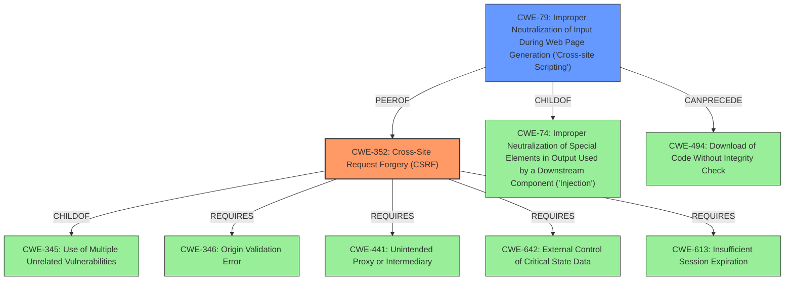

# Raw Analyzer Response for CVE-2021-24570

# Summary
| CWE ID | CWE Name | Confidence | CWE Abstraction Level | CWE Vulnerability Mapping Label | CWE-Vulnerability Mapping Notes |
|---|---|---|---|---|---|
| CWE-352 | Cross-Site Request Forgery (CSRF) | 1.0 | Compound | Primary | Allowed |
| CWE-79 | Improper Neutralization of Input During Web Page Generation ('Cross-site Scripting') | 1.0 | Base | Secondary | Allowed |

## Evidence and Confidence

*   **Confidence Score:** 1.0
*   **Evidence Strength:** HIGH

## Relationship Analysis
The primary weakness is CWE-352, Cross-Site Request Forgery (CSRF), which is a Compound CWE. The secondary weakness is CWE-79, Improper Neutralization of Input During Web Page Generation ('Cross-site Scripting'), which is a Base CWE. CWE-352 requires other CWEs to be present such as CWE-346, CWE-441, CWE-642, and CWE-613. CWE-79 is a child of CWE-74 (Improper Neutralization of Special Elements in Output Used by a Downstream Component ('Injection')). CWE-79 can precede CWE-494 (Download of Code Without Integrity Check) and is a peer of CWE-352.

## Vulnerability Chain
The vulnerability chain starts with a **missing CSRF check** (CWE-352). This allows an attacker to trick an authenticated admin into creating a new button. Then one of the Button field is not escaped before being output in an attribute when editing a Button, leading to a Stored Cross-Site Scripting issue (CWE-79) as well.

## Summary of Analysis
The analysis identified two CWEs relevant to the vulnerability: CWE-352 and CWE-79.

The "Vulnerability Description Key Phrases" section identifies the **missing CSRF check** and **cross-site scripting** as a **rootcause** and **weakness**, which aligns with the description.
The "CVE Reference Links Content Summary" section provides supporting information about the **CSRF vulnerability** and **Stored XSS vulnerability**.
The retriever results also list CWE-352 and CWE-79.

CWE-352 (Cross-Site Request Forgery (CSRF)) is selected because the function to create a new button is **lacking a CSRF check**. An attacker could use this to make an authenticated admin create a new button.
CWE-79 (Improper Neutralization of Input During Web Page Generation ('Cross-site Scripting')) is selected because one of the Button field is not escaped before being output in an attribute when editing a Button, leading to a Stored Cross-Site Scripting issue as well.

The selected CWEs are at the optimal level of specificity, with CWE-352 being a Compound type and CWE-79 being a Base type.

Other CWEs Considered:
*   CWE-116: Improper Encoding or Escaping of Output - While related to XSS, CWE-79 is a more direct match for the stored XSS vulnerability described.
*   CWE-862: Missing Authorization - While CSRF can be seen as a form of missing authorization, CWE-352 is a more specific and accurate representation of the vulnerability.
*   CWE-434: Unrestricted Upload of File with Dangerous Type - Not applicable as the vulnerability doesn't involve file uploads.
*   CWE-472: External Control of Assumed-Immutable Web Parameter - Not applicable because the vulnerability doesn't involve assumed-immutable parameters.
*   CWE-73: External Control of File Name or Path - Not applicable because the vulnerability doesn't involve external control of filenames or paths.
*   CWE-863: Incorrect Authorization - While CSRF can be seen as a form of incorrect authorization, CWE-352 is a more specific and accurate representation of the vulnerability.
*   CWE-138: Improper Neutralization of Special Elements - While related to XSS, CWE-79 is a more direct match for the stored XSS vulnerability described.
*   CWE-319: Cleartext Transmission of Sensitive Information - Not applicable as the vulnerability doesn't involve cleartext transmission of sensitive information.