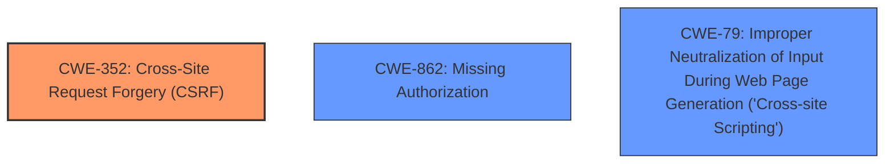

# Analysis for CVE-2021-24584

# Summary
| CWE ID  | CWE Name                                       | Confidence | CWE Abstraction Level | CWE Vulnerability Mapping Label | CWE-Vulnerability Mapping Notes |
| :-------- | :--------------------------------------------- | :--------- | :-------------------- | :------------------------------ | :------------------------------ |
| CWE-352 | Cross-Site Request Forgery (CSRF)                | 0.9        | Compound              | Primary                       | Allowed                       |
| CWE-862 | Missing Authorization                          | 0.8        | Class                | Secondary                      | Allowed-with-Review          |
| CWE-79 | Improper Neutralization of Input During Web Page Generation ('Cross-site Scripting') | 0.7        | Base                | Secondary                      | Allowed                       |

## Evidence and Confidence

*   **Confidence Score:** 0.8
*   **Evidence Strength:** HIGH

## Relationship Analysis

The primary weakness is **CWE-352: Cross-Site Request Forgery (CSRF)**, as the vulnerability description explicitly mentions the lack of **CSRF** protection. **CWE-862: Missing Authorization** is a related weakness because the **improper access control** allows users with the edit_posts capability (contributor+) to update arbitrary timeslots from any events, indicating a failure to properly authorize access. Also, the lack of sanitisation and escaping in some of the fields leads to **CWE-79: Improper Neutralization of Input During Web Page Generation ('Cross-site Scripting')** vulnerability.

## Vulnerability Chain

The vulnerability chain is as follows:

1.  **Missing Authorization (CWE-862):** **Improper access control** allows unauthorized users (contributor+) to attempt to update timeslots.
2.  **Cross-Site Request Forgery (CWE-352):** No **CSRF** protection allows attackers to exploit the **missing authorization** by forging requests on behalf of authorized users.
3.  **Improper Neutralization of Input During Web Page Generation ('Cross-site Scripting') (CWE-79):** The lack of sanitisation and escaping in some of the fields, like the description, could lead to **Stored XSS** issues

The chain starts with **missing authorization**, which is then exploited via **CSRF** to **update arbitrary timeslots** and **Stored XSS**.

## Summary of Analysis

The initial analysis strongly points towards **CWE-352: Cross-Site Request Forgery (CSRF)** as the primary weakness, supported by the direct mention of missing **CSRF** protection. The analysis also highlights the **improper access control**, leading to **CWE-862: Missing Authorization**. The lack of sanitisation and escaping in some of the fields, like the description, leading to **CWE-79: Improper Neutralization of Input During Web Page Generation ('Cross-site Scripting')** vulnerability.

The graph relationships reinforce this by showing how **missing authorization** can be exploited through **CSRF** to achieve unauthorized actions. The selected CWEs are at an appropriate level of specificity, with **CWE-352** being a Compound weakness and **CWE-862** being a Class weakness that accurately reflects the nature of the vulnerability. **CWE-79** is a Base weakness which is also accurate in reflecting the nature of the vulnerability.

Relevant CWE Information:

# Enhanced Context (25 CWEs)
The following CWEs were identified as potentially relevant to this vulnerability:

## CWE-472: External Control of Assumed-Immutable Web Parameter
**Abstraction Level**: Base
**Similarity Score**: 0.75
**Source**: dense

**Description**:
The web application does not sufficiently verify inputs that are assumed to be immutable but are actually externally controllable, such as hidden form fields.

**Mapping Guidance**:
- Usage: Allowed
- Rationale: This CWE entry is at the Base level of abstraction, which is a preferred level of abstraction for mapping to the root causes of vulnerabilities.

## CWE-352: Cross-Site Request Forgery (CSRF)
**Abstraction Level**: Compound
**Similarity Score**: 0.74
**Source**: dense

**Description**:
The web application does not, or can not, sufficiently verify whether a well-formed, valid, consistent request was intentionally provided by the user who submitted the request.

**Mapping Guidance**:
- Usage: Allowed
- Rationale: This is a well-known Composite of multiple weaknesses that must all occur simultaneously, although it is attack-oriented in nature.

## CWE-425: Direct Request ('Forced Browsing')
**Abstraction Level**: Base
**Similarity Score**: 0.73
**Source**: dense

**Description**:
The web application does not adequately enforce appropriate authorization on all restricted URLs, scripts, or files.

**Mapping Guidance**:
- Usage: Allowed
- Rationale: This CWE entry is at the Base level of abstraction, which is a preferred level of abstraction for mapping to the root causes of vulnerabilities.

## CWE-208: Observable Timing Discrepancy
**Abstraction Level**: Base
**Similarity Score**: 0.73
**Source**: dense

**Description**:
Two separate operations in a product require different amounts of time to complete, in a way that is observable to an actor and reveals security-relevant information about the state of the product, such as whether a particular operation was successful or not.

**Mapping Guidance**:
- Usage: Allowed
- Rationale: This CWE entry is at the Base level of abstraction, which is a preferred level of abstraction for mapping to the root causes of vulnerabilities.

## CWE-116: Improper Encoding or Escaping of Output
**Abstraction Level**: Class
**Similarity Score**: 0.72
**Source**: dense

**Description**:
The product prepares a structured message for communication with another component, but encoding or escaping of the data is either missing or done incorrectly. As a result, the intended structure of the message is not preserved.

**Mapping Guidance**:
- Usage: Allowed-with-Review
- Rationale: This CWE entry is a Class and might have Base-level children that would be more appropriate

## CWE-639: Authorization Bypass Through User-Controlled Key
**Abstraction Level**: Base
**Similarity Score**: 0.72
**Source**: dense

**Description**:
The system's authorization functionality does not prevent one user from gaining access to another user's data or record by modifying the key value identifying the data.

**Mapping Guidance**:
- Usage: Allowed
- Rationale: This CWE entry is at the Base level of abstraction, which is a preferred level of abstraction for mapping to the root causes of vulnerabilities.

## CWE-434: Unrestricted Upload of File with Dangerous Type
**Abstraction Level**: Base
**Similarity Score**: 0.71
**Source**: dense

**Description**:
The product allows the upload or transfer of dangerous file types that are automatically processed within its environment.

**Mapping Guidance**:
- Usage: Allowed
- Rationale: This CWE entry is at the Base level of abstraction, which is a preferred level of abstraction for mapping to the root causes of vulnerabilities.

## CWE-1390: Weak Authentication
**Abstraction Level**: Class
**Similarity Score**: 0.71
**Source**: dense

**Description**:
The product uses an authentication mechanism to restrict access to specific users or identities, but the mechanism does not sufficiently prove that the claimed identity is correct.

**Mapping Guidance**:
- Usage: Allowed-with-Review
- Rationale: This CWE entry is a Class and might have Base-level children that would be more appropriate

## CWE-184: Incomplete List of Disallowed Inputs
**Abstraction Level**: Base
**Similarity Score**: 0.70
**Source**: dense

**Description**:
The product implements a protection mechanism that relies on a list of inputs (or properties of inputs) that are not allowed by policy or otherwise require other action to neutralize before additional processing takes place, but the list is incomplete.

**Mapping Guidance**:
- Usage: Allowed
- Rationale: This CWE entry is at the Base level of abstraction, which is a preferred level of abstraction for mapping to the root causes of vulnerabilities.

## CWE-138: Improper Neutralization of Special Elements
**Abstraction Level**: Class
**Similarity Score**: 0.70
**Source**: dense

**Description**:
The product receives input from an upstream component, but it does not neutralize or incorrectly neutralizes special elements that could be interpreted as control elements or syntactic markers when they are sent to a downstream component.

**Mapping Guidance**:
- Usage: Discouraged
- Rationale: This CWE entry is a level-1 Class (i.e., a child of a Pillar). It might have lower-level children that would be more appropriate

## CWE-3