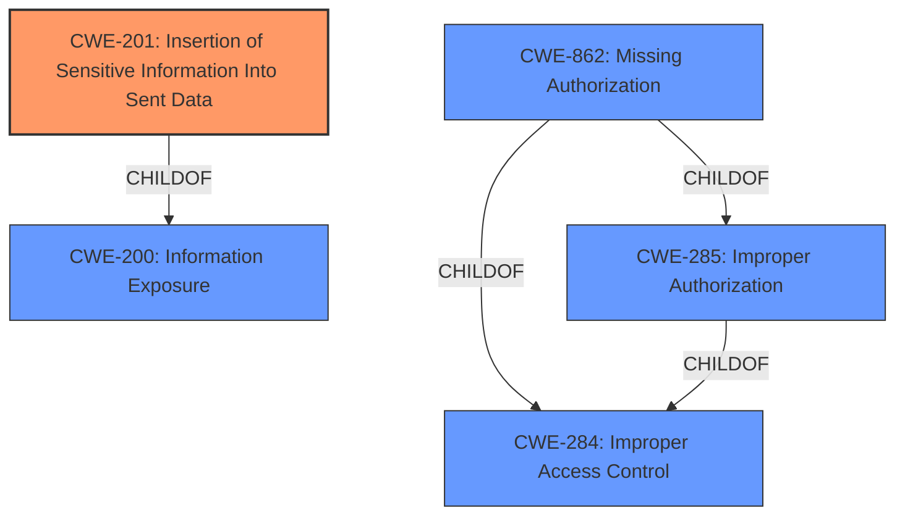

# Analysis for CVE-2021-24585

# Summary
| CWE ID | CWE Name | Confidence | CWE Abstraction Level | CWE Vulnerability Mapping Label | CWE-Vulnerability Mapping Notes |
|---|---|---|---|---|---|
| CWE-201 | Insertion of Sensitive Information Into Sent Data | 1.0 | Base | Allowed | Primary CWE |
| CWE-862 | Missing Authorization | 0.7 | Class | Allowed-with-Review | Secondary Candidate |

## Evidence and Confidence

*   **Confidence Score:** 0.85
*   **Evidence Strength:** HIGH

## Relationship Analysis
The primary CWE is CWE-201, which has a parent CWE of CWE-200 (Information Exposure). The secondary CWE is CWE-862, which has a parent CWE of CWE-285 (Improper Authorization) and CWE-284 (Improper Access Control). The vulnerability involves the disclosure of sensitive information due to **lack of proper authorization checks**, which is why both CWE-201 and CWE-862 are considered.

## Vulnerability Chain
The vulnerability chain starts with the **lack of proper authorization** (CWE-862), leading to the **insertion of sensitive information into sent data** (CWE-201).

## Summary of Analysis
The primary weakness is CWE-201 (**Insertion of Sensitive Information Into Sent Data**), as the vulnerability description clearly states that sensitive user data (hashed password, username, and email address) is being output in the response when requesting event timeslot data. The "CVE Reference Links Content Summary" section supports this by stating "The plugin outputs sensitive user data (hashed password, username, and email address) when requesting event timeslot data."

The secondary weakness is CWE-862 (**Missing Authorization**), as the vulnerability allows low-privilege users to access this sensitive data, indicating a **lack of proper authorization checks**. The "CVE Reference Links Content Summary" section supports this by stating "Lack of proper authorization checks."

Both CWEs are at appropriate levels of specificity (Base and Class, respectively) and accurately reflect the nature of the vulnerability.

Relevant CWE Information:
*   **CWE-201**: Matches the vulnerability description as sensitive information is being sent.
*   **CWE-862**: Matches the vulnerability description as there is a **lack of authorization checks**.
*   **CWE-285**: Considered but not used because CWE-862 is a more specific child.
*   **CWE-863**: Considered but not used because CWE-862 is a better fit as it specifically points to the absence of a check rather than an incorrect check.
*   **CWE-352**: Cross-Site Request Forgery (CSRF) is not applicable because the issue is related to data exposure, not request forgery.
*   **CWE-639**: Authorization Bypass Through User-Controlled Key is also a good candidate, but not as strong as CWE-862.