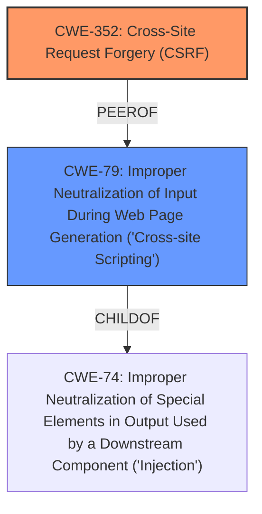

# Enhanced Analysis for CVE-2021-24586

# Summary
| CWE ID | CWE Name | Confidence | CWE Abstraction Level | CWE Vulnerability Mapping Label | CWE-Vulnerability Mapping Notes |
|---|---|---|---|---|---|
| CWE-352 | Cross-Site Request Forgery (CSRF) | 1.0 | Compound | Allowed | Primary CWE |
| CWE-79 | Improper Neutralization of Input During Web Page Generation ('Cross-site Scripting') | 1.0 | Base | Allowed | Secondary CWE |

## Evidence and Confidence

*   **Confidence Score:** 1.0
*   **Evidence Strength:** HIGH

## Relationship Analysis
The primary weakness is the **lack of CSRF protection**, which allows an attacker to **make a logged in admin change them** on the plugin settings. This directly corresponds to CWE-352. The secondary weakness is **Stored XSS**, because the plugin allows arbitrary HTML to be inserted in one of the setting. CWE-79 is related to CWE-352, because the attacker might use CSRF in order to trick the victim into submitting requests to the server in which the requests contain an XSS payload.



## Vulnerability Chain
The vulnerability chain starts with the **lack of CSRF protection** (CWE-352), which allows an attacker to modify the plugin settings. Because the plugin allows arbitrary HTML to be inserted in one of the setting, this leads to **Stored XSS** (CWE-79) because the HTML is not neutralized. The final impact is that the XSS will be triggered either in the backend, frontend or both depending on the payload used.

## Summary of Analysis
The analysis is based on the provided evidence, especially the "Vulnerability Description Key Phrases" and "CVE Reference Links Content Summary".

The vulnerability description clearly states that the plugin is **lacking any CSRF check** and that it leads to a **Stored XSS** issue. The retriever results also confirms that CWE-352 and CWE-79 are the most relevant CWEs.

CWE-352 is a Compound type, but it is ALLOWED for mapping. CWE-79 is a Base type, which is also ALLOWED for mapping.

The final selection is based on the evidence that the plugin **lacking any CSRF check** and the plugin allows arbitrary HTML to be inserted in one of the setting, this leads to **Stored XSS** issue.

Relevant CWE Information:

# Enhanced Context (25 CWEs)
The following CWEs were identified as potentially relevant to this vulnerability:

## CWE-472: External Control of Assumed-Immutable Web Parameter
**Abstraction Level**: Base
**Similarity Score**: 0.77
**Source**: dense

**Description**:
The web application does not sufficiently verify inputs that are assumed to be immutable but are actually externally controllable, such as hidden form fields.

**Mapping Guidance**:
- Usage: Allowed
- Rationale: This CWE entry is at the Base level of abstraction, which is a preferred level of abstraction for mapping to the root causes of vulnerabilities.

**Why Not Used:** This CWE is not used because the vulnerability is not related to external control of assumed-immutable web parameters. It is more related to the **lack of CSRF protection** and **Stored XSS**.

## CWE-538: Insertion of Sensitive Information into Externally-Accessible File or Directory
**Abstraction Level**: Base
**Similarity Score**: 0.76
**Source**: dense

**Description**:
The product places sensitive information into files or directories that are accessible to actors who are allowed to have access to the files, but not to the sensitive information.

**Mapping Guidance**:
- Usage: Allowed
- Rationale: This CWE entry is at the Base level of abstraction, which is a preferred level of abstraction for mapping to the root causes of vulnerabilities.

**Why Not Used:** This CWE is not used because the vulnerability is not related to insertion of sensitive information into externally-accessible file or directory. It is more related to the **lack of CSRF protection** and **Stored XSS**.

## CWE-74: Improper Neutralization of Special Elements in Output Used by a Downstream Component ('Injection')
**Abstraction Level**: Class
**Similarity Score**: 0.76
**Source**: dense

**Description**:
The product constructs all or part of a command, data structure, or record using externally-influenced input from an upstream component, but it does not neutralize or incorrectly neutralizes special elements that could modify how it is parsed or interpreted when it is sent to a downstream component.

**Mapping Guidance**:
- Usage: Discouraged
- Rationale: CWE-74 is high-level and often misused when lower-level weaknesses are more appropriate.

**Why Not Used:** This CWE is not used because it is a high-level class and there are more specific CWEs that are more appropriate.

## CWE-807: Reliance on Untrusted Inputs in a Security Decision
**Abstraction Level**: Base
**Similarity Score**: 0.76
**Source**: dense

**Description**:
The product uses a protection mechanism that relies on the existence or values of an input, but the input can be modified by an untrusted actor in a way that bypasses the protection mechanism.

**Mapping Guidance**:
- Usage: Allowed
- Rationale: This CWE entry is at the Base level of abstraction, which is a preferred level of abstraction for mapping to the root causes of vulnerabilities.

**Why Not Used:** This CWE is not used because the vulnerability is not related to reliance on untrusted inputs in a security decision. It is more related to the **lack of CSRF protection** and **Stored XSS**.

## CWE-639: Authorization Bypass Through User-Controlled Key
**Abstraction Level**: Base
**Similarity Score**: 0.75
**Source**: dense

**Description**:
The system's authorization functionality does not prevent one user from gaining access to another user's data or record by modifying the key value identifying the data.

**Mapping Guidance**:
- Usage: Allowed
- Rationale: This CWE entry is at the Base level of abstraction, which is a preferred level of abstraction for mapping to the root causes of vulnerabilities.

**Why Not Used:** This CWE is not used because the vulnerability is not related to authorization bypass through user-controlled key. It is more related to the **lack of CSRF protection** and **Stored XSS**.

## CWE-212: Improper Removal of Sensitive Information Before Storage or Transfer
**Abstraction Level**: Base
**Similarity Score**: 0.75
**Source**: dense

**Description**:
The product stores, transfers, or shares a resource that contains sensitive information, but it does not properly remove that information before the product makes the resource available to unauthorized actors.

**Mapping Guidance**:
- Usage: Allowed
- Rationale: This CWE entry is at the Base level of abstraction, which is a preferred level of abstraction for mapping to the root causes of vulnerabilities.

**Why Not Used:** This CWE is not used because the vulnerability is not related to improper removal of sensitive information before storage or transfer. It is more related to the **lack of CSRF protection** and **Stored XSS**.

## CWE-41: Improper Resolution of Path Equivalence
**Abstraction Level**: Base
**Similarity Score**: 0.75
**Source**: dense

**Description**:
The product is vulnerable to file system contents disclosure through path equivalence. Path equivalence involves the use of special characters in file and directory names. The associated manipulations are intended to generate multiple names for the same object.

**Mapping Guidance**:
- Usage: Allowed
- Rationale: This CWE entry is at the Base level of abstraction, which is a preferred level of abstraction for mapping to the root causes of vulnerabilities.

**Why Not Used:** This CWE is not used because the vulnerability is not related to improper resolution of path equivalence. It is more related to the **lack of CSRF protection** and **Stored XSS**.

## CWE-425: Direct Request ('Forced Browsing')
**Abstraction Level**: Base
**Similarity Score**: 0.75
**Source**: dense

**Description**:
The web application does not adequately enforce appropriate authorization on all restricted URLs, scripts, or files.

**Mapping Guidance**:
- Usage: Allowed
- Rationale: This CWE entry is at the Base level of abstraction, which is a preferred level of abstraction for mapping to the root causes of vulnerabilities.

**Why Not Used:** Although direct request is a valid concern, it is not the primary issue. The primary issue is the **lack of CSRF protection** and the secondary issue is **Stored XSS**.

## CWE-552: Files or Directories Accessible to External Parties
**Abstraction


## CWE Relationship Analysis

Current CWEs represent these abstraction levels: .


### Vulnerability Chain Analysis

**Chain starting from CWE-79:**
- 79 (Improper Neutralization of Input During Web Page Generation ('Cross-site Scripting')) - ROOT


**Chain starting from CWE-41:**
- 41 (Improper Resolution of Path Equivalence) - ROOT


### CWE Relationship Diagram

```mermaid
graph TD
    classDef primary fill:#f96,stroke:#333,stroke-width:2px
    classDef secondary fill:#69f,stroke:#333
    classDef tertiary fill:#9e9,stroke:#333
```