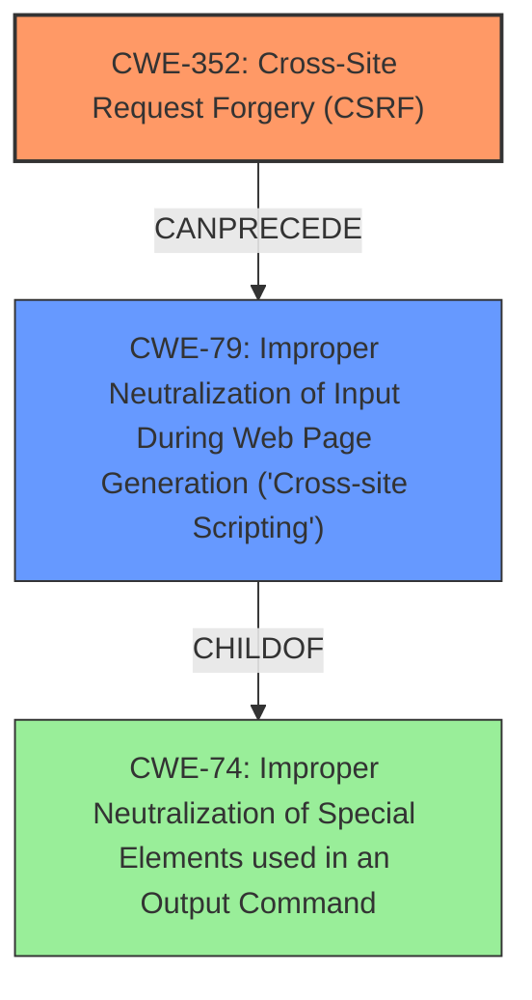

# Analysis Report for CVE-2021-24595

# Vulnerability Analysis Report: CVE-2021-24595

## Description


## Analysis (with Relationship Data)

# Summary
| CWE ID | CWE Name | Confidence | CWE Abstraction Level | CWE Vulnerability Mapping Label | CWE-Vulnerability Mapping Notes |
|---|---|---|---|---|---|
| CWE-352 | Cross-Site Request Forgery (CSRF) | 1.0 | Compound | Allowed | Primary CWE. The application **lacks CSRF checks** when saving options. |
| CWE-79 | Improper Neutralization of Input During Web Page Generation ('Cross-site Scripting') | 1.0 | Base | Allowed | Secondary CWE. The application does **not escape them when outputting them in attributes**, leading to XSS. |

## Evidence and Confidence

*   **Confidence Score:** 1.0
*   **Evidence Strength:** HIGH

## Relationship Analysis
The primary weakness is CWE-352 [Cross-Site Request Forgery (CSRF)], a Compound CWE, because the plugin **lacks any CSRF check** when saving its options. The secondary weakness is CWE-79 [Improper Neutralization of Input During Web Page Generation ('Cross-site Scripting')], a Base CWE, because the plugin does **not escape them when outputting them in attributes**. CWE-352 can lead to CWE-79 because an attacker uses CSRF to inject XSS payloads.



## Vulnerability Chain
The vulnerability chain starts with the **lack of CSRF checks** (CWE-352), which allows an attacker to make a logged-in admin change settings to arbitrary values including XSS payloads. The improper output escaping (CWE-79) then leads to the execution of the injected XSS payload in the administrator's browser.

## Summary of Analysis
The analysis indicates a clear chain of events leading to the vulnerability. The primary cause is the **lack of CSRF protection** (CWE-352), enabling an attacker to inject malicious code. The subsequent **failure to properly escape output** (CWE-79) allows the injected code to be executed as XSS.

The evidence supporting this assessment is strong, as indicated by:

*   **Vulnerability Description Key Phrases:** "**lacking CSRF check**", "**cross-site scripting**".
*   **CVE Reference Links Content Summary:** "The plugin **lacks CSRF protection** when saving options and **fails to properly escape** these options when outputting them in HTML attributes."

The graph relationships confirm that CWE-352 can lead to CWE-79, as an attacker can use CSRF to inject XSS payloads. The selected CWEs are at the optimal level of specificity, with CWE-352 being a Compound weakness and CWE-79 being a Base weakness.

**CWE Considerations:**

*   **CWE-352 [Cross-Site Request Forgery (CSRF)]:** This is the primary CWE because the application **lacks CSRF checks**. The description of CWE-352 matches the vulnerability's root cause: "The web application does not, or can not, sufficiently verify whether a well-formed, valid, consistent request was intentionally provided by the user who submitted the request."
*   **CWE-79 [Improper Neutralization of Input During Web Page Generation ('Cross-site Scripting')]**: This is a secondary CWE because the application does **not escape them when outputting them in attributes**. The description of CWE-79 matches the vulnerability's behavior: "The product does not neutralize or incorrectly neutralizes user-controllable input before it is placed in output that is used as a web page that is served to other users."
*   **CWE-116 [Improper Encoding or Escaping of Output]**: This CWE was considered but not selected as a primary because it is a Class CWE. CWE-79, which is a child of CWE-74 [Improper Neutralization of Special Elements used in an Output Command], is a better fit because the XSS is the result of the output not being neutralized.
*   **CWE-862 [Missing Authorization] and CWE-863 [Incorrect Authorization]**: These CWEs were considered but not selected because the core issue is related to CSRF.
*   **CWE-434 [Unrestricted Upload of File with Dangerous Type]**: This CWE was considered but not selected because the vulnerability does not involve file uploads.


## CWE Relationship Analysis

Current CWEs represent these abstraction levels: .


### Vulnerability Chain Analysis

**Chain starting from CWE-79:**
- 79 (Improper Neutralization of Input During Web Page Generation ('Cross-site Scripting')) - ROOT


**Chain starting from CWE-862:**
- 862 (Missing Authorization) - ROOT


### CWE Relationship Diagram

```mermaid
graph TD
    classDef primary fill:#f96,stroke:#333,stroke-width:2px
    classDef secondary fill:#69f,stroke:#333
    classDef tertiary fill:#9e9,stroke:#333
```


*Report generated on 2025-04-01 21:01:15*
