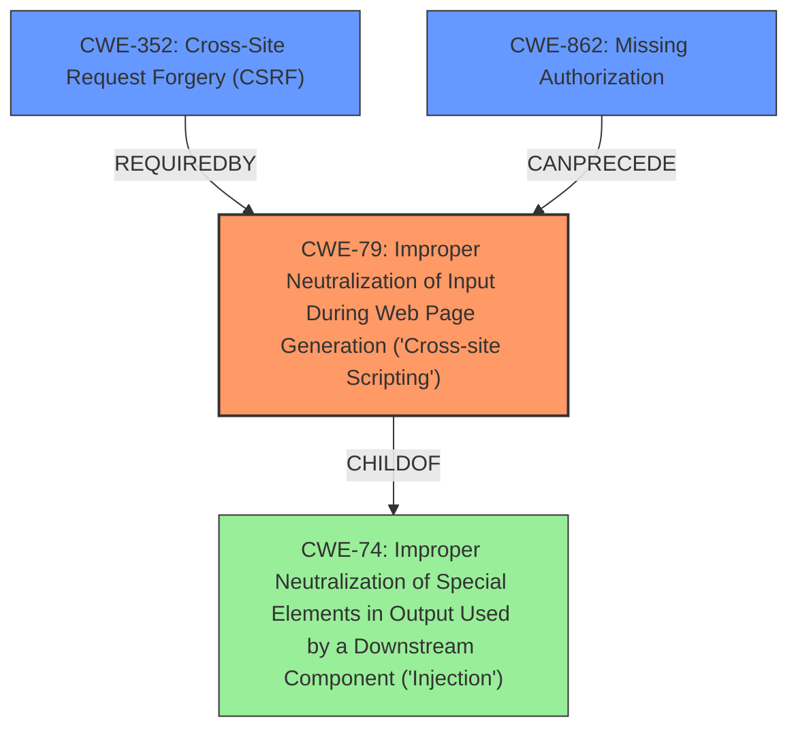

# Enhanced Analysis for CVE-2021-24618

# Summary
| CWE ID | CWE Name | Confidence | CWE Abstraction Level | CWE Vulnerability Mapping Label | CWE-Vulnerability Mapping Notes |
|---|---|---|---|---|---|
| CWE-79 | Improper Neutralization of Input During Web Page Generation ('Cross-site Scripting') | 1.0 | Base | Allowed | Primary CWE. The plugin **does not sanitize or escape** its QRCode Image setting, resulting in a Stored Cross-Site Scripting (XSS) vulnerability. |
| CWE-352 | Cross-Site Request Forgery (CSRF) | 1.0 | Compound | Allowed | Secondary CWE. The plugin does not have any CSRF checks in place when saving settings, allowing unauthenticated users via a CSRF vector to update them. |
| CWE-862 | Missing Authorization | 0.8 | Class | Allowed-with-Review | Secondary CWE. The plugin does not have any capability checks in place when saving settings, allowing any authenticated user (as low as subscriber) to update them. |

## Evidence and Confidence

*   **Confidence Score:** 0.9
*   **Evidence Strength:** HIGH

## Relationship Analysis
The primary weakness is CWE-79 [CWE-79: Improper Neutralization of Input During Web Page Generation ('Cross-site Scripting')], which is caused by the **lack of input sanitization**. CWE-352 [CWE-352: Cross-Site Request Forgery (CSRF)] and CWE-862 [CWE-862: Missing Authorization] are contributing factors that allow attackers, including unauthenticated users (via CSRF) and low-privileged authenticated users, to exploit the XSS vulnerability. CWE-79 is a base level CWE, which is the preferred level of abstraction. CWE-352 is a compound CWE and CWE-862 is a class CWE, but are included due to their direct contribution to the exploitability of the primary weakness.



## Vulnerability Chain
The vulnerability chain starts with the **lack of input sanitization** in the QRCode Image setting (CWE-79). The absence of CSRF protection (CWE-352) allows unauthenticated attackers to modify the setting. The missing capability checks (CWE-862) enable low-privileged authenticated users to do the same. The final impact is a Stored Cross-Site Scripting (XSS) vulnerability that can be exploited by visiting any frontend post where the vulnerable setting is used.

## Summary of Analysis
The initial analysis identified the **lack of input sanitization** as the primary **root cause**, leading to a Stored Cross-Site Scripting (XSS) vulnerability. The absence of CSRF and capability checks exacerbates the issue by expanding the attack surface. The final conclusion is based on the provided evidence, including the vulnerability description and CVE reference links.

The evidence from the vulnerability description key phrases is:
- **rootcause:** **lack of input sanitization**
- **weakness:** **cross-site scripting**
The evidence from the CVE Reference Links Content Summary is:
- **Root cause of vulnerability:** The plugin **does not sanitize or escape** the QRCode Image setting.
- **Weaknesses/vulnerabilities present:** Stored Cross-Site Scripting (XSS) vulnerability due to **lack of sanitization/escaping**. Additionally, missing CSRF and capability checks when saving settings.

The graph relationships influenced the selection by highlighting the connections between the primary weakness (CWE-79) and the contributing factors (CWE-352 and CWE-862). CWE-79 is at the optimal level of specificity, as it directly addresses the improper neutralization of input during web page generation. CWE-352 and CWE-862 are included to provide a complete picture of the vulnerability's exploitability.

Relevant CWE Information:

# Enhanced Context (25 CWEs)
The following CWEs were identified as potentially relevant to this vulnerability:

## CWE-74: Improper Neutralization of Special Elements in Output Used by a Downstream Component ('Injection')
**Abstraction Level**: Class
**Similarity Score**: 0.78
**Source**: dense

**Description**:
The product constructs all or part of a command, data structure, or record using externally-influenced input from an upstream component, but it does not neutralize or incorrectly neutralizes special elements that could modify how it is parsed or interpreted when it is sent to a downstream component.

**Mapping Guidance**:
- Usage: Discouraged
- Rationale: CWE-74 is high-level and often misused when lower-level weaknesses are more appropriate.

**Not Used:** This is a class level CWE and CWE-79 is a more specific base CWE.

## CWE-80: Improper Neutralization of Script-Related HTML Tags in a Web Page (Basic XSS)
**Abstraction Level**: Variant
**Similarity Score**: 0.78
**Source**: dense

**Description**:
The product receives input from an upstream component, but it does not neutralize or incorrectly neutralizes special characters such as "<", ">", and "&" that could be interpreted as web-scripting elements when they are sent to a downstream component that processes web pages.

**Mapping Guidance**:
- Usage: Allowed
- Rationale: This CWE entry is at the Variant level of abstraction, which is a preferred level of abstraction for mapping to the root causes of vulnerabilities.

**Not Used:** CWE-79 is a better fit.

## CWE-184: Incomplete List of Disallowed Inputs
**Abstraction Level**: Base
**Similarity Score**: 0.77
**Source**: dense

**Description**:
The product implements a protection mechanism that relies on a list of inputs (or properties of inputs) that are not allowed by policy or otherwise require other action to neutralize before additional processing takes place, but the list is incomplete.

**Mapping Guidance**:
- Usage: Allowed
- Rationale: This CWE entry is at the Base level of abstraction, which is a preferred level of abstraction for mapping to the root causes of vulnerabilities.

**Not Used:** There's no evidence of a denylist being used.

## CWE-1289: Improper Validation of Unsafe Equivalence in Input
**Abstraction Level**: Base
**Similarity Score**: 0.77
**Source**: dense

**Description**:
The product receives an input value that is used as a resource identifier or other type of reference, but it does not validate or incorrectly validates that the input is equivalent to a potentially-unsafe value.

**Mapping Guidance**:
- Usage: Allowed
- Rationale: This CWE entry is at the Base level of abstraction, which is a preferred level of abstraction for mapping to the root causes of vulnerabilities.

**Not Used:** Not applicable.

## CWE-138: Improper Neutralization of Special Elements
**Abstraction Level**: Class
**Similarity Score**: 0.76
**Source**: dense

**Description**:
The product receives input from an upstream component, but it does not neutralize or incorrectly neutralizes special elements that could be interpreted as control elements or syntactic markers when they are sent to a downstream component.

**Mapping Guidance**:
- Usage: Discouraged
- Rationale: This CWE entry is a level-1 Class (i.e., a child of a Pillar). It might have lower-level children that would be more appropriate

**Not Used:** This is a class level CWE and CWE-79 is a more specific base CWE.

## CWE-73: External Control of File Name or Path
**Abstraction Level**: Base
**Similarity Score**: 0.76
**Source**: dense

**Description**:
The product allows user input to control or influence paths or file names that are used in filesystem operations.

**Mapping Guidance**:
- Usage: Allowed
- Rationale: This CWE entry is at the Base level of abstraction, which is a preferred level of abstraction for mapping to the root causes of vulnerabilities.

**Not Used:** Not applicable.

## CWE-41: Improper Resolution of Path Equivalence
**Abstraction Level**: Base
**Similarity Score**: 0.76
**Source**: dense

**Description**:
The product is vulnerable to file system contents disclosure through path equivalence. Path equivalence involves the use of special characters in file and directory names. The associated manipulations are intended to generate multiple names for the same object.

**Mapping Guidance**:
- Usage: Allowed
- Rationale: This


## CWE Relationship Analysis

Current CWEs represent these abstraction levels: .


### Vulnerability Chain Analysis

**Chain starting from CWE-79:**
- 79 (Improper Neutralization of Input During Web Page Generation ('Cross-site Scripting')) - ROOT


**Chain starting from CWE-862:**
- 862 (Missing Authorization) - ROOT


### CWE Relationship Diagram

```mermaid
graph TD
    classDef primary fill:#f96,stroke:#333,stroke-width:2px
    classDef secondary fill:#69f,stroke:#333
    classDef tertiary fill:#9e9,stroke:#333
```