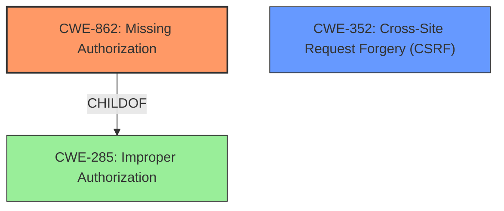

# Enhanced Analysis for CVE-2021-24635

# Summary
| CWE ID | CWE Name | Confidence | CWE Abstraction Level | CWE Vulnerability Mapping Label | CWE-Vulnerability Mapping Notes |
|---|---|---|---|---|---|
| CWE-862 | Missing Authorization | 0.9 | Class | Primary | Allowed-with-Review |
| CWE-352 | Cross-Site Request Forgery (CSRF) | 0.7 | Compound | Secondary | Allowed |

## Evidence and Confidence

*   **Confidence Score:** 0.8
*   **Evidence Strength:** HIGH

## Relationship Analysis
The primary weakness is **CWE-862 Missing Authorization**, which is a Class-level CWE. **CWE-352 Cross-Site Request Forgery (CSRF)** is a Compound-level CWE. **CWE-862** is a child of **CWE-285** (Improper Authorization). The selection of **CWE-862** is driven by the root cause analysis and the evidence that authorization checks were missing.



## Vulnerability Chain
The vulnerability chain starts with the **missing authorization** (**CWE-862**), allowing unauthorized access to functionalities. The presence of a **CSRF** nonce that is available for all authenticated users enables **CWE-352 Cross-Site Request Forgery (CSRF)**. The ultimate impact involves gaining access to draft posts, password-protected posts, and uploading images, all without proper authorization.

## Summary of Analysis
The initial assessment focused on identifying the root cause of the vulnerability based on the provided evidence. The vulnerability description clearly states the plugin **does not enforce authorization on several AJAX actions**. This directly points to an authorization issue. The "CVE Reference Links Content Summary" further supports this, stating, "The plugin does not enforce authorization checks on several AJAX actions and exposes the CSRF nonce to all authenticated users." The presence of an exposed **CSRF** nonce leads to the possibility of **CWE-352**.

The primary mapping is to **CWE-862 Missing Authorization**, as the core issue is the absence of authorization checks on AJAX actions. The exposure of the CSRF nonce allows **CWE-352 Cross-Site Request Forgery (CSRF)** attacks. **CWE-862** is at the Class level, while **CWE-352** is a Compound. The graph relationships indicate the parent-child relation between **CWE-862** and **CWE-285**. **CWE-862** is the more appropriate CWE, as it directly reflects the **missing** authorization.

The selection of **CWE-862** is based on strong evidence and aligns with MITRE's mapping guidance, which encourages using more specific CWEs where possible. The presence of the exposed **CSRF** nonce, which is not properly validated, is evidence that **CWE-352 Cross-Site Request Forgery (CSRF)** is possible.

Relevant CWE Information:

# Enhanced Context (25 CWEs)

## CWE-80: Improper Neutralization of Script-Related HTML Tags in a Web Page (Basic XSS)
**Abstraction Level**: Variant
**Similarity Score**: 0.79
**Source**: dense

**Description**:
The product receives input from an upstream component, but it does not neutralize or incorrectly neutralizes special characters such as "<", ">", and "&" that could be interpreted as web-scripting elements when they are sent to a downstream component that processes web pages.

**Mapping Guidance**:
- Usage: Allowed
- Rationale: This CWE entry is at the Variant level of abstraction, which is a preferred level of abstraction for mapping to the root causes of vulnerabilities.

I did not select **CWE-80**, because the "Vulnerability Description" section does not mention any neutralization of script-related HTML tags.

## CWE-639: Authorization Bypass Through User-Controlled Key
**Abstraction Level**: Base
**Similarity Score**: 0.78
**Source**: dense

**Description**:
The system's authorization functionality does not prevent one user from gaining access to another user's data or record by modifying the key value identifying the data.

**Mapping Guidance**:
- Usage: Allowed
- Rationale: This CWE entry is at the Base level of abstraction, which is a preferred level of abstraction for mapping to the root causes of vulnerabilities.

I considered **CWE-639**, because an authenticated user can access unauthorized actions. However, I did not select this CWE because there is no evidence that the attacker is modifying a key value.

## CWE-472: External Control of Assumed-Immutable Web Parameter
**Abstraction Level**: Base
**Similarity Score**: 0.78
**Source**: dense

**Description**:
The web application does not sufficiently verify inputs that are assumed to be immutable but are actually externally controllable, such as hidden form fields.

**Mapping Guidance**:
- Usage: Allowed
- Rationale: This CWE entry is at the Base level of abstraction, which is a preferred level of abstraction for mapping to the root causes of vulnerabilities.

I did not select **CWE-472**, because the "Vulnerability Description" section does not mention any external control of assumed-immutable web parameters.

## CWE-425: Direct Request ('Forced Browsing')
**Abstraction Level**: Base
**Similarity Score**: 0.78
**Source**: dense

**Description**:
The web application does not adequately enforce appropriate authorization on all restricted URLs, scripts, or files.

**Mapping Guidance**:
- Usage: Allowed
- Rationale: This CWE entry is at the Base level of abstraction, which is a preferred level of abstraction for mapping to the root causes of vulnerabilities.

I did not select **CWE-425**, because the rootcause is the **missing** authorization.

## CWE-74: Improper Neutralization of Special Elements in Output Used by a Downstream Component ('Injection')
**Abstraction Level**: Class
**Similarity Score**: 0.77
**Source**: dense

**Description**:
The product constructs all or part of a command, data structure, or record using externally-influenced input from an upstream component, but it does not neutralize or incorrectly neutralizes special elements that could modify how it is parsed or interpreted when it is sent to a downstream component.

**Mapping Guidance**:
- Usage: Discouraged
- Rationale: CWE-74 is high-level and often misused when lower-level weaknesses are more appropriate.

I did not select **CWE-74**, because the "Vulnerability Description" section does not mention any neutralization of special elements.

## CWE-116: Improper Encoding or Escaping of Output
**Abstraction Level**: Class
**Similarity Score**: 0.77
**Source**: dense

**Description**:
The product prepares a structured message for communication with another component, but encoding or escaping of the data is either missing or done incorrectly. As a result, the intended structure of the message is not preserved.

**Mapping Guidance**:
- Usage: Allowed-with-Review
- Rationale: This CWE entry is a Class and might have Base-level children that would be more appropriate

I did not select **CWE-116**, because the "Vulnerability Description" section does not mention any encoding or escaping of output.

## CWE-41: Improper Resolution of Path Equivalence
**Abstraction Level**: Base
**Similarity Score**: 0.77
**Source**: dense

**Description**:
The product is vulnerable to file system contents disclosure through path equivalence. Path equivalence involves the use of special characters in file and directory names. The associated manipulations are intended to generate multiple names for the same object.

**Mapping Guidance**:
- Usage: Allowed
- Rationale: This CWE entry is at the Base level of abstraction, which is a preferred level of abstraction for mapping to the root causes of vulnerabilities.

I did not select **CWE-41**, because the "Vulnerability Description" section does not mention any path equivalence.

## CWE-23: Relative Path Traversal
**Abstraction Level**: Base
**Similarity Score**: 0.77
**Source**: dense

**Description**:
The product uses external input to construct a pathname that should be within a restricted directory, but it does not properly neutralize sequences such as ".." that can resolve to a location that is outside of that directory.

**Mapping Guidance**:
- Usage: Allowed
- Rationale: This CWE entry is at the Base level of abstraction, which is a preferred level of abstraction for mapping to the root causes of vulnerabilities.

I did not select **CWE-23**, because the "Vulnerability Description" section does not mention any path traversal.

## CWE-184: Incomplete List


## CWE Relationship Analysis

Current CWEs represent these abstraction levels: .


### Vulnerability Chain Analysis

**Chain starting from CWE-862:**
- 862 (Missing Authorization) - ROOT


**Chain starting from CWE-80:**
- 80 (Improper Neutralization of Script-Related HTML Tags in a Web Page (Basic XSS)) - ROOT


### CWE Relationship Diagram

```mermaid
graph TD
    classDef primary fill:#f96,stroke:#333,stroke-width:2px
    classDef secondary fill:#69f,stroke:#333
    classDef tertiary fill:#9e9,stroke:#333
```