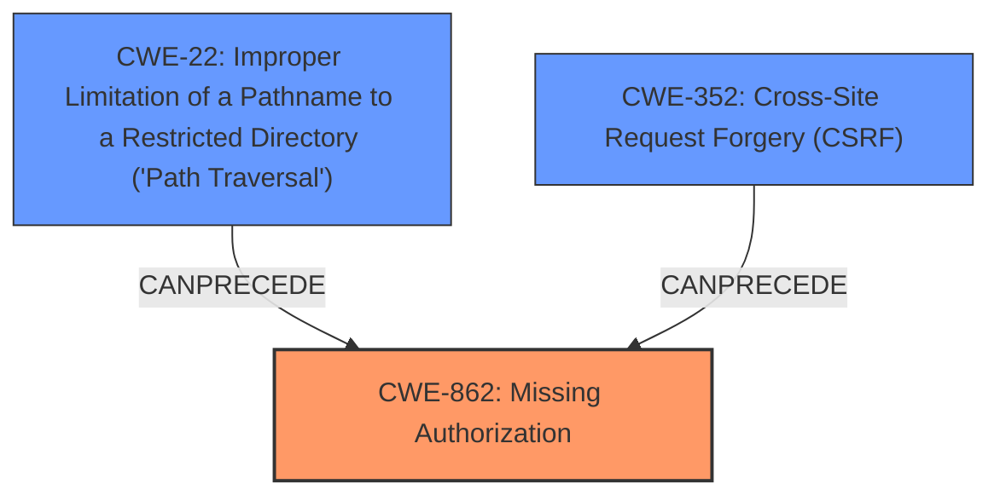

# Analysis for CVE-2021-24639

# Summary
| CWE ID   | CWE Name                                                                                                    | Confidence | CWE Abstraction Level | CWE Vulnerability Mapping Label | CWE-Vulnerability Mapping Notes |
| :--------- | :---------------------------------------------------------------------------------------------------------- | :--------- | :---------------------- | :-------------------------------- | :-------------------------------- |
| CWE-862  | Missing Authorization                                                                                       | 0.95       | Class                   | Primary                           | Allowed-with-Review             |
| CWE-352  | Cross-Site Request Forgery (CSRF)                                                                         | 0.85       | Compound                | Secondary                         | Allowed                         |
| CWE-22   | Improper Limitation of a Pathname to a Restricted Directory ('Path Traversal')                              | 0.75       | Base                    | Secondary                         | Allowed                         |

## Evidence and Confidence

*   **Confidence Score:** 0.9
*   **Evidence Strength:** HIGH

## Relationship Analysis
The primary weakness is **CWE-862 Missing Authorization**, because the AJAX action **does not perform an authorization check** when an actor attempts to access a resource or perform an action.

**CWE-352 Cross-Site Request Forgery (CSRF)** is a Compound weakness that occurs because the web application **does not sufficiently verify** whether a well-formed, valid, consistent request was intentionally provided by the user who submitted the request.

**CWE-22 Improper Limitation of a Pathname to a Restricted Directory ('Path Traversal')** is a Base level weakness that occurs because the product **does not properly neutralize sequences** such as ".." that can resolve to a location that is outside of that directory.

## Vulnerability Chain
The vulnerability chain starts with **missing authorization (CWE-862)**, which allows authenticated users to bypass access controls.  This is compounded by a **lack of CSRF protection (CWE-352)**, enabling attackers to potentially trick users into performing actions they didn't intend. Additionally, **improper path validation (CWE-22)** allows for deletion of arbitrary files or folders.

## Summary of Analysis
This analysis is primarily based on the provided evidence, which includes a detailed vulnerability description and keyphrase-specific CWE analysis. The description explicitly mentions **missing path validation, authorization, and CSRF checks** in the `omgf_ajax_empty_dir` AJAX action.

The primary CWE is **CWE-862 Missing Authorization**, because the identified problem is that the AJAX action **does not perform an authorization check** when an actor attempts to access a resource or perform an action. The vulnerability description explicitly states that the plugin **does not enforce authorization**.

The secondary CWE is **CWE-352 Cross-Site Request Forgery (CSRF)**, as the description indicates a **missing CSRF check**. This means an attacker could potentially forge requests on behalf of an authenticated user.

The third CWE is **CWE-22 Improper Limitation of a Pathname to a Restricted Directory ('Path Traversal')** because there is **no path validation**, and the weakness allows any authenticated users to delete arbitrary files or folders on the server.

These CWEs are at the optimal level of specificity, as they directly address the **root causes** of the vulnerability. While higher-level CWEs like **CWE-285 Improper Authorization** were considered, they are less specific than **CWE-862**, which accurately describes the **missing authorization check**.

Relevant CWE Information:

# Enhanced Context (25 CWEs)
The following CWEs were identified as potentially relevant to this vulnerability:

## CWE-425: Direct Request ('Forced Browsing')
**Abstraction Level**: Base
**Similarity Score**: 0.74
**Source**: dense

**Description**:
The web application does not adequately enforce appropriate authorization on all restricted URLs, scripts, or files.

**Mapping Guidance**:
- Usage: Allowed
- Rationale: This CWE entry is at the Base level of abstraction, which is a preferred level of abstraction for mapping to the root causes of vulnerabilities.

## CWE-472: External Control of Assumed-Immutable Web Parameter
**Abstraction Level**: Base
**Similarity Score**: 0.73
**Source**: dense

**Description**:
The web application does not sufficiently verify inputs that are assumed to be immutable but are actually externally controllable, such as hidden form fields.

**Mapping Guidance**:
- Usage: Allowed
- Rationale: This CWE entry is at the Base level of abstraction, which is a preferred level of abstraction for mapping to the root causes of vulnerabilities.

## CWE-434: Unrestricted Upload of File with Dangerous Type
**Abstraction Level**: Base
**Similarity Score**: 0.72
**Source**: dense

**Description**:
The product allows the upload or transfer of dangerous file types that are automatically processed within its environment.

**Mapping Guidance**:
- Usage: Allowed
- Rationale: This CWE entry is at the Base level of abstraction, which is a preferred level of abstraction for mapping to the root causes of vulnerabilities.

## CWE-352: Cross-Site Request Forgery (CSRF)
**Abstraction Level**: Compound
**Similarity Score**: 0.71
**Source**: dense

**Description**:
The web application does not, or can not, sufficiently verify whether a well-formed, valid, consistent request was intentionally provided by the user who submitted the request.

**Mapping Guidance**:
- Usage: Allowed
- Rationale: This is a well-known Composite of multiple weaknesses that must all occur simultaneously, although it is attack-oriented in nature.

## CWE-639: Authorization Bypass Through User-Controlled Key
**Abstraction Level**: Base
**Similarity Score**: 0.71
**Source**: dense

**Description**:
The system's authorization functionality does not prevent one user from gaining access to another user's data or record by modifying the key value identifying the data.

**Mapping Guidance**:
- Usage: Allowed
- Rationale: This CWE entry is at the Base level of abstraction, which is a preferred level of abstraction for mapping to the root causes of vulnerabilities.

## CWE-41: Improper Resolution of Path Equivalence
**Abstraction Level**: Base
**Similarity Score**: 0.71
**Source**: dense

**Description**:
The product is vulnerable to file system contents disclosure through path equivalence. Path equivalence involves the use of special characters in file and directory names. The associated manipulations are intended to generate multiple names for the same object.

**Mapping Guidance**:
- Usage: Allowed
- Rationale: This CWE entry is at the Base level of abstraction, which is a preferred level of abstraction for mapping to the root causes of vulnerabilities.

## CWE-552: Files or Directories Accessible to External Parties
**Abstraction Level**: Base
**Similarity Score**: 0.70
**Source**: dense

**Description**:
The product makes files or directories accessible to unauthorized actors, even though they should not be.

**Mapping Guidance**:
- Usage: Allowed
- Rationale: This CWE entry is at the Base level of abstraction, which is a preferred level of abstraction for mapping to the root causes of vulnerabilities.

## CWE-807: Reliance on Untrusted Inputs in a Security Decision
**Abstraction Level**: Base
**Similarity Score**: 0.70
**Source**: dense

**Description**:
The product uses a protection mechanism that relies on the existence or values of an input, but the input can be modified by an untrusted actor in a way that bypasses the protection mechanism.

**Mapping Guidance**:
- Usage: Allowed
- Rationale: This CWE entry is at the Base level of abstraction, which is a preferred level of abstraction for mapping to the root causes of vulnerabilities.

## CWE-23: Relative Path Traversal
**Abstraction Level**: Base
**Similarity Score**: 0.70
**Source**: dense

**Description**:
The product uses external input to construct a pathname that should be within a restricted directory, but it does not properly neutralize sequences such as ".." that can resolve to a location that is outside of that directory.

**Mapping Guidance**:
- Usage: Allowed
- Rationale: This CWE entry is at the Base level of abstraction, which is a preferred level of abstraction for mapping to the root causes of vulnerabilities.

## CWE-178: Improper Handling of Case Sensitivity
**Abstraction Level**: Base
**Similarity Score**: 0.70
**Source**: dense

**Description**:
The product does not properly account for differences in case sensitivity when accessing or determining the properties of a resource, leading to inconsistent results.

**Mapping Guidance

# Enhanced Query for CVE-2021-24639

# Vulnerability Description

    The OMGF WordPress plugin before 4.5.4 does not enforce path validation, authorisation and CSRF checks in the omgf_ajax_empty_dir AJAX action, which allows any authenticated users to delete arbitrary files or folders on the server.

    # Keyphrase-Specific CWE Analysis
    This vulnerability contains multiple keyphrases that may map to different CWEs. 
    Please analyze each keyphrase separately and determine the most appropriate CWE(s) for each.

    ## WEAKNESS: 'no path validation'

Relevant CWEs for this WEAKNESS:

### 1. CWE-352: Cross-Site Request Forgery (CSRF) (Score: 301.90)

The web application does not, or can not, sufficiently verify whether a well-formed, valid, consistent request was intentionally provided by the user who submitted the request....

### 2. CWE-862: Missing Authorization (Score: 276.97)

The product does not perform an authorization check when an actor attempts to access a resource or perform an action....

### 3. CWE-23: Relative Path Traversal (Score: 249.64)

The product uses external input to construct a pathname that should be within a restricted directory, but it does not properly neutralize sequences such as ".." that can resolve to a location that is outside of that directory....

### 4. CWE-863: Incorrect Authorization (Score: 245.60)

The product performs an authorization check when an actor attempts to access a resource or perform an action, but it does not correctly perform the check....

### 5. CWE-425: Direct Request ('Forced Browsing') (Score: 232.43)

The web application does not adequately enforce appropriate authorization on all restricted URLs, scripts, or files....

## WEAKNESS: 'authorisation bypass'

Relevant CWEs for this WEAKNESS:

### 1. CWE-352: Cross-Site Request Forgery (CSRF) (Score: 301.90)

The web application does not, or can not, sufficiently verify whether a well-formed, valid, consistent request was intentionally provided by the user who submitted the request....

### 2. CWE-862: Missing Authorization (Score: 276.97)

The product does not perform an authorization check when an actor attempts to access a resource or perform an action....

### 3. CWE-285: Improper Authorization (Score: 246.03)

The product does not perform or incorrectly performs an authorization check when an actor attempts to access a resource or perform an action....

### 4. CWE-863: Incorrect Authorization (Score: 245.60)

The product performs an authorization check when an actor attempts to access a resource or perform an action, but it does not correctly perform the check....

### 5. CWE-425: Direct Request ('Forced Browsing') (Score: 232.43)

The web application does not adequately enforce appropriate authorization on all restricted URLs, scripts, or files....

## WEAKNESS: 'CSRF bypass'

Relevant CWEs for this WEAKNESS:

### 1. CWE-352: Cross-Site Request Forgery (CSRF) (Score: 301.90)

The web application does not, or can not, sufficiently verify whether a well-formed, valid, consistent request was intentionally provided by the user who submitted the request....

### 2. CWE-862: Missing Authorization (Score: 276.97)

The product does not perform an authorization check when an actor attempts to access a resource or perform an action....

### 3. CWE-285: Improper Authorization (Score: 246.03)

The product does not perform or incorrectly performs an authorization check when an actor attempts to access a resource or perform an action....

### 4. CWE-863: Incorrect Authorization (Score: 245.60)

The product performs an authorization check when an actor attempts to access a resource or perform an action, but it does not correctly perform the check....

### 5. CWE-425: Direct Request ('Forced Browsing') (Score: 232.43)

The web application does not adequately enforce appropriate authorization on all restricted URLs, scripts, or files....

## IMPACT: 'arbitrary file deletion'

Relevant CWEs for this IMPACT:

### 1. CWE-352: Cross-Site Request Forgery (CSRF) (Score: 301.90)

The web application does not, or can not, sufficiently verify whether a well-formed, valid, consistent request was intentionally provided by the user who submitted the request....

### 2. CWE-862: Missing Authorization (Score: 276.97)

The product does not perform an authorization check when an actor attempts to access a resource or perform an action....

### 3. CWE-23: Relative Path Traversal (Score: 249.64)

The product uses external input to construct a pathname that should be within a restricted directory, but it does not properly neutralize sequences such as ".." that can resolve to a location that is outside of that directory....

### 4. CWE-863: Incorrect Authorization (Score: 245.60)

The product performs an authorization check when an actor attempts to access a resource or perform an action, but it does not correctly perform the check....

### 5. CWE-434: Unrestricted Upload of File with Dangerous Type (Score: 83.89)

The product allows the upload or transfer of dangerous file types that are automatically processed within its environment....

## ATTACKER: 'authenticated users'

Relevant CWEs for this ATTACKER:

### 1. CWE-352: Cross-Site Request Forgery (CSRF) (Score: 301.90)

The web application does not, or can not, sufficiently verify whether a well-formed, valid, consistent request was intentionally provided by the user who submitted the request....

### 2. CWE-862: Missing Authorization (Score: 276.97)

The product does not perform an authorization check when an actor attempts to access a resource or perform an action....

### 3. CWE-23: Relative Path Traversal (Score: 249.64)

The product uses external input to construct a pathname that should be within a restricted directory, but it does not properly neutralize sequences such as ".." that can resolve to a location that is outside of that directory....

### 4. CWE-285: Improper Authorization (Score: 246.03)

The product does not perform or incorrectly performs an authorization check when an actor attempts to access a resource or perform an action....

### 5. CWE-863: Incorrect Authorization (Score: 245.60)

The product performs an authorization check when an actor attempts to access a resource or perform an action, but it does not correctly perform the check....

## PRODUCT: 'OMGF WordPress plugin'

Relevant CWEs for this PRODUCT:

### 1. CWE-352: Cross-Site Request Forgery (CSRF) (Score: 301.90)

The web application does not, or can not, sufficiently verify whether a well-formed, valid, consistent request was intentionally provided by the user who submitted the request....

### 2. CWE-862: Missing Authorization (Score: 276.97)

The product does not perform an authorization check when an actor attempts to access a resource or perform an action....

### 3. CWE-285: Improper Authorization (Score: 246.03)

The product does not perform or incorrectly performs an authorization check when an actor attempts to access a resource or perform an action....

### 4. CWE-863: Incorrect Authorization (Score: 245.60)

The product performs an authorization check when an actor attempts to access a resource or perform an action, but it does not correctly perform the check....

### 5. CWE-425: Direct Request ('Forced Browsing') (Score: 232.43)

The web application does not adequately enforce appropriate authorization on all restricted URLs, scripts, or files....

## VERSION: 'before 4.5.4'

Relevant CWEs for this VERSION:

### 1. CWE-352: Cross-Site Request Forgery (CSRF) (Score: 301.90)

The web application does not, or can not, sufficiently verify whether a well-formed, valid, consistent request was intentionally provided by the user who submitted the request....

### 2. CWE-862: Missing Authorization (Score: 276.97)

The product does not perform an authorization check when an actor attempts to access a resource or perform an action....

### 3. CWE-23: Relative Path Traversal (Score: 249.64)

The product uses external input to construct a pathname that should be within a restricted directory, but it does not properly neutralize sequences such as ".." that can resolve to a location that is outside of that directory....

### 4. CWE-285: Improper Authorization (Score: 246.03)

The product does not perform or incorrectly performs an authorization check when an actor attempts to access a resource or perform an action....

### 5. CWE-863: Incorrect Authorization (Score: 245.60)

The product performs an authorization check when an actor attempts to access a resource or perform an action, but it does not correctly perform the check....

## COMPONENT: 'omgf_ajax_empty_dir AJAX action'

Relevant CWEs for this COMPONENT:

### 1. CWE-352: Cross-Site Request Forgery (CSRF) (Score: 301.90)

The web application does not, or can not, sufficiently verify whether a well-formed, valid, consistent request was intentionally provided by the user who submitted the request....

### 2. CWE-862: Missing Authorization (Score: 276.97)

The product does not perform an authorization check when an actor attempts to access a resource or perform an action....

### 3. CWE-23: Relative Path Traversal (Score: 249.64)

The product uses external input to construct a pathname that should be within a restricted directory, but it does not properly neutralize sequences such as ".." that can resolve to a location that is outside of that directory....

### 4. CWE-285: Improper Authorization (Score: 246.03)

The product does not perform or incorrectly performs an authorization check when an actor attempts to access a resource or perform an action....

### 5. CWE-863: Incorrect Authorization (Score: 245.60)

The product performs an authorization check when an actor attempts to access a resource or perform an action, but it does not correctly perform the check....

    # Analysis Instructions
    1. For each keyphrase, identify the most appropriate CWE(s) that represent the weakness.
    2. Consider how the different keyphrases might relate to each other in the vulnerability chain.
    3. Provide a final determination of primary CWE(s) and any secondary CWEs.
    4. Format your response using the standard analysis template.

    Please analyze how these different weaknesses interact and provide a comprehensive CWE classification.
    