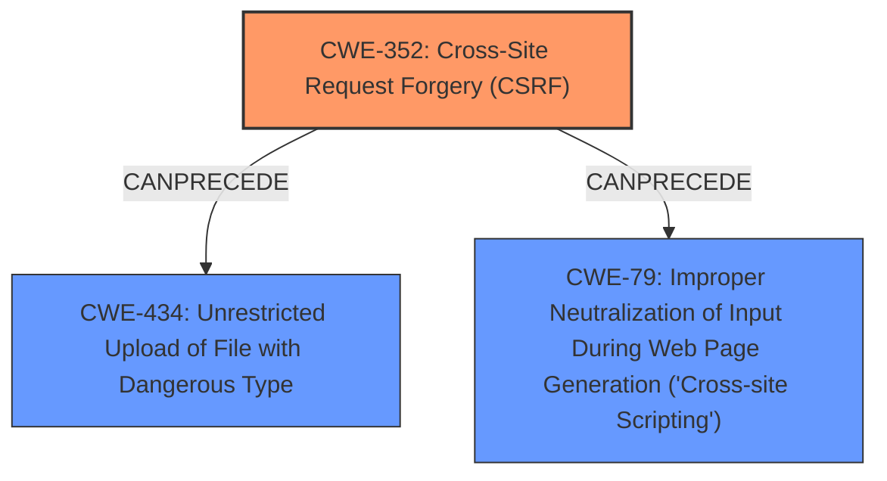

# Enhanced Analysis for CVE-2021-24642

# Summary
| CWE ID | CWE Name | Confidence | CWE Abstraction Level | CWE Vulnerability Mapping Label | CWE-Vulnerability Mapping Notes |
|---|---|---|---|---|---|
| CWE-352 | Cross-Site Request Forgery (CSRF) | 1.0 | Compound | Allowed | Primary CWE |
| CWE-434 | Unrestricted Upload of File with Dangerous Type | 0.9 | Base | Allowed | Secondary Candidate |
| CWE-79 | Improper Neutralization of Input During Web Page Generation ('Cross-site Scripting') | 0.8 | Base | Allowed | Secondary Candidate |

## Evidence and Confidence

*   **Confidence Score:** 0.9
*   **Evidence Strength:** HIGH

## Relationship Analysis
The primary weakness is CWE-352, Cross-Site Request Forgery (CSRF). The vulnerability description explicitly states a **lack of CSRF protection**. This can lead to an attacker tricking a logged-in administrator into performing actions, such as changing settings. The ability to change settings leads to secondary weaknesses like CWE-434, Unrestricted Upload of File with Dangerous Type, and CWE-79, Improper Neutralization of Input During Web Page Generation ('Cross-site Scripting'). These vulnerabilities are related in a chain where the **lack of CSRF protection** is the initial weakness, enabling other vulnerabilities due to **improper handling of user input** or **unrestricted file uploads**.



## Vulnerability Chain
The vulnerability chain starts with the **lack of CSRF protection** (CWE-352), which allows an attacker to modify plugin settings. This leads to:
  1. Unrestricted file uploads (CWE-434), enabling remote code execution.
  2. Cross-site scripting (CWE-79) due to **improper sanitization, escaping or validation**.

The **lack of CSRF protection** is the root cause, and the other weaknesses are consequences of this initial flaw.

## Summary of Analysis
The assessment is based on the vulnerability description, which clearly states the **lack of CSRF protection** as the primary issue. The "CVE Reference Links Content Summary" confirms this by stating that the "Root cause of vulnerability" is "The plugin **lacks CSRF protection** when saving settings and **does not sanitize, escape, or validate user input**."

The graph relationships indicate how the **lack of CSRF protection** (CWE-352) can lead to further vulnerabilities such as unrestricted file uploads (CWE-434) and XSS (CWE-79). The selected CWEs are at the optimal level of specificity. CWE-352 is a Compound weakness that accurately describes the **lack of CSRF protection**. CWE-434 and CWE-79 are Base level weaknesses that describe the consequences of the **lack of CSRF protection**.

Relevant CWE Information:

# Enhanced Context (25 CWEs)

## CWE-352: Cross-Site Request Forgery (CSRF)
**Technical Explanation:** The Scroll Baner WordPress plugin through version 1.0 does not implement CSRF protection for saving settings. This means an attacker can craft a malicious request that, when triggered by a logged-in administrator, will modify the plugin's settings.
**Security Implications:** Attackers can trick administrators into making unintended changes, leading to RCE or XSS.
**Relationship:** This is the primary weakness, as it enables other vulnerabilities.
**Mapping Guidance Influence:** The usage is "Allowed," and the rationale fits the description, as it is a well-known composite of multiple weaknesses.
**Confidence:** 1.0

## CWE-434: Unrestricted Upload of File with Dangerous Type
**Technical Explanation:** The plugin allows uploading files without proper validation of the file type. This could allow an attacker to upload a malicious file (e.g., a PHP script) that can be executed on the server, leading to remote code execution. The vulnerability description states that the exploitation of the lack of CSRF leads to Remote Code Execution via a file upload.
**Security Implications:** Remote code execution, full system compromise.
**Relationship:** This is a secondary weakness that results from the **lack of CSRF protection**, which allows an attacker to modify settings and upload malicious files.
**Mapping Guidance Influence:** The usage is "Allowed," and the rationale fits because this is a base-level weakness related to dangerous file uploads.
**Confidence:** 0.9

## CWE-79: Improper Neutralization of Input During Web Page Generation ('Cross-site Scripting')
**Technical Explanation:** The plugin does not properly sanitize or escape user input, allowing an attacker to inject malicious scripts into web pages viewed by other users.
**Security Implications:** An attacker can execute arbitrary JavaScript code in the context of the victim's browser, potentially stealing cookies, redirecting the user, or defacing the website. The vulnerability description states that the exploitation of the lack of CSRF leads to XSS.
**Relationship:** This is a secondary weakness that results from the **lack of CSRF protection**, which allows an attacker to modify settings and inject malicious scripts.
**Mapping Guidance Influence:** The usage is "Allowed," and the rationale fits because it's a base-level weakness.
**Confidence:** 0.8

### Considered but not used:

*   **CWE-116: Improper Encoding or Escaping of Output:** While related to XSS (CWE-79), CWE-79 is more specific.
*   **CWE-862: Missing Authorization & CWE-863: Incorrect Authorization:** While authorization is related, the core issue is the **lack of CSRF protection**. The settings are not supposed to be changed by unauthorized users, but the **lack of CSRF protection** makes it possible.
*   **CWE-472: External Control of Assumed-Immutable Web Parameter:** This CWE is relevant but less specific than CWE-352. The **lack of CSRF protection** is the root cause that allows external control.
*   **CWE-73: External Control of File Name or Path:** This is related to CWE-434, but CWE-434 is more specific to the file upload aspect of the vulnerability.
*   **CWE-89: Improper Neutralization of Special Elements used in an SQL Command ('SQL Injection'):** There is no evidence of SQL injection in the vulnerability description.
*   **CWE-425: Direct Request ('Forced Browsing'):** The vulnerability is not about direct requests to restricted resources but rather about exploiting the **lack of CSRF protection**.


## CWE Relationship Analysis

Current CWEs represent these abstraction levels: .


### Vulnerability Chain Analysis

**Chain starting from CWE-79:**
- 79 (Improper Neutralization of Input During Web Page Generation ('Cross-site Scripting')) - ROOT


**Chain starting from CWE-862:**
- 862 (Missing Authorization) - ROOT


### CWE Relationship Diagram

```mermaid
graph TD
    classDef primary fill:#f96,stroke:#333,stroke-width:2px
    classDef secondary fill:#69f,stroke:#333
    classDef tertiary fill:#9e9,stroke:#333
```