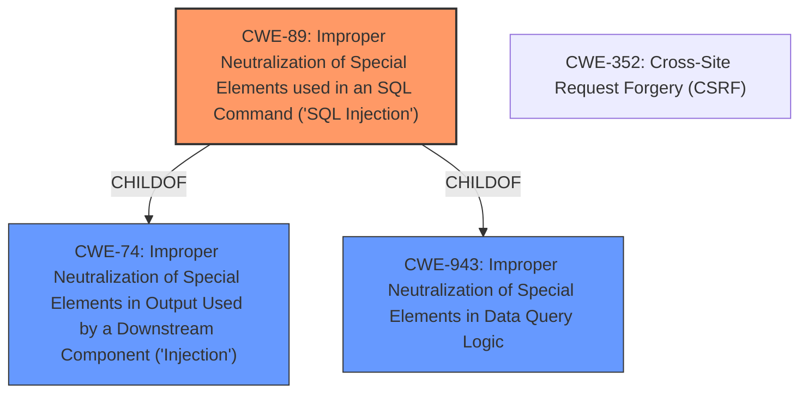

# Analysis Report for CVE-2021-24651

# Vulnerability Analysis Report: CVE-2021-24651

## Description


## Analysis (with Relationship Data)

# Summary
| CWE ID | CWE Name | Confidence | CWE Abstraction Level | CWE Vulnerability Mapping Label | CWE-Vulnerability Mapping Notes |
|---|---|---|---|---|---|
| CWE-89 | Improper Neutralization of Special Elements used in an SQL Command ('SQL Injection') | 1.0 | Base | Allowed | Primary CWE |
| CWE-352 | Cross-Site Request Forgery (CSRF) | 0.4 | Compound | Allowed | Secondary Candidate |

## Evidence and Confidence

*   **Confidence Score:** 0.9
*   **Evidence Strength:** HIGH

## Relationship Analysis
The primary CWE is CWE-89, which is a Base level CWE. CWE-89 is a child of CWE-74 (Improper Neutralization of Special Elements in Output Used by a Downstream Component ('Injection')) and CWE-943 (Improper Neutralization of Special Elements in Data Query Logic). The description clearly indicates **SQL injection** as the **weakness**. CWE-352, while present in the retriever results, is less directly relevant as the vulnerability stems from the lack of proper input sanitization leading to SQL injection, not a CSRF condition.



## Vulnerability Chain
The chain of events is as follows:

1.  **Root Cause:** **Missing/Improper input sanitization** in the `ays_finish_poll` AJAX action.
2.  **Weakness:** **SQL injection** vulnerability due to the root cause.
3.  **Impact:** Potential data exfiltration (password hashes) via timing attacks and possible further attacks leading to complete compromise of the site.

## Summary of Analysis
The initial analysis correctly identified the presence of **SQL injection**. The primary focus is on the root cause - the **lack of proper input sanitization** which leads to the exploitable **SQL injection** (**CWE-89**). The vulnerability allows unauthenticated users to inject arbitrary SQL queries, potentially exfiltrating sensitive data.

The selection of CWE-89 is based on:

*   Direct evidence from the vulnerability description indicating **SQL injection** as the core issue.
*   Retriever results ranking CWE-89 as the top match.
*   CWE-89's definition aligning perfectly with the vulnerability's technical details.

The high confidence score reflects the strong evidence supporting this classification.

CWEs considered but not used:

*   CWE-352 (Cross-Site Request Forgery): While the `ays_finish_poll` AJAX action is involved, the primary issue is the **SQL injection** itself, not the lack of CSRF protection. Therefore, CWE-352 is less relevant.
*   CWE-502 (Deserialization of Untrusted Data): This CWE is not relevant, as the vulnerability does not involve deserialization.
*   CWE-79 (Improper Neutralization of Input During Web Page Generation ('Cross-site Scripting')): This CWE is not relevant because the injected code is not executed in the context of a web page but rather directly against the database.
*   CWE-862 (Missing Authorization) & CWE-863 (Incorrect Authorization): The description states that unauthenticated users can perform **SQL injection**. However, the root cause of the vulnerability is the **lack of proper input sanitization** that leads to the **SQL injection** (**CWE-89**).

Relevant CWE Information:

# Enhanced Context (25 CWEs)
The following CWEs were identified as potentially relevant to this vulnerability:

## CWE-89: Improper Neutralization of Special Elements used in an SQL Command ('SQL Injection')
**Abstraction Level**: Base
**Similarity Score**: 1.0
**Description**: The product constructs all or part of an SQL command using externally-influenced input from an upstream component, but it does not neutralize or incorrectly neutralizes special elements that could modify the intended SQL command when it is sent to a downstream component.
**Mapping Guidance**: Usage: Allowed, Rationale: This CWE entry is at the Base level of abstraction, which is a preferred level of abstraction for mapping to the root causes of vulnerabilities.

## CWE-352: Cross-Site Request Forgery (CSRF)
**Abstraction Level**: Compound
**Similarity Score**: 0.278
**Description**: The web application does not, or can not, sufficiently verify whether a well-formed, valid, consistent request was intentionally provided by the user who submitted the request.
**Mapping Guidance**: Usage: Allowed, Rationale: This is a well-known Composite of multiple weaknesses that must all occur simultaneously, although it is attack-oriented in nature.


## CWE Relationship Analysis

Current CWEs represent these abstraction levels: .


### Vulnerability Chain Analysis

**Chain starting from CWE-502:**
- 502 (Deserialization of Untrusted Data) - ROOT


**Chain starting from CWE-79:**
- 79 (Improper Neutralization of Input During Web Page Generation ('Cross-site Scripting')) - ROOT


### CWE Relationship Diagram

```mermaid
graph TD
    classDef primary fill:#f96,stroke:#333,stroke-width:2px
    classDef secondary fill:#69f,stroke:#333
    classDef tertiary fill:#9e9,stroke:#333
```


*Report generated on 2025-04-02 10:42:37*
