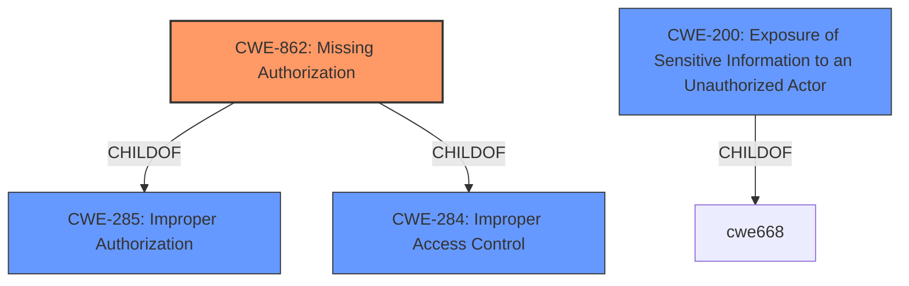

# Analysis Report for CVE-2021-24677

# Vulnerability Analysis Report: CVE-2021-24677

## Description


## Analysis (with Relationship Data)

# Summary
| CWE ID | CWE Name | Confidence | CWE Abstraction Level | CWE Vulnerability Mapping Label | CWE-Vulnerability Mapping Notes |
|---|---|---|---|---|---|
| CWE-862 | Missing Authorization | 1.0 | Class | Allowed-with-Review | Primary CWE |
| CWE-200 | Exposure of Sensitive Information to an Unauthorized Actor | 0.6 | Class | Discouraged | Secondary Candidate |

## Evidence and Confidence

*   **Confidence Score:** 0.8
*   **Evidence Strength:** HIGH

## Relationship Analysis
The primary CWE is CWE-862 **Missing Authorization**.
  - CWE-862 is a child of CWE-285 Improper Authorization and CWE-284 Improper Access Control.
  - CWE-425 Direct Request is also a child of CWE-862, but the description indicates that the application makes a false assumption that resources can only be reached through a given navigation path. This is not the case in the description provided.



## Vulnerability Chain
The vulnerability chain starts with the **missing authorization** check in the REST API (CWE-862), which allows unauthenticated users to enumerate private posts titles, leading to **exposure of sensitive information** (CWE-200).

## Summary of Analysis
The analysis indicates that the primary weakness is the **missing authorization** check in the REST API of the Find My Blocks WordPress plugin, which allows unauthenticated users to enumerate private posts titles. This is a clear case of **missing authorization**, as the plugin does not verify the user's permissions before allowing access to the private posts titles.

The vulnerability description clearly states: "The Find My Blocks WordPress plugin before 3.4.0 does not have authorisation checks in its REST API, which could allow unauthenticated users to enumerate private posts titles."

The **CVE Reference Links Content Summary** confirms the root cause: "The Find My Blocks plugin lacks authorization checks in its REST API." The impact is also clear: "An unauthenticated attacker can enumerate the titles of private posts."

CWE-862 **Missing Authorization** is the most appropriate CWE, as it directly reflects the **lack of authorization checks** in the REST API. The description of CWE-862 states: "The product does not perform an authorization check when an actor attempts to access a resource or perform an action." This aligns perfectly with the vulnerability description.

CWE-200 **Exposure of Sensitive Information to an Unauthorized Actor** is a secondary consideration, as the impact of the **missing authorization** is the **exposure of private posts titles** to unauthenticated users. However, CWE-200 is a high-level class and is often misused to represent the loss of confidentiality. Therefore, it is not the primary CWE, but it is a relevant secondary consideration.

The selection of CWE-862 is based on the evidence from the vulnerability description and the CVE reference links content summary. The relationship analysis and mapping guidance also support this decision. The confidence in this mapping is high (0.8).


## CWE Relationship Analysis

Current CWEs represent these abstraction levels: .


### Vulnerability Chain Analysis

**Chain starting from CWE-862:**
- 862 (Missing Authorization) - ROOT


**Chain starting from CWE-284:**
- 284 (Improper Access Control) - ROOT


### CWE Relationship Diagram

```mermaid
graph TD
    classDef primary fill:#f96,stroke:#333,stroke-width:2px
    classDef secondary fill:#69f,stroke:#333
    classDef tertiary fill:#9e9,stroke:#333
```


*Report generated on 2025-04-02 11:47:30*
