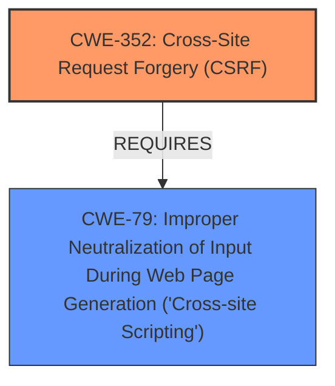

# Raw Analyzer Response for CVE-2021-24685

# Summary
| CWE ID | CWE Name | Confidence | CWE Abstraction Level | CWE Vulnerability Mapping Label | CWE-Vulnerability Mapping Notes |
|---|---|---|---|---|---|
| CWE-352 | Cross-Site Request Forgery (CSRF) | 0.9 | Compound | Allowed | Primary CWE. The plugin **does not enforce nonce checks** when saving settings, which is a key indicator of CSRF.|
| CWE-79 | Improper Neutralization of Input During Web Page Generation ('Cross-site Scripting') | 0.8 | Base | Allowed | Secondary CWE. The plugin **does not sanitize and escape** settings, which can lead to XSS.|

## Evidence and Confidence

*   **Confidence Score:** 0.85
*   **Evidence Strength:** HIGH

## Relationship Analysis
The primary relationship influencing the decision is the `REQUIRES` relationship of CWE-352, which often necessitates proper input handling (or neutralization) to prevent exploits like XSS.

## Vulnerability Chain
The vulnerability chain starts with the **missing nonce check** (CWE-352) allowing an attacker to inject a malicious payload. Due to the **lack of sanitization and escaping** (CWE-79), this payload is then executed, leading to Cross-Site Scripting.

## Summary of Analysis
The initial assessment identified two key weaknesses: **lack of nonce checks** and **improper sanitization/escaping**. The **lack of nonce checks** directly leads to the possibility of CSRF (CWE-352), as the application cannot verify if the request was intentionally made by the user. The **improper sanitization and escaping** (CWE-79) then allows for the injection of malicious scripts, leading to XSS.

The provided evidence strongly supports these mappings. The vulnerability description states, "The Flat Preloader WordPress plugin before 1.5.4 **does not enforce nonce checks** when saving its settings, as well as **does not sanitise and escape them**, which could allow attackers to a make logged in admin change them with a Cross-Site Scripting payload." The CVE Reference Links Content Summary further reinforces this by stating, "The plugin **does not enforce nonce checks** when saving its settings and **fails to sanitize and escape** them."

CWE-352 is selected as the primary CWE because the vulnerability description explicitly mentions the **absence of nonce checks**, which is a defining characteristic of CSRF. CWE-79 is selected as a secondary CWE because the **lack of sanitization and escaping** directly enables the XSS payload to be executed.

The selection of CWE-352 and CWE-79 is also supported by the Retriever Results, which lists CWE-352 and CWE-79 as potential matches with high scores.

Other CWEs Considered:

*   CWE-116: Improper Encoding or Escaping of Output - Similar to CWE-79, but CWE-79 is more specific to web page generation and XSS.
*   CWE-862: Missing Authorization - While related, the primary issue is the lack of CSRF protection (nonce check) rather than a general authorization problem.
*   CWE-89: Improper Neutralization of Special Elements used in an SQL Command ('SQL Injection') - Not applicable as the vulnerability involves XSS, not SQL injection.
*   CWE-96: Improper Neutralization of Directives in Statically Saved Code ('Static Code Injection') - Not applicable as the code isn't being injected into static code.
*   CWE-434: Unrestricted Upload of File with Dangerous Type - Not applicable as there is no file upload involved.

The selected CWEs are at the optimal level of specificity, with CWE-352 being a Compound weakness directly related to CSRF and CWE-79 being a Base weakness directly related to XSS.

Relevant CWE Information:

# Enhanced Context (25 CWEs)

## CWE-74: Improper Neutralization of Special Elements in Output Used by a Downstream Component ('Injection')
**Abstraction Level**: Class
**Similarity Score**: 0.77
**Source**: dense

**Description**:
The product constructs all or part of a command, data structure, or record using externally-influenced input from an upstream component, but it does not neutralize or incorrectly neutralizes special elements that could modify how it is parsed or interpreted when it is sent to a downstream component.

**Mapping Guidance**:
- Usage: Discouraged
- Rationale: CWE-74 is high-level and often misused when lower-level weaknesses are more appropriate.

## CWE-807: Reliance on Untrusted Inputs in a Security Decision
**Abstraction Level**: Base
**Similarity Score**: 0.77
**Source**: dense

**Description**:
The product uses a protection mechanism that relies on the existence or values of an input, but the input can be modified by an untrusted actor in a way that bypasses the protection mechanism.

**Mapping Guidance**:
- Usage: Allowed
- Rationale: This CWE entry is at the Base level of abstraction, which is a preferred level of abstraction for mapping to the root causes of vulnerabilities.

## CWE-472: External Control of Assumed-Immutable Web Parameter
**Abstraction Level**: Base
**Similarity Score**: 0.77
**Source**: dense

**Description**:
The web application does not sufficiently verify inputs that are assumed to be immutable but are actually externally controllable, such as hidden form fields.

**Mapping Guidance**:
- Usage: Allowed
- Rationale: This CWE entry is at the Base level of abstraction, which is a preferred level of abstraction for mapping to the root causes of vulnerabilities.

## CWE-184: Incomplete List of Disallowed Inputs
**Abstraction Level**: Base
**Similarity Score**: 0.76
**Source**: dense

**Description**:
The product implements a protection mechanism that relies on a list of inputs (or properties of inputs) that are not allowed by policy or otherwise require other action to neutralize before additional processing takes place, but the list is incomplete.

**Mapping Guidance**:
- Usage: Allowed
- Rationale: This CWE entry is at the Base level of abstraction, which is a preferred level of abstraction for mapping to the root causes of vulnerabilities.

## CWE-639: Authorization Bypass Through User-Controlled Key
**Abstraction Level**: Base
**Similarity Score**: 0.76
**Source**: dense

**Description**:
The system's authorization functionality does not prevent one user from gaining access to another user's data or record by modifying the key value identifying the data.

**Mapping Guidance**:
- Usage: Allowed
- Rationale: This CWE entry is at the Base level of abstraction, which is a preferred level of abstraction for mapping to the root causes of vulnerabilities.

## CWE-1289: Improper Validation of Unsafe Equivalence in Input
**Abstraction Level**: Base
**Similarity Score**: 0.76
**Source**: dense

**Description**:
The product receives an input value that is used as a resource identifier or other type of reference, but it does not validate or incorrectly validates that the input is equivalent to a potentially-unsafe value.

**Mapping Guidance**:
- Usage: Allowed
- Rationale: This CWE entry is at the Base level of abstraction, which is a preferred level of abstraction for mapping to the root causes of vulnerabilities.

## CWE-303: Incorrect Implementation of Authentication Algorithm
**Abstraction Level**: Base
**Similarity Score**: 0.75
**Source**: dense

**Description**:
The requirements for the product dictate the use of an established authentication algorithm, but the implementation of the algorithm is incorrect.

**Mapping Guidance**:
- Usage: Allowed
- Rationale: This CWE entry is at the Base level of abstraction, which is a preferred level of abstraction for mapping to the root causes of vulnerabilities.

## CWE-345: Insufficient Verification of Data Authenticity
**Abstraction Level**: Class
**Similarity Score**: 0.75
**Source**: dense

**Description**:
The product does not sufficiently verify the origin or authenticity of data, in a way that causes it to accept invalid data.

**Mapping Guidance**:
- Usage: Discouraged
- Rationale: This CWE entry is a level-1 Class (i.e., a child of a Pillar). It might have lower-level children that would be more appropriate

## CWE-1390: Weak Authentication
**Abstraction Level**: Class
**Similarity Score**: 0.75
**Source**: dense

**Description**:
The product uses an authentication mechanism to restrict access to specific users or identities, but the mechanism does not sufficiently prove that the claimed identity is correct.

**Mapping Guidance**:
- Usage: Allowed-with-Review
- Rationale: This CWE entry is a Class and might have Base