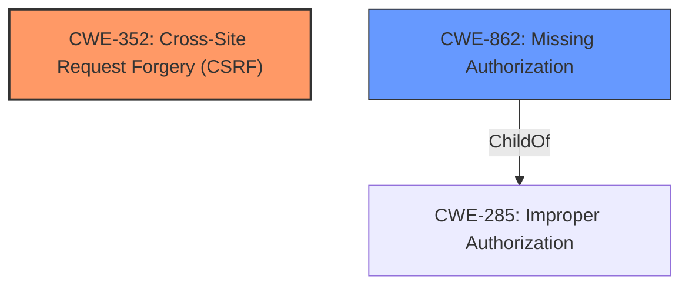

# Raw Analyzer Response for CVE-2021-24703

# Summary
| CWE ID | CWE Name | Confidence | CWE Abstraction Level | CWE Vulnerability Mapping Label | CWE-Vulnerability Mapping Notes |
|---|---|---|---|---|---|
| CWE-352 | Cross-Site Request Forgery (CSRF) | 0.9 | Compound | Allowed | Primary CWE. Addresses the missing CSRF check in the AJAX action. |
| CWE-862 | Missing Authorization | 0.9 | Class | Allowed-with-Review | Secondary CWE. Addresses the missing capability check in the AJAX action. |

## Evidence and Confidence

*   **Confidence Score:** 0.9
*   **Evidence Strength:** HIGH

## Relationship Analysis
The primary relationship influencing the decision is that CWE-352 [Cross-Site Request Forgery (CSRF)] is a compound weakness that REQUIRES other weaknesses to be present. Similarly, CWE-862 [Missing Authorization] is a class-level CWE, indicating the absence of a proper authorization mechanism. Both CWEs are relevant as the vulnerability stems from both **missing CSRF checks** and **missing capability checks**. The relationship between these CWEs is that they are independent contributing factors to the overall vulnerability. Choosing the base-level CWEs under each class would be more specific; however, due to the limited information, a higher-level class is used.

## Vulnerability Chain
The vulnerability chain starts with the **lack of capability and CSRF checks** in the `dpwap_plugin_activate` AJAX action. This **missing** security measure allows authenticated users (even subscribers) to activate plugins that are already installed.

## Summary of Analysis
The initial analysis focused on the **root cause** highlighted in the vulnerability description: the **lack of capability and CSRF checks**. The CVE Reference Links Content Summary confirms this by stating, "The plugin lacks capability and CSRF checks in the `dpwap_plugin_activate` AJAX action." This directly supports the selection of CWE-352 and CWE-862.

The retriever results also highlighted CWE-352 as a top candidate, further supporting this choice. While other CWEs like CWE-863 (Incorrect Authorization) were considered, the vulnerability description explicitly states that the checks are **missing**, not incorrectly implemented, making CWE-862 a more accurate fit.

The selection of CWE-352 and CWE-862 is based on the provided evidence. These CWEs are at the optimal level of specificity given the available information.

Relevant CWE Information:

# Enhanced Context (25 CWEs)
The following CWEs were identified as potentially relevant to this vulnerability:

## CWE-807: Reliance on Untrusted Inputs in a Security Decision
**Abstraction Level**: Base
**Similarity Score**: 0.77
**Source**: dense

**Description**:
The product uses a protection mechanism that relies on the existence or values of an input, but the input can be modified by an untrusted actor in a way that bypasses the protection mechanism.

**Mapping Guidance**:
- Usage: Allowed
- Rationale: This CWE entry is at the Base level of abstraction, which is a preferred level of abstraction for mapping to the root causes of vulnerabilities.

*Was considered but not selected since the vulnerability is due to **missing** security checks and not due to reliance on untrusted inputs in a security decision.*

## CWE-74: Improper Neutralization of Special Elements in Output Used by a Downstream Component ('Injection')
**Abstraction Level**: Class
**Similarity Score**: 0.77
**Source**: dense

**Description**:
The product constructs all or part of a command, data structure, or record using externally-influenced input from an upstream component, but it does not neutralize or incorrectly neutralizes special elements that could modify how it is parsed or interpreted when it is sent to a downstream component.

**Mapping Guidance**:
- Usage: Discouraged
- Rationale: CWE-74 is high-level and often misused when lower-level weaknesses are more appropriate.

*Was considered but not selected as the vulnerability isn't directly related to injection vulnerabilities.*

## CWE-472: External Control of Assumed-Immutable Web Parameter
**Abstraction Level**: Base
**Similarity Score**: 0.76
**Source**: dense

**Description**:
The web application does not sufficiently verify inputs that are assumed to be immutable but are actually externally controllable, such as hidden form fields.

**Mapping Guidance**:
- Usage: Allowed
- Rationale: This CWE entry is at the Base level of abstraction, which is a preferred level of abstraction for mapping to the root causes of vulnerabilities.

*Was considered but not selected since the vulnerability is due to **missing** security checks and not due to externally controlled immutable web parameters.*

## CWE-639: Authorization Bypass Through User-Controlled Key
**Abstraction Level**: Base
**Similarity Score**: 0.76
**Source**: dense

**Description**:
The system's authorization functionality does not prevent one user from gaining access to another user's data or record by modifying the key value identifying the data.

**Mapping Guidance**:
- Usage: Allowed
- Rationale: This CWE entry is at the Base level of abstraction, which is a preferred level of abstraction for mapping to the root causes of vulnerabilities.

*Was considered but not selected since the vulnerability doesn't involve authorization bypass through user-controlled keys.*

## CWE-184: Incomplete List of Disallowed Inputs
**Abstraction Level**: Base
**Similarity Score**: 0.76
**Source**: dense

**Description**:
The product implements a protection mechanism that relies on a list of inputs (or properties of inputs) that are not allowed by policy or otherwise require other action to neutralize before additional processing takes place, but the list is incomplete.

**Mapping Guidance**:
- Usage: Allowed
- Rationale: This CWE entry is at the Base level of abstraction, which is a preferred level of abstraction for mapping to the root causes of vulnerabilities.

*Was considered but not selected since the vulnerability is due to **missing** security checks and not due to an incomplete list of disallowed inputs.*

## CWE-303: Incorrect Implementation of Authentication Algorithm
**Abstraction Level**: Base
**Similarity Score**: 0.76
**Source**: dense

**Description**:
The requirements for the product dictate the use of an established authentication algorithm, but the implementation of the algorithm is incorrect.

**Mapping Guidance**:
- Usage: Allowed
- Rationale: This CWE entry is at the Base level of abstraction, which is a preferred level of abstraction for mapping to the root causes of vulnerabilities.

*Was considered but not selected since the vulnerability is due to **missing** security checks and not due to incorrect implementation of an authentication algorithm.*

## CWE-1289: Improper Validation of Unsafe Equivalence in Input
**Abstraction Level**: Base
**Similarity Score**: 0.76
**Source**: dense

**Description**:
The product receives an input value that is used as a resource identifier or other type of reference, but it does not validate or incorrectly validates that the input is equivalent to a potentially-unsafe value.

**Mapping Guidance**:
- Usage: Allowed
- Rationale: This CWE entry is at the Base level of abstraction, which is a preferred level of abstraction for mapping to the root causes of vulnerabilities.

*Was considered but not selected since the vulnerability is due to **missing** security checks and not due to improper validation of unsafe equivalence in input.*

## CWE-799: Improper Control of Interaction Frequency
**Abstraction Level**: Class
**Similarity Score**: 0.75
**Source**: dense

**Description**:
The product does not properly limit the number or frequency of interactions that it has with an actor, such as the number of incoming requests.

**Mapping Guidance**:
- Usage: Allowed-with-Review
- Rationale: This CWE entry is a Class and might have Base-level children that would be more appropriate

*Was considered but not selected since the vulnerability is due to **missing** security checks and not due to improper control of interaction frequency.*

## CWE-425: Direct Request ('Forced Browsing')
**Abstraction Level**: Base
**Similarity Score**: 0.75
**Source**: dense

**Description**:
The web application does not adequately enforce appropriate authorization on all restricted URLs, scripts, or files.

**Mapping Guidance**:
- Usage: Allowed
- Rationale: This CWE entry is at the Base level of abstraction, which is a preferred level of abstraction for mapping to the root causes of vulnerabilities.

*Was considered but not selected as the description is too general for the provided vulnerability description.*

## CWE-41: Improper Resolution of Path Equivalence
**Abstraction Level**: Base
**Similarity Score**: 0.75
**Source**: dense

**Description**:
The product is vulnerable to file system contents disclosure through path equivalence. Path