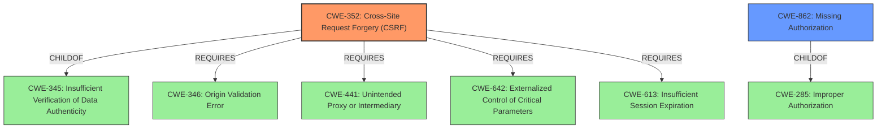

# Raw Analyzer Response for CVE-2021-24730

# Summary
| CWE ID | CWE Name | Confidence | CWE Abstraction Level | CWE Vulnerability Mapping Label | CWE-Vulnerability Mapping Notes |
|---|---|---|---|---|---|
| CWE-352 | Cross-Site Request Forgery (CSRF) | 1.0 | Compound | Allowed | Primary CWE |
| CWE-862 | Missing Authorization | 0.9 | Class | Allowed-with-Review | Secondary Candidate |

## Evidence and Confidence

*   **Confidence Score:** 0.95
*   **Evidence Strength:** HIGH

## Relationship Analysis
The primary weakness is the **lack of CSRF protection (CWE-352)**, a compound weakness. This vulnerability also involves **missing authorization checks (CWE-862)**, which allows unauthorized users to perform actions they shouldn't be able to. CWE-352 requires other CWEs to be present, such as **CWE-346: Origin Validation Error**, **CWE-441: Unintended Proxy or Intermediary**, **CWE-642: Externalized Control of Critical Parameters**, and **CWE-613: Insufficient Session Expiration**.

## Vulnerability Chain
The chain of events starts with the **lack of CSRF and authorization checks**. This allows any authenticated user, even with low privileges, to **modify arbitrary uploaded media**. The vulnerability exists in the `lswss_save_attachment_data` AJAX action.

## Summary of Analysis
The vulnerability stems from the **lack of CSRF and authorization checks** in the `lswss_save_attachment_data` AJAX action of the "Logo Showcase with Slick Slider" WordPress plugin. This allows authenticated users, such as subscribers, to change the title, description, alt text, and URL of arbitrary uploaded media.

The primary CWE is **CWE-352: Cross-Site Request Forgery (CSRF)**, because the AJAX action lacks CSRF protection, making it vulnerable to CSRF attacks. The vulnerability also involves **CWE-862: Missing Authorization**, because the AJAX action does not properly verify user roles or capabilities before allowing modifications. This allows even low-privileged users like subscribers to perform unauthorized actions.

The selection of **CWE-352** is based on the vulnerability description stating a **lack of CSRF protection**. The selection of **CWE-862** is based on the description stating a **lack of authorization checks**, which is in line with the CWE's description.

The **Retriever Results** listed **CWE-352** as the top combined result and **CWE-862** as a close second. The relationship analysis shows that **CWE-352** is a compound weakness that requires other weaknesses to be present, such as **CWE-346**, **CWE-441**, **CWE-642**, and **CWE-613**. **CWE-862** is a class-level weakness that is a child of **CWE-285: Improper Authorization**.

I considered **CWE-863: Incorrect Authorization**, but decided against it because the vulnerability description states a **lack of authorization checks**, not an incorrect one. I also considered **CWE-425: Direct Request ('Forced Browsing')**, but it doesn't fully capture the CSRF aspect of the vulnerability.
The selected CWEs are at the optimal level of specificity because they accurately represent the weaknesses described in the vulnerability description.

Relevant CWE Information:

# Enhanced Context (25 CWEs)

## CWE-352: Cross-Site Request Forgery (CSRF)
**Abstraction:** Compound
**Status:** Stable

### Description
The web application does not, or can not, sufficiently verify whether a well-formed, valid, consistent request was intentionally provided by the user who submitted the request.

### Extended Description
When a web server is designed to receive a request from a client without any mechanism for verifying that it was intentionally sent, then it might be possible for an attacker to trick a client into making an unintentional request to the web server which will be treated as an authentic request. This can be done via a URL, image load, XMLHttpRequest, etc. and can result in exposure of data or unintended code execution.

### Alternative Terms
Session Riding
Cross Site Reference Forgery
XSRF

### Relationships
ChildOf -> CWE-345
ChildOf -> CWE-345
Requires -> CWE-346
Requires -> CWE-441
Requires -> CWE-642
Requires -> CWE-613

### Mapping Guidance
**Usage:** Allowed
**Rationale:** This is a well-known Composite of multiple weaknesses that must all occur simultaneously, although it is attack-oriented in nature.
**Comments:** While attack-oriented composites are supported in CWE, they have not been a focus of research. There is a chance that future research or CWE scope clarifications will change or deprecate them. Perform root-cause analysis to determine if other weaknesses allow CSRF attacks to occur, and map to those weaknesses. For example, predictable CSRF tokens might allow bypass of CSRF protection mechanisms; if this occurs, they might be better characterized as randomness/predictability weaknesses.
**Reasons:**
- Other

### Additional Notes
**[Relationship]** 

There can be a close relationship between XSS and CSRF (CWE-352). An attacker might use CSRF in order to trick the victim into submitting requests to the server in which the requests contain an XSS payload. A well-known example of this was the Samy worm on MySpace [REF-956]. The worm used XSS to insert malicious HTML sequences into a user's profile and add the attacker as a MySpace friend. MySpace friends of that victim would then execute the payload to modify their own profiles, causing the worm to propagate exponentially. Since the victims did not intentionally insert the malicious script themselves, CSRF was a root cause.

**[Theoretical]** 

The CSRF topology is multi-channel:

  - Attacker (as outsider) to intermediary (as user). The interaction point is either an external or internal channel.

  - Intermediary (as user) to server (as victim). The activation point is an internal channel.

### Observed Examples
- **CVE-2004-1703:** Add user accounts via a URL in an img tag
- **CVE-2004-1995:** Add user accounts via a URL in an img tag
- **CVE-2004-1967:** Arbitrary code execution by specifying the code in a crafted img tag or URL

## CWE-862: Missing Authorization
**Abstraction:** Class
**Status:** Incomplete

### Description
The product does not perform an authorization check when an actor attempts to access a resource or perform an action.

### Extended Description
Not provided

### Alternative Terms
AuthZ: "AuthZ" is typically used as an abbreviation of "authorization" within the web application security community. It is distinct from "AuthN" (or, sometimes, "AuthC") which is an abbreviation of "authentication." The use of "Auth" as an abbreviation is discouraged, since it could be used for either authentication or authorization.

### Relationships
ChildOf -> CWE-285
ChildOf -> CWE-284

### Mapping Guidance
**Usage:** Allowed-with-Review
**Rationale:** This CWE entry is a Class and might have Base-level children that would be more appropriate
**Comments:** Examine children of this entry to see if there is a better fit
**Reasons:**
- Abstraction

### Additional Notes
**[Terminology