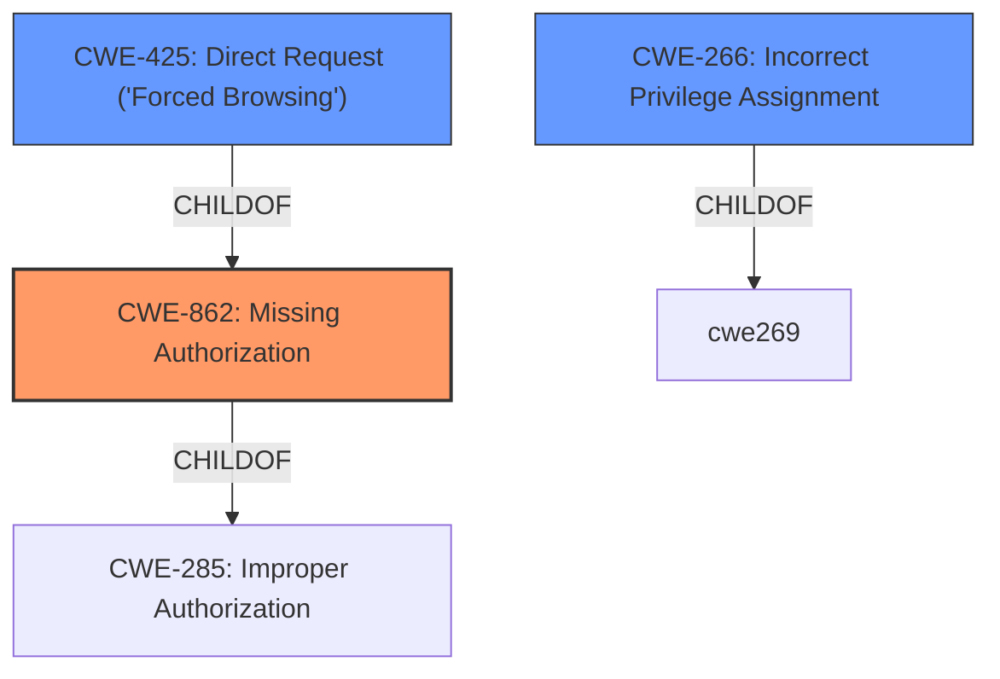

# Analysis Report for CVE-2021-24733

# Vulnerability Analysis Report: CVE-2021-24733

## Description


## Analysis (with Relationship Data)

# Summary
| CWE ID | CWE Name | Confidence | CWE Abstraction Level | CWE Vulnerability Mapping Label | CWE-Vulnerability Mapping Notes |
|---|---|---|---|---|---|
| CWE-862 | Missing Authorization | 0.9 | Class | Allowed-with-Review | Primary CWE |
| CWE-425 | Direct Request ('Forced Browsing') | 0.7 | Base | Allowed | Secondary Candidate |
| CWE-266 | Incorrect Privilege Assignment | 0.6 | Base | Allowed | Secondary Candidate |

## Evidence and Confidence

*   **Confidence Score:** 0.9
*   **Evidence Strength:** HIGH

## Relationship Analysis
The primary weakness is **CWE-862 [Missing Authorization]**, which is a Class-level CWE. The vulnerability description highlights a **lack of proper access control**, allowing users with minimal privileges to access resources they shouldn't. **CWE-862 [Missing Authorization]** is a child of **CWE-285 [Improper Authorization]**, but **CWE-862 [Missing Authorization]** is more specific because it indicates the authorization check is absent, not just incorrectly performed. **CWE-425 [Direct Request ('Forced Browsing')]** is related because the vulnerability allows direct access to posts, bypassing the intended access controls. **CWE-266 [Incorrect Privilege Assignment]** is also relevant as the Contributor role is incorrectly allowed access to sensitive posts.


## Vulnerability Chain
The vulnerability chain starts with the **missing authorization** check (**CWE-862 [Missing Authorization]**). This leads to **unauthorized access** to draft and password-protected posts, ultimately resulting in **information disclosure**.

## Summary of Analysis
The initial analysis focused on the **lack of access control** in the WP Post Page Clone plugin, which allows Contributor roles to access and clone other users' draft and password-protected posts. This is a clear case of **missing authorization**. The "**Root cause of vulnerability**" confirms the "**lack of proper access control**" and the "**Broken Access Control**". The "**Attack vectors**" section shows that a Contributor can use the "Click to Clone" feature to gain access, further supporting the **missing authorization** aspect.

The primary CWE selected is **CWE-862 [Missing Authorization]** because the plugin **fails to perform an authorization check** before allowing a user to clone and view other users' posts. This is supported by the vulnerability description and the CVE reference.

**CWE-425 [Direct Request ('Forced Browsing')]** was considered, as it describes a scenario where the application does not adequately enforce authorization on restricted URLs. This is related because the cloning feature allows direct access to posts that should be restricted.

**CWE-266 [Incorrect Privilege Assignment]** was also considered. The vulnerability description indicates that the Contributor role has **incorrect privileges**, allowing them to clone posts that should be restricted from them.

**CWE-863 [Incorrect Authorization]** was initially considered as it was the top result in Retriever Results but was rejected as the evidence indicates the authorization check is missing.

The selected CWEs are at the optimal level of specificity. **CWE-862 [Missing Authorization]** accurately describes the root cause, which is the lack of an authorization check. **CWE-425 [Direct Request ('Forced Browsing')]** and **CWE-266 [Incorrect Privilege Assignment]** provide additional context about how the vulnerability manifests.

Relevant CWE Information:

# Enhanced Context (25 CWEs)
The following CWEs were identified as potentially relevant to this vulnerability:

## CWE-434: Unrestricted Upload of File with Dangerous Type
**Abstraction Level**: Base
**Similarity Score**: 0.79
**Source**: dense

**Description**:
The product allows the upload or transfer of dangerous file types that are automatically processed within its environment.

**Mapping Guidance**:
- Usage: Allowed
- Rationale: This CWE entry is at the Base level of abstraction, which is a preferred level of abstraction for mapping to the root causes of vulnerabilities.


## CWE-552: Files or Directories Accessible to External Parties
**Abstraction Level**: Base
**Similarity Score**: 0.79
**Source**: dense

**Description**:
The product makes files or directories accessible to unauthorized actors, even though they should not be.

**Mapping Guidance**:
- Usage: Allowed
- Rationale: This CWE entry is at the Base level of abstraction, which is a preferred level of abstraction for mapping to the root causes of vulnerabilities.


## CWE-472: External Control of Assumed-Immutable Web Parameter
**Abstraction Level**: Base
**Similarity Score**: 0.78
**Source**: dense

**Description**:
The web application does not sufficiently verify inputs that are assumed to be immutable but are actually externally controllable, such as hidden form fields.

**Mapping Guidance**:
- Usage: Allowed
- Rationale: This CWE entry is at the Base level of abstraction, which is a preferred level of abstraction for mapping to the root causes of vulnerabilities.


## CWE-538: Insertion of Sensitive Information into Externally-Accessible File or Directory
**Abstraction Level**: Base
**Similarity Score**: 0.77
**Source**: dense

**Description**:
The product places sensitive information into files or directories that are accessible to actors who are allowed to have access to the files, but not to the sensitive information.

**Mapping Guidance**:
- Usage: Allowed
- Rationale: This CWE entry is at the Base level of abstraction, which is a preferred level of abstraction for mapping to the root causes of vulnerabilities.


## CWE-184: Incomplete List of Disallowed Inputs
**Abstraction Level**: Base
**Similarity Score**: 0.77
**Source**: dense

**Description**:
The product implements a protection mechanism that relies on a list of inputs (or properties of inputs) that are not allowed by policy or otherwise require other action to neutralize before additional processing takes place, but the list is incomplete.

**Mapping Guidance**:
- Usage: Allowed
- Rationale: This CWE entry is at the Base level of abstraction, which is a preferred level of abstraction for mapping to the root causes of vulnerabilities.


## CWE-425: Direct Request ('Forced Browsing')
**Abstraction Level**: Base
**Similarity Score**: 0.77
**Source**: dense

**Description**:
The web application does not adequately enforce appropriate authorization on all restricted URLs, scripts, or files.

**Mapping Guidance**:
- Usage: Allowed
- Rationale: This CWE entry is at the Base level of abstraction, which is a preferred level of abstraction for mapping to the root causes of vulnerabilities.


## CWE-639: Authorization Bypass Through User-Controlled Key
**Abstraction Level**: Base
**Similarity Score**: 0.77
**Source**: dense

**Description**:
The system's authorization functionality does not prevent one user from gaining access to another user's data or record by modifying the key value identifying the data.

**Mapping Guidance**:
- Usage: Allowed
- Rationale: This CWE entry is at the Base level of abstraction, which is a preferred level of abstraction for mapping to the root causes of vulnerabilities.


## CWE-41: Improper Resolution of Path Equivalence
**Abstraction Level**: Base
**Similarity Score**: 0.77
**Source**: dense

**Description**:
The product is vulnerable to file system contents disclosure through path equivalence. Path equivalence involves the use of special characters in file and directory names. The associated manipulations are intended to generate multiple names for the same object.

**Mapping Guidance**:
- Usage: Allowed
- Rationale: This CWE entry is at the Base level of abstraction, which is a preferred level of abstraction for mapping to the root causes of vulnerabilities.


## CWE-23: Relative Path Traversal
**Abstraction Level**: Base
**Similarity Score**: 0.77
**Source**: dense

**Description**:
The product uses external input to construct a pathname that should be within a restricted directory, but it does not properly neutralize sequences such as ".." that can resolve to a location that is outside of that directory.

**Mapping Guidance**:
- Usage: Allowed
- Rationale: This CWE entry is at the Base level of abstraction, which is a preferred level of abstraction for mapping to the root causes of vulnerabilities.


## CWE-807: Reliance on Untrusted Inputs in a Security Decision
**Abstraction Level**: Base
**Similarity Score**: 0.76
**Source


## CWE Relationship Analysis

Current CWEs represent these abstraction levels: .


### Vulnerability Chain Analysis

**Chain starting from CWE-862:**
- 862 (Missing Authorization) - ROOT


**Chain starting from CWE-41:**
- 41 (Improper Resolution of Path Equivalence) - ROOT


### CWE Relationship Diagram

```mermaid
graph TD
    classDef primary fill:#f96,stroke:#333,stroke-width:2px
    classDef secondary fill:#69f,stroke:#333
    classDef tertiary fill:#9e9,stroke:#333
```


*Report generated on 2025-04-02 13:01:29*
