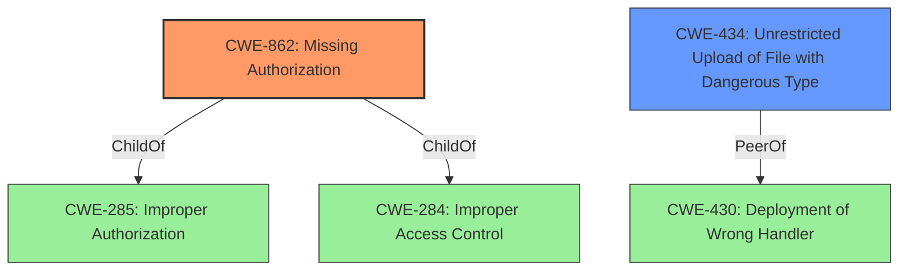

# Enhanced Analysis for CVE-2021-24757

# Summary
| CWE ID | CWE Name | Confidence | CWE Abstraction Level | CWE Vulnerability Mapping Label | CWE-Vulnerability Mapping Notes |
|---|---|---|---|---|---|
| CWE-862 | Missing Authorization | 1 | Class | Primary | Allowed-with-Review |
| CWE-434 | Unrestricted Upload of File with Dangerous Type | 0.8 | Base | Secondary | Allowed |

## Evidence and Confidence

*   **Confidence Score:** 0.9
*   **Evidence Strength:** HIGH

## Relationship Analysis
The primary relationship is that CWE-862 [CWE-862: Missing Authorization] is a child of CWE-285 [CWE-285: Improper Authorization] and CWE-284 [CWE-284: Improper Access Control]. CWE-434 [CWE-434: Unrestricted Upload of File with Dangerous Type] is a peer of CWE-430 [CWE-430: Deployment of Wrong Handler]. We select the child CWE when a more specific CWE can be identified.



## Vulnerability Chain
The chain of events is as follows:
1.  **Root Cause:** **Lack of capability checks** in the `spl_upload_ser_img` AJAX action.
2.  **Weakness:** CWE-862 [CWE-862: Missing Authorization]: The application **does not perform an authorization check** when an actor attempts to access the resource or perform the action.
3.  **Impact:** Unauthenticated users can upload images, potentially leading to the upload of malicious content, defacement, or other security issues (CWE-434 [CWE-434: Unrestricted Upload of File with Dangerous Type]).

## Summary of Analysis
Initially, the vulnerability allows unauthenticated users to upload images due to the **lack of capability checks**. Later, even after unauthenticated access was removed, the action still lacked proper authorization checks, making it exploitable by any authenticated user.

The primary weakness is CWE-862 [CWE-862: Missing Authorization] because the application **does not perform the necessary authorization checks**. This aligns with the description of CWE-862, where "the product **does not perform an authorization check** when an actor attempts to access a resource or perform an action." The vulnerability description key phrases state a **lack of capability checks**, and the CVE reference links confirm that the plugin's AJAX action `spl_upload_ser_img` for uploading images **lacked capability checks**.

The secondary weakness is CWE-434 [CWE-434: Unrestricted Upload of File with Dangerous Type] because the **missing authorization** leads to the **unrestricted upload of files**, which is a dangerous file type. The CVE reference links confirm that the vulnerability allows unauthenticated users to upload arbitrary image files.

CWE-285 [CWE-285: Improper Authorization] was considered but not selected because it's a more general case that includes both missing and incorrect authorization, and CWE-862 [CWE-862: Missing Authorization] provides a more precise description of the vulnerability. CWE-863 [CWE-863: Incorrect Authorization] was also considered, but it does not fit because the authorization check is **missing**, not **incorrect**. CWE-425 [CWE-425: Direct Request ('Forced Browsing')] was also considered, but the root cause is not directly related to direct requests but rather to the absence of authorization checks.


## CWE Relationship Analysis

Current CWEs represent these abstraction levels: .


### Vulnerability Chain Analysis

**Chain starting from CWE-862:**
- 862 (Missing Authorization) - ROOT


**Chain starting from CWE-284:**
- 284 (Improper Access Control) - ROOT


### CWE Relationship Diagram

```mermaid
graph TD
    classDef primary fill:#f96,stroke:#333,stroke-width:2px
    classDef secondary fill:#69f,stroke:#333
    classDef tertiary fill:#9e9,stroke:#333
```