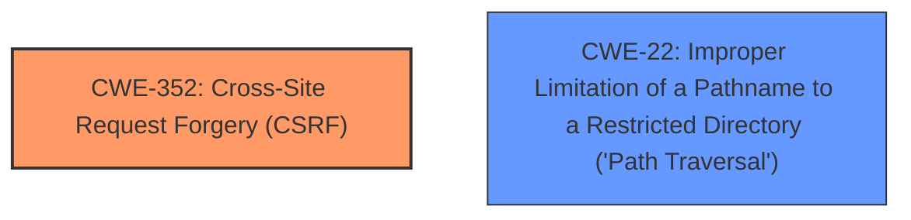

# Raw Analyzer Response for CVE-2021-24761

# Summary
| CWE ID    | CWE Name                                                                       | Confidence | CWE Abstraction Level | CWE Vulnerability Mapping Label | CWE-Vulnerability Mapping Notes |
| :-------- | :----------------------------------------------------------------------------- | :--------- | :-------------------- | :------------------------------ | :------------------------------ |
| CWE-352   | Cross-Site Request Forgery (CSRF)                                              | 0.9        | Compound              | Primary                         | Allowed                         |
| CWE-22    | Improper Limitation of a Pathname to a Restricted Directory ('Path Traversal') | 0.9        | Base                  | Secondary                       | Allowed                         |

## Evidence and Confidence

*   **Confidence Score:** 0.9
*   **Evidence Strength:** HIGH

## Relationship Analysis
The primary weakness is CWE-352 [CWE-352: Cross-Site Request Forgery (CSRF)], which occurs due to the **missing nonce check**. The secondary weakness is CWE-22 [CWE-22: Improper Limitation of a Pathname to a Restricted Directory ('Path Traversal')], caused by the **lack of path traversal prevention**. These weaknesses are independent but can be exploited together. There are no direct hierarchical relationships between CWE-352 and CWE-22. However, both are often related to input validation and authorization issues.

## Vulnerability Chain
The vulnerability chain starts with two independent weaknesses:
1.  **Missing Nonce Check:** This leads to CWE-352 [CWE-352: Cross-Site Request Forgery (CSRF)], allowing an attacker to forge requests on behalf of a logged-in administrator.
2.  **Lack of Path Traversal Prevention:** This leads to CWE-22 [CWE-22: Improper Limitation of a Pathname to a Restricted Directory ('Path Traversal')], allowing an attacker to manipulate file paths to access or delete arbitrary files.

The combination of these weaknesses allows an attacker to **delete arbitrary text files** on the web server, as a logged-in administrator could be tricked into deleting files outside the intended directory due to the **lack of path traversal prevention**, and the request can be initiated without a valid nonce due to the **missing nonce check**.

## Summary of Analysis
The primary vulnerability is CWE-352 [CWE-352: Cross-Site Request Forgery (CSRF)] due to the **missing nonce check** when deleting a log file. The vulnerability description explicitly states "The Error Log Viewer WordPress plugin before 1.1.2 does not perform nonce check when deleting a log file...". This **allows attackers to make a logged in admin delete arbitrary text files on the web server.**

The secondary vulnerability is CWE-22 [CWE-22: Improper Limitation of a Pathname to a Restricted Directory ('Path Traversal')] because the plugin "does not have path traversal prevention, which could allow attackers to make a logged in admin delete arbitrary text files on the web server." This indicates that user-supplied input used to construct the file path is not properly validated, allowing attackers to specify paths outside the intended directory.

CWE-352 [CWE-352: Cross-Site Request Forgery (CSRF)] is a compound weakness that accurately reflects the **missing nonce check** issue. CWE-22 [CWE-22: Improper Limitation of a Pathname to a Restricted Directory ('Path Traversal')] is a base-level weakness that appropriately captures the **lack of path traversal prevention**. These CWEs are selected because they directly map to the identified root causes in the vulnerability description. Both CWEs are at the optimal level of specificity, providing a clear and accurate representation of the weaknesses.

Other CWEs were considered, such as CWE-862 [CWE-862: Missing Authorization] and CWE-434 [CWE-434: Unrestricted Upload of File with Dangerous Type], but they were not as directly relevant as CWE-352 [CWE-352: Cross-Site Request Forgery (CSRF)] and CWE-22 [CWE-22: Improper Limitation of a Pathname to a Restricted Directory ('Path Traversal')]. Specifically, CWE-862 [CWE-862: Missing Authorization] addresses authorization checks, while the vulnerability is more about CSRF due to the **missing nonce check**. CWE-434 [CWE-434: Unrestricted Upload of File with Dangerous Type] concerns file uploads, which is not the case in this vulnerability.