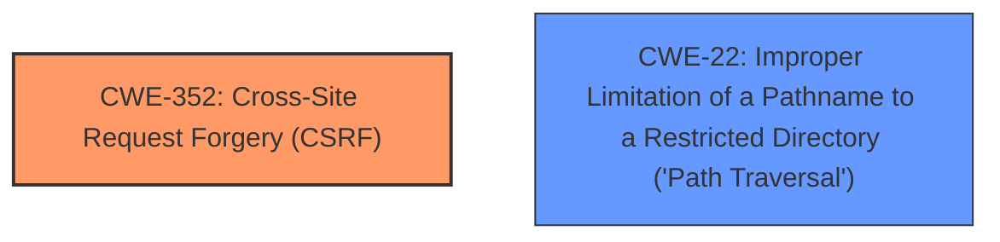

# Analysis for CVE-2021-24761

# Summary
| CWE ID    | CWE Name                                                                       | Confidence | CWE Abstraction Level | CWE Vulnerability Mapping Label | CWE-Vulnerability Mapping Notes |
| :-------- | :----------------------------------------------------------------------------- | :--------- | :-------------------- | :------------------------------ | :------------------------------ |
| CWE-352   | Cross-Site Request Forgery (CSRF)                                              | 0.9        | Compound              | Primary                         | Allowed                         |
| CWE-22    | Improper Limitation of a Pathname to a Restricted Directory ('Path Traversal') | 0.9        | Base                  | Secondary                       | Allowed                         |

## Evidence and Confidence

*   **Confidence Score:** 0.9
*   **Evidence Strength:** HIGH

## Relationship Analysis
The primary weakness is CWE-352 [CWE-352: Cross-Site Request Forgery (CSRF)], which occurs due to the **missing nonce check**. The secondary weakness is CWE-22 [CWE-22: Improper Limitation of a Pathname to a Restricted Directory ('Path Traversal')], caused by the **lack of path traversal prevention**. These weaknesses are independent but can be exploited together. There are no direct hierarchical relationships between CWE-352 and CWE-22. However, both are often related to input validation and authorization issues.

## Vulnerability Chain
The vulnerability chain starts with two independent weaknesses:
1.  **Missing Nonce Check:** This leads to CWE-352 [CWE-352: Cross-Site Request Forgery (CSRF)], allowing an attacker to forge requests on behalf of a logged-in administrator.
2.  **Lack of Path Traversal Prevention:** This leads to CWE-22 [CWE-22: Improper Limitation of a Pathname to a Restricted Directory ('Path Traversal')], allowing an attacker to manipulate file paths to access or delete arbitrary files.

The combination of these weaknesses allows an attacker to **delete arbitrary text files** on the web server, as a logged-in administrator could be tricked into deleting files outside the intended directory due to the **lack of path traversal prevention**, and the request can be initiated without a valid nonce due to the **missing nonce check**.

## Summary of Analysis
The primary vulnerability is CWE-352 [CWE-352: Cross-Site Request Forgery (CSRF)] due to the **missing nonce check** when deleting a log file. The vulnerability description explicitly states "The Error Log Viewer WordPress plugin before 1.1.2 does not perform nonce check when deleting a log file...". This **allows attackers to make a logged in admin delete arbitrary text files on the web server.**

The secondary vulnerability is CWE-22 [CWE-22: Improper Limitation of a Pathname to a Restricted Directory ('Path Traversal')] because the plugin "does not have path traversal prevention, which could allow attackers to make a logged in admin delete arbitrary text files on the web server." This indicates that user-supplied input used to construct the file path is not properly validated, allowing attackers to specify paths outside the intended directory.

CWE-352 [CWE-352: Cross-Site Request Forgery (CSRF)] is a compound weakness that accurately reflects the **missing nonce check** issue. CWE-22 [CWE-22: Improper Limitation of a Pathname to a Restricted Directory ('Path Traversal')] is a base-level weakness that appropriately captures the **lack of path traversal prevention**. These CWEs are selected because they directly map to the identified root causes in the vulnerability description. Both CWEs are at the optimal level of specificity, providing a clear and accurate representation of the weaknesses.

Other CWEs were considered, such as CWE-862 [CWE-862: Missing Authorization] and CWE-434 [CWE-434: Unrestricted Upload of File with Dangerous Type], but they were not as directly relevant as CWE-352 [CWE-352: Cross-Site Request Forgery (CSRF)] and CWE-22 [CWE-22: Improper Limitation of a Pathname to a Restricted Directory ('Path Traversal')]. Specifically, CWE-862 [CWE-862: Missing Authorization] addresses authorization checks, while the vulnerability is more about CSRF due to the **missing nonce check**. CWE-434 [CWE-434: Unrestricted Upload of File with Dangerous Type] concerns file uploads, which is not the case in this vulnerability.

# Enhanced Query for CVE-2021-24761

# Vulnerability Description

    The Error Log Viewer WordPress plugin before 1.1.2 does not perform nonce check when deleting a log file and does not have path traversal prevention, which could allow attackers to make a logged in admin delete arbitrary text files on the web server.

    # Keyphrase-Specific CWE Analysis
    This vulnerability contains multiple keyphrases that may map to different CWEs. 
    Please analyze each keyphrase separately and determine the most appropriate CWE(s) for each.

    ## ROOTCAUSE: 'missing nonce check'

Relevant CWEs for this ROOTCAUSE:

### 1. CWE-352: Cross-Site Request Forgery (CSRF) (Score: 362.59)

The web application does not, or can not, sufficiently verify whether a well-formed, valid, consistent request was intentionally provided by the user who submitted the request....

### 2. CWE-862: Missing Authorization (Score: 323.26)

The product does not perform an authorization check when an actor attempts to access a resource or perform an action....

### 3. CWE-22: Improper Limitation of a Pathname to a Restricted Directory ('Path Traversal') (Score: 302.91)

The product uses external input to construct a pathname that is intended to identify a file or directory that is located underneath a restricted parent directory, but the product does not properly neutralize special elements within the pathname that can cause the pathname to resolve to a location th...

### 4. CWE-434: Unrestricted Upload of File with Dangerous Type (Score: 282.60)

The product allows the upload or transfer of dangerous file types that are automatically processed within its environment....

### 5. CWE-863: Incorrect Authorization (Score: 276.85)

The product performs an authorization check when an actor attempts to access a resource or perform an action, but it does not correctly perform the check....

## ROOTCAUSE: 'lack of path traversal prevention'

Relevant CWEs for this ROOTCAUSE:

### 1. CWE-352: Cross-Site Request Forgery (CSRF) (Score: 362.59)

The web application does not, or can not, sufficiently verify whether a well-formed, valid, consistent request was intentionally provided by the user who submitted the request....

### 2. CWE-23: Relative Path Traversal (Score: 313.50)

The product uses external input to construct a pathname that should be within a restricted directory, but it does not properly neutralize sequences such as ".." that can resolve to a location that is outside of that directory....

### 3. CWE-59: Improper Link Resolution Before File Access ('Link Following') (Score: 310.90)

The product attempts to access a file based on the filename, but it does not properly prevent that filename from identifying a link or shortcut that resolves to an unintended resource....

### 4. CWE-22: Improper Limitation of a Pathname to a Restricted Directory ('Path Traversal') (Score: 302.91)

The product uses external input to construct a pathname that is intended to identify a file or directory that is located underneath a restricted parent directory, but the product does not properly neutralize special elements within the pathname that can cause the pathname to resolve to a location th...

### 5. CWE-434: Unrestricted Upload of File with Dangerous Type (Score: 282.60)

The product allows the upload or transfer of dangerous file types that are automatically processed within its environment....

## IMPACT: 'delete arbitrary text files'

Relevant CWEs for this IMPACT:

### 1. CWE-352: Cross-Site Request Forgery (CSRF) (Score: 362.59)

The web application does not, or can not, sufficiently verify whether a well-formed, valid, consistent request was intentionally provided by the user who submitted the request....

### 2. CWE-862: Missing Authorization (Score: 323.26)

The product does not perform an authorization check when an actor attempts to access a resource or perform an action....

### 3. CWE-22: Improper Limitation of a Pathname to a Restricted Directory ('Path Traversal') (Score: 302.91)

The product uses external input to construct a pathname that is intended to identify a file or directory that is located underneath a restricted parent directory, but the product does not properly neutralize special elements within the pathname that can cause the pathname to resolve to a location th...

### 4. CWE-434: Unrestricted Upload of File with Dangerous Type (Score: 282.60)

The product allows the upload or transfer of dangerous file types that are automatically processed within its environment....

### 5. CWE-178: Improper Handling of Case Sensitivity (Score: 94.26)

The product does not properly account for differences in case sensitivity when accessing or determining the properties of a resource, leading to inconsistent results....

## ATTACKER: 'logged in admin'

Relevant CWEs for this ATTACKER:

### 1. CWE-352: Cross-Site Request Forgery (CSRF) (Score: 362.59)

The web application does not, or can not, sufficiently verify whether a well-formed, valid, consistent request was intentionally provided by the user who submitted the request....

### 2. CWE-862: Missing Authorization (Score: 323.26)

The product does not perform an authorization check when an actor attempts to access a resource or perform an action....

### 3. CWE-22: Improper Limitation of a Pathname to a Restricted Directory ('Path Traversal') (Score: 302.91)

The product uses external input to construct a pathname that is intended to identify a file or directory that is located underneath a restricted parent directory, but the product does not properly neutralize special elements within the pathname that can cause the pathname to resolve to a location th...

### 4. CWE-434: Unrestricted Upload of File with Dangerous Type (Score: 282.60)

The product allows the upload or transfer of dangerous file types that are automatically processed within its environment....

### 5. CWE-425: Direct Request ('Forced Browsing') (Score: 100.04)

The web application does not adequately enforce appropriate authorization on all restricted URLs, scripts, or files....

## PRODUCT: 'Error Log Viewer WordPress plugin'

Relevant CWEs for this PRODUCT:

### 1. CWE-352: Cross-Site Request Forgery (CSRF) (Score: 362.59)

The web application does not, or can not, sufficiently verify whether a well-formed, valid, consistent request was intentionally provided by the user who submitted the request....

### 2. CWE-862: Missing Authorization (Score: 323.26)

The product does not perform an authorization check when an actor attempts to access a resource or perform an action....

### 3. CWE-22: Improper Limitation of a Pathname to a Restricted Directory ('Path Traversal') (Score: 302.91)

The product uses external input to construct a pathname that is intended to identify a file or directory that is located underneath a restricted parent directory, but the product does not properly neutralize special elements within the pathname that can cause the pathname to resolve to a location th...

### 4. CWE-434: Unrestricted Upload of File with Dangerous Type (Score: 282.60)

The product allows the upload or transfer of dangerous file types that are automatically processed within its environment....

### 5. CWE-425: Direct Request ('Forced Browsing') (Score: 100.04)

The web application does not adequately enforce appropriate authorization on all restricted URLs, scripts, or files....

## VERSION: 'before 1.1.2'

Relevant CWEs for this VERSION:

### 1. CWE-352: Cross-Site Request Forgery (CSRF) (Score: 362.59)

The web application does not, or can not, sufficiently verify whether a well-formed, valid, consistent request was intentionally provided by the user who submitted the request....

### 2. CWE-862: Missing Authorization (Score: 323.26)

The product does not perform an authorization check when an actor attempts to access a resource or perform an action....

### 3. CWE-22: Improper Limitation of a Pathname to a Restricted Directory ('Path Traversal') (Score: 302.91)

The product uses external input to construct a pathname that is intended to identify a file or directory that is located underneath a restricted parent directory, but the product does not properly neutralize special elements within the pathname that can cause the pathname to resolve to a location th...

### 4. CWE-434: Unrestricted Upload of File with Dangerous Type (Score: 282.60)

The product allows the upload or transfer of dangerous file types that are automatically processed within its environment....

### 5. CWE-863: Incorrect Authorization (Score: 276.85)

The product performs an authorization check when an actor attempts to access a resource or perform an action, but it does not correctly perform the check....

    # Analysis Instructions
    1. For each keyphrase, identify the most appropriate CWE(s) that represent the weakness.
    2. Consider how the different keyphrases might relate to each other in the vulnerability chain.
    3. Provide a final determination of primary CWE(s) and any secondary CWEs.
    4. Format your response using the standard analysis template.

    Please analyze how these different weaknesses interact and provide a comprehensive CWE classification.
    