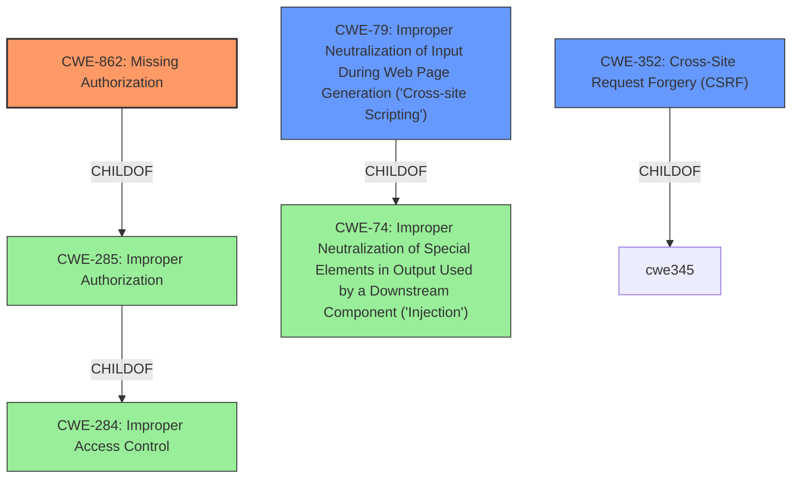

# Enhanced Analysis for CVE-2021-24763

# Summary
| CWE ID  | CWE Name                                                                       | Confidence | CWE Abstraction Level | CWE Vulnerability Mapping Label | CWE-Vulnerability Mapping Notes |
| :-------- | :----------------------------------------------------------------------------- | :---------- | :---------------------- | :------------------------------ | :------------------------------ |
| CWE-862   | Missing Authorization                                                          | 0.9         | Class                   | Primary                         | Allowed-with-Review             |
| CWE-352   | Cross-Site Request Forgery (CSRF)                                            | 0.8         | Compound                | Secondary                       | Allowed                       |
| CWE-79    | Improper Neutralization of Input During Web Page Generation ('Cross-site Scripting') | 0.7         | Base                    | Secondary                       | Allowed                       |

## Evidence and Confidence

*   **Confidence Score:** 0.8
*   **Evidence Strength:** HIGH

## Relationship Analysis
The primary weakness is the **lack of authorization** (CWE-862), which falls under the broader category of **Improper Authorization** (CWE-285) and ultimately **Improper Access Control** (CWE-284). The absence of CSRF checks (CWE-352) makes the application susceptible to cross-site request forgery attacks. The **lack of sanitization** leads to **Improper Neutralization of Input During Web Page Generation** ('Cross-site Scripting') (CWE-79).



## Vulnerability Chain
The vulnerability chain starts with a **missing authorization** check. Because of this **lack of authorization**, unauthenticated users can access the `save_global_setting` AJAX action. The chain continues with the **lack of CSRF checks**, which allows attackers to trick authenticated users into making unwanted requests. Finally, the chain ends with the **lack of sanitization and escaping**, which allows for stored XSS.

## Summary of Analysis
The analysis indicates a vulnerability in the Perfect Survey WordPress plugin due to a **lack of proper authorization and CSRF checks** in the `save_global_setting` AJAX action, compounded by a **lack of sanitization and escaping** of settings, leading to a stored XSS vulnerability.

The primary CWE is CWE-862 (**Missing Authorization**), as the root cause of the issue is the **absence of an authorization check**. This allows unauthenticated users to access and modify plugin settings. The evidence for this is in the "Vulnerability Description Key Phrases" which states: "**rootcause:** **lack of proper authorization and CSRF checks**" and in the "CVE Reference Links Content Summary" which states: "* **Missing Authorization:** The plugin does not verify if the user initiating the AJAX request has the necessary permissions to perform the action. This allows unauthenticated users to access and modify plugin settings."

CWE-352 (**Cross-Site Request Forgery (CSRF)**) is a secondary CWE, as the absence of CSRF checks allows attackers to trick authenticated users into performing unwanted actions. The evidence for this is in the "Vulnerability Description Key Phrases" which states: "**rootcause:** **lack of proper authorization and CSRF checks**" and in the "CVE Reference Links Content Summary" which states: "* **Missing CSRF Protection:** The absence of CSRF checks makes it possible for attackers to trick authenticated users into performing unwanted actions, including changing settings."

CWE-79 (**Improper Neutralization of Input During Web Page Generation ('Cross-site Scripting')**) is also a secondary CWE, stemming from the **lack of sanitization and escaping** of user-supplied data, leading to a stored XSS vulnerability. The evidence for this is in the "Vulnerability Description Key Phrases" which states: "**weakness:** **cross-site scripting**" and in the "CVE Reference Links Content Summary" which states: "* **Stored Cross-Site Scripting (XSS):**  The plugin does not properly sanitize or escape user input when updating settings. This allows an attacker to inject malicious JavaScript code, which will then be executed in the context of any user who views a survey using the affected plugin."

Other CWEs considered but not used:

*   CWE-284 (**Improper Access Control**): While the vulnerability does involve access control issues, CWE-862 (**Missing Authorization**) is a more specific and accurate representation of the root cause. CWE-284 is too high-level.
*   CWE-285 (**Improper Authorization**): Similar to CWE-284, CWE-862 (**Missing Authorization**) provides a more precise description of the vulnerability.
*   CWE-116 (**Improper Encoding or Escaping of Output**): While related to the XSS vulnerability, CWE-79 (**Improper Neutralization of Input During Web Page Generation ('Cross-site Scripting')**) is a more direct and applicable classification.
*   CWE-472 (**External Control of Assumed-Immutable Web Parameter**): This CWE is not applicable, as the vulnerability does not involve the modification of assumed-immutable web parameters.
*   CWE-863 (**Incorrect Authorization**): While the description has the word "incorrect" in it, there is no authorization check at all, so the authorization is missing.

The selected CWEs are at the optimal level of specificity, providing a clear and accurate representation of the vulnerability's root causes and weaknesses.


## CWE Relationship Analysis

Current CWEs represent these abstraction levels: .


### Vulnerability Chain Analysis

**Chain starting from CWE-79:**
- 79 (Improper Neutralization of Input During Web Page Generation ('Cross-site Scripting')) - ROOT


**Chain starting from CWE-862:**
- 862 (Missing Authorization) - ROOT


### CWE Relationship Diagram

```mermaid
graph TD
    classDef primary fill:#f96,stroke:#333,stroke-width:2px
    classDef secondary fill:#69f,stroke:#333
    classDef tertiary fill:#9e9,stroke:#333
```