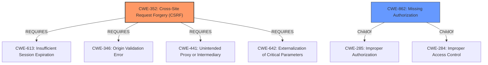

# Enhanced Analysis for CVE-2021-24779

# Summary
| CWE ID | CWE Name | Confidence | CWE Abstraction Level | CWE Vulnerability Mapping Label | CWE-Vulnerability Mapping Notes |
|---|---|---|---|---|---|
| CWE-352 | Cross-Site Request Forgery (CSRF) | 0.9 | Compound | Allowed | Primary CWE |
| CWE-862 | Missing Authorization | 0.9 | Class | Allowed-with-Review | Secondary Candidate |

## Evidence and Confidence

*   **Confidence Score:** 0.9
*   **Evidence Strength:** HIGH

## Relationship Analysis
The analysis focuses on the relationship between **CWE-352 (Cross-Site Request Forgery (CSRF))** and **CWE-862 (Missing Authorization)**.

- **CWE-352** is a Compound CWE that **requires** other CWEs like **CWE-346 (Origin Validation Error)**, **CWE-441 (Unintended Proxy or Intermediary)**, **CWE-642 (Externalization of Critical Parameters)** and **CWE-613 (Insufficient Session Expiration)**. In this instance, we are looking at the **missing** CSRF check.
- **CWE-862** is a Class CWE that is a child of **CWE-285 (Improper Authorization)** and **CWE-284 (Improper Access Control)**, indicating a general lack of authorization.

The primary choice is CWE-352 since the vulnerability description explicitly mentions the **missing CSRF checks**. The secondary choice is CWE-862 because the description also mentions **missing authorisation**.



## Vulnerability Chain
The vulnerability chain starts with the **missing authorisation and CSRF checks** in the `update_settings()` function of the WP Debugging WordPress plugin. This leads to the ability for **unauthenticated users** to **update settings**, potentially causing unintended changes or disruption.

Root Cause: **Missing authorisation and CSRF checks**
Weakness: Unauthenticated access
Impact: Settings can be updated by unauthenticated users

## Summary of Analysis
The initial analysis identified both **missing authorisation and CSRF checks** as key weaknesses.
The retriever results also pointed to both CWE-352 and CWE-862. The final decision relies heavily on the explicit mention of both **missing authorisation and CSRF checks** in the vulnerability description key phrases and the CVE reference.

> Vulnerability Description Key Phrases
> - **rootcause:** **missing authorisation and CSRF checks**
> CVE Reference Links Content Summary
> - Missing authorization checks
> - Missing CSRF protection

CWE-352 is chosen as the primary CWE due to the explicit mention of **missing CSRF checks**, a hallmark of this vulnerability type. The CWE-352 description matches this scenario where the application does not sufficiently verify that the request was intentionally provided by the user.
CWE-862 is added as a secondary CWE because the vulnerability description key phrases also indicates **missing authorization**.

Both selected CWEs are at appropriate levels of specificity (Compound and Class).
CWE-352 is at the compound level because it is a composition of multiple CWEs.
CWE-862 is at the class level because it represents the absence of an authorization check.

Relevant CWE Information:
- CWE-352: Cross-Site Request Forgery (CSRF)
- CWE-862: Missing Authorization


## CWE Relationship Analysis

Current CWEs represent these abstraction levels: .


### Vulnerability Chain Analysis

**Chain starting from CWE-862:**
- 862 (Missing Authorization) - ROOT


**Chain starting from CWE-284:**
- 284 (Improper Access Control) - ROOT


### CWE Relationship Diagram

```mermaid
graph TD
    classDef primary fill:#f96,stroke:#333,stroke-width:2px
    classDef secondary fill:#69f,stroke:#333
    classDef tertiary fill:#9e9,stroke:#333
```