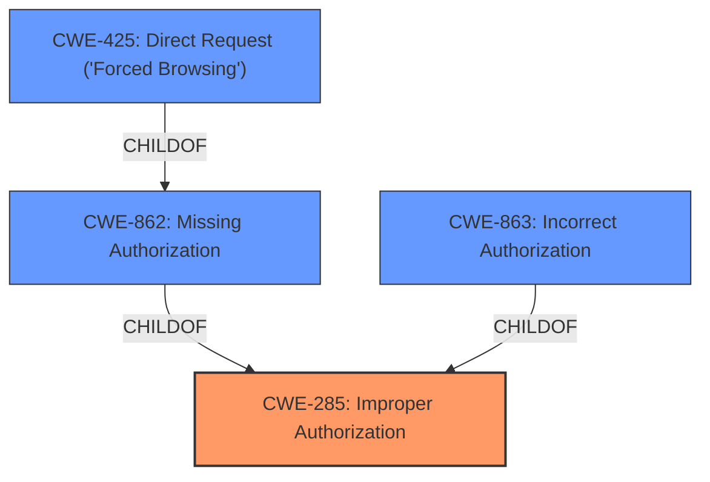

# Analysis for CVE-2021-24788

# Summary
| CWE ID | CWE Name | Confidence | CWE Abstraction Level | CWE Vulnerability Mapping Label | CWE-Vulnerability Mapping Notes |
|---|---|---|---|---|---|
| CWE-285 | Improper Authorization | 0.9 | Class | Primary | Discouraged, but selected due to lack of a more specific Base level CWE. |
| CWE-862 | Missing Authorization | 0.7 | Class | Secondary | Allowed-with-Review, as a potential more specific child of CWE-285. |
| CWE-863 | Incorrect Authorization | 0.6 | Class | Secondary | Allowed-with-Review, as another potential more specific child of CWE-285. |
| CWE-425 | Direct Request ('Forced Browsing') | 0.5 | Base | Secondary | Allowed. |

## Evidence and Confidence

*   **Confidence Score:** 0.8
*   **Evidence Strength:** HIGH

## Relationship Analysis
The primary CWE is CWE-285, "Improper Authorization," a Class-level CWE. The analysis considered its child CWEs, CWE-862, "Missing Authorization," and CWE-863, "Incorrect Authorization," as well as CWE-425, "Direct Request ('Forced Browsing')" as possible base level children. The vulnerability involves authenticated users gaining unauthorized access to functionality, which aligns with authorization issues.

## Vulnerability Chain
The chain of events in this vulnerability is as follows:
1.  The plugin defines custom AJAX actions.
2.  Authentication is required for these actions, but they are available to all user roles.
3.  Any authenticated user, including subscribers, can add/set/delete arbitrary categories to posts.

This represents a broken access control issue where the **authorization** mechanism is **improperly** implemented.

## Summary of Analysis
The initial assessment identified CWE-285 "Improper Authorization" as the primary candidate due to the broken access control where authenticated users are able to perform actions they should not be authorized to perform.

The evidence supporting this decision comes from the "CVE Reference Links Content Summary" section, which states: "**Root cause of vulnerability**: The plugin defines custom AJAX actions that, while requiring authentication, are available to all user roles, including subscribers. **Weaknesses/vulnerabilities present**: Broken access control. Authenticated users, including subscribers, can add, set, or delete arbitrary categories to posts."

Other CWEs considered were CWE-862 "Missing Authorization", CWE-863 "Incorrect Authorization", and CWE-425 "Direct Request ('Forced Browsing')". These were considered because CWE-285 is a Class-level CWE, and the guidance suggests considering more specific Base-level CWEs when possible.

CWE-862 "Missing Authorization" was considered because the description refers to the product not performing an authorization check when an actor attempts to access a resource or perform an action. However, authentication *is* present, but authorization is flawed.

CWE-863 "Incorrect Authorization" was considered because the product *does* perform an authorization check, but it's not correctly implemented, thus aligning better with the vulnerability. It is still not base level.

CWE-425 "Direct Request ('Forced Browsing')" was considered because it mentions that the web application does not adequately enforce appropriate authorization on all restricted URLs, scripts, or files. This is also a strong candidate.

CWE-285 is selected due to the high-level **improper authorization** aspect. While CWE-863 and CWE-425 are more specific, they don't fully capture the essence of the vulnerability, which is a broader problem with how authorization is handled for different user roles. Therefore, while discouraged, CWE-285 is chosen, but its children are also noted as possibilities.

Relevant CWE Information:

# Enhanced Context (25 CWEs)
The following CWEs were identified as potentially relevant to this vulnerability:

## CWE-807: Reliance on Untrusted Inputs in a Security Decision
**Abstraction Level**: Base
**Similarity Score**: 0.76
**Source**: dense

**Description**:
The product uses a protection mechanism that relies on the existence or values of an input, but the input can be modified by an untrusted actor in a way that bypasses the protection mechanism.

**Mapping Guidance**:
- Usage: Allowed
- Rationale: This CWE entry is at the Base level of abstraction, which is a preferred level of abstraction for mapping to the root causes of vulnerabilities.

## CWE-472: External Control of Assumed-Immutable Web Parameter
**Abstraction Level**: Base
**Similarity Score**: 0.76
**Source**: dense

**Description**:
The web application does not sufficiently verify inputs that are assumed to be immutable but are actually externally controllable, such as hidden form fields.

**Mapping Guidance**:
- Usage: Allowed
- Rationale: This CWE entry is at the Base level of abstraction, which is a preferred level of abstraction for mapping to the root causes of vulnerabilities.

## CWE-639: Authorization Bypass Through User-Controlled Key
**Abstraction Level**: Base
**Similarity Score**: 0.76
**Source**: dense

**Description**:
The system's authorization functionality does not prevent one user from gaining access to another user's data or record by modifying the key value identifying the data.

**Mapping Guidance**:
- Usage: Allowed
- Rationale: This CWE entry is at the Base level of abstraction, which is a preferred level of abstraction for mapping to the root causes of vulnerabilities.

## CWE-1390: Weak Authentication
**Abstraction Level**: Class
**Similarity Score**: 0.75
**Source**: dense

**Description**:
The product uses an authentication mechanism to restrict access to specific users or identities, but the mechanism does not sufficiently prove that the claimed identity is correct.

**Mapping Guidance**:
- Usage: Allowed-with-Review
- Rationale: This CWE entry is a Class and might have Base-level children that would be more appropriate

## CWE-1220: Insufficient Granularity of Access Control
**Abstraction Level**: Base
**Similarity Score**: 0.75
**Source**: dense

**Description**:
The product implements access controls via a policy or other feature with the intention to disable or restrict accesses (reads and/or writes) to assets in a system from untrusted agents. However, implemented access controls lack required granularity, which renders the control policy too broad because it allows accesses from unauthorized agents to the security-sensitive assets.

**Mapping Guidance**:
- Usage: Allowed
- Rationale: This CWE entry is at the Base level of abstraction, which is a preferred level of abstraction for mapping to the root causes of vulnerabilities.

## CWE-303: Incorrect Implementation of Authentication Algorithm
**Abstraction Level**: Base
**Similarity Score**: 0.75
**Source**: dense

**Description**:
The requirements for the product dictate the use of an established authentication algorithm, but the implementation of the algorithm is incorrect.

**Mapping Guidance**:
- Usage: Allowed
- Rationale: This CWE entry is at the Base level of abstraction, which is a preferred level of abstraction for mapping to the root causes of vulnerabilities.

## CWE-1289: Improper Validation of Unsafe Equivalence in Input
**Abstraction Level**: Base
**Similarity Score**: 0.74
**Source**: dense

**Description**:
The product receives an input value that is used as a resource identifier or other type of reference, but it does not validate or incorrectly validates that the input is equivalent to a potentially-unsafe value.

**Mapping Guidance**:
- Usage: Allowed
- Rationale: This CWE entry is at the Base level of abstraction, which is a preferred level of abstraction for mapping to the root causes of vulnerabilities.

## CWE-74: Improper Neutralization of Special Elements in Output Used by a Downstream Component ('Injection')
**Abstraction Level**: Class
**Similarity Score**: 0.74
**Source**: dense

**Description**:
The product constructs all or part of a command, data structure, or record using externally-influenced input from an upstream component, but it does not neutralize or incorrectly neutralizes special elements that could modify how it is parsed or interpreted when it is sent to a downstream component.

**Mapping Guidance**:
- Usage: Discouraged
- Rationale: CWE-74 is high-level and often misused when