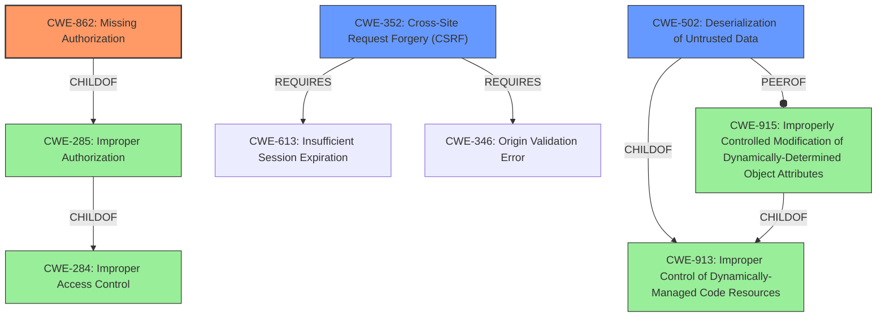

# Analysis for CVE-2021-24790

# Summary
| CWE ID | CWE Name | Confidence | CWE Abstraction Level | CWE Vulnerability Mapping Label | CWE-Vulnerability Mapping Notes |
|---|---|---|---|---|---|
| CWE-862 | Missing Authorization | 0.9 | Class | Allowed-with-Review | Primary CWE |
| CWE-352 | Cross-Site Request Forgery (CSRF) | 0.9 | Compound | Allowed | Secondary Candidate |
| CWE-502 | Deserialization of Untrusted Data | 0.7 | Base | Allowed | Secondary Candidate |

## Evidence and Confidence

*   **Confidence Score:** 0.8
*   **Evidence Strength:** HIGH

## Relationship Analysis
The primary CWE is CWE-862 [CWE-862: Missing Authorization], which falls under the broader category of CWE-285 [CWE-285: Improper Authorization] and CWE-284 [CWE-284: Improper Access Control]. CWE-352 [CWE-352: Cross-Site Request Forgery (CSRF)] is a compound weakness that requires other weaknesses to be present. CWE-502 [CWE-502: Deserialization of Untrusted Data] is related to CWE-913 [CWE-913: Improper Control of Dynamically-Managed Code Resources] and CWE-915 [CWE-915: Improperly Controlled Modification of Dynamically-Determined Object Attributes].

## Vulnerability Chain
The vulnerability chain starts with **lack of authorization and CSRF checks** in the `delete_cf7_data` and `export_cf7_data` AJAX actions. This leads to arbitrary metadata deletion and potential **PHP Object Injection** via the `maybe_unserialize()` function, which in turn could lead to arbitrary code execution if a suitable gadget chain is present. The chain can be represented as: Missing Authorization/CSRF -> PHP Object Injection -> Arbitrary Code Execution.

## Summary of Analysis
The primary weakness is the **lack of authorization** for the AJAX actions, which allows authenticated users with minimal privileges to trigger sensitive functions. The "Root cause of vulnerability" from the CVE Reference Links Content Summary states: "The plugin lacks authorization and CSRF checks in its `delete_cf7_data` and `export_cf7_data` AJAX actions." This directly supports the selection of CWE-862 [CWE-862: Missing Authorization].

CWE-352 [CWE-352: Cross-Site Request Forgery (CSRF)] is also a contributing factor, as the **lack of CSRF checks** allows attackers to potentially craft malicious requests on behalf of legitimate users.

The `maybe_unserialize()` function being called on user data without validation leads to CWE-502 [CWE-502: Deserialization of Untrusted Data], as highlighted by "Weaknesses/vulnerabilities present": "PHP Object Injection via `maybe_unserialize()`" in the CVE Reference Links Content Summary.

CWE-284 [CWE-284: Improper Access Control] and CWE-285 [CWE-285: Improper Authorization] were considered but deemed too high-level. CWE-863 [CWE-863: Incorrect Authorization] was considered, but the description specifically mentions **missing** authorization, making CWE-862 [CWE-862: Missing Authorization] a more accurate fit. CWE-915 [CWE-915: Improperly Controlled Modification of Dynamically-Determined Object Attributes] was considered as a possible alternative to CWE-502 [CWE-502: Deserialization of Untrusted Data], but the vulnerability involves deserialization of untrusted data, not just modification of object attributes.